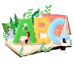
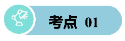
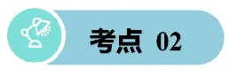

# M2U1 Food and drinks!

|语音 语调|/uː/：food, cool, school, juice, moon /e/：egg, bread, pen, desk, fresh 注意：询问食物饮品相关的特殊疑问句用降调，如 “What's your favourite food?（降调）”；选择疑问句前升后降，如 “Do you like milk or juice?（升调 + 降调）”| |
|---|---|---|
|必记 单词|四会|food（食物）、drink（饮料）、rice（米饭）、noodle（面条）、egg（鸡蛋）、 milk（牛奶）、juice（果汁）、cake（蛋糕）、bread（面包）、fish（鱼）、 meat（肉）、apple（苹果）、banana（香蕉）、water（水）、tea（茶）|
| |三会|delicious（美味的）、fresh（新鲜的）、sweet（甜的）、sour（酸的）、healthy （健康的）、hungry（饿的）、thirsty（渴的）、snack（零食）、breakfast（早 餐）、lunch（午餐）、dinner（晚餐）|
|常考 短语|have breakfast（吃早餐）、have lunch（吃午餐）、have dinner（吃晚餐）drink milk（喝 牛奶）、eat rice（吃米饭）、a glass of juice（一杯果汁）a piece of bread（一片面包）、 favourite food（最喜欢的食物）、healthy food（健康的食物）| |
|必会 句型|1. 询问喜好的食物 / 饮品：  - What's your favourite food/drink?（你最喜欢的食物 / 饮品是什么？） - My favourite food/drink is rice/milk.（我最喜欢的食物 / 饮品是米饭 / 牛奶。）   2. 表达想吃 / 喝某物：  - I'm hungry/thirsty. I want to eat/drink some bread/water.（我饿了 / 渴了，我想吃 / 喝 点面包 / 水。）  3. 询问对方是否喜欢某物：  - Do you like fish?（你喜欢鱼吗？） - Yes, I do./No, I don't.（是的，我喜欢。/ 不，我不喜欢。）   4. 描述食物的特征：   - The apple is sweet.（这个苹果是甜的。） - The orange is sour.（这个橙子是酸的。） | |

|核心 语法|1. 名 词的 单复 数 （食 物 饮品 类） ： 可数 名 词有 单复 数 变化 ， 如 egg→eggs, noodle→noodles；不可数名词无单复数，如 rice, milk, water，表数量需加量词，如 a bowl of rice（一碗米饭）。 2. 一般现在时（表达喜好和日常饮食）：表示习惯性的喜好、日常的饮食行为，主语 为第三人称单数时，动词用三单形式，如 He likes bread. She drinks milk every morning. |
|---|---|

### 名词的单复数

- 1. 核心定义 名词的单数表示一个人或事物，复数表示两个或两个以上的人或事物，小学阶段重点掌握食物、 文具、动物、生活用品等常见名词的单复数变化，也是上海五下的基础考点。
- 2. 两类核心名词

- （1）可数名词 能数清数量的名词，有单数和复数两种形式，如 pen（钢笔）、egg（鸡蛋）、book（书）。
- （2）不可数名词 数不清具体数量、无单复数变化的名词，表数量时需搭配量词，如 rice（米饭）、milk（牛奶）、 water（水）、bread（面包），常见量词：a bowl of（一碗）、a glass of（一杯）、a piece of （一片 / 一块）。

- 3. 可数名词复数规则变化（五下重点，占 80%） 变化规则 例子 直接在词尾加 s pen→pens, book→books, car→cars 以 s, x, sh, ch 结尾，加 es box→boxes, brush→brushes, watch→watches 以辅音字母 + y 结尾，变 y 为

baby→babies, family→families, candy→candies

i 加 es

以元音字母 + y 结尾，直接加 s

boy→boys, toy→toys, key→keys

变化规则 例子 以 o 结尾，有生命加 es，无生 命加 s

有 生 命 ： tomato→tomatoes, potato→potatoes 无 生 命 ： photo→photos, radio→radios

以 f/fe 结尾，变 f/fe 为 v 加 es

knife→knives, leaf→leaves, wolf→wolves（五下高频：knife/leaf）

- 4. 可数名词复数不规则变化（五下必考，需熟记） 无固定规则，直接记原形和复数，以下是五下高频词： man→men, woman→women child→children foot→feet, tooth→teeth mouse→mice fish→fish（单复数同形，表 “鱼的数量”） sheep→sheep（单复数同形） egg→eggs, noodle→noodles（食物类高频）
- 5. 五下易错点提醒 不可数名词永远不能直接加 s/es，也不能用数词（one/two/three）直接修饰，如：不能说 two rice， 要说 two bowls of rice。 “a/an + 单数名词”，“some/any/many + 复数名词 / 不可数名词”，如：a pen, some pens, some milk。 集体名词：people（人们）、police（警察），本身表 “复数”，不能说 a people，要说 a person。

### 一、用所给单词的适当形式填空

- 1.I have two ______（egg）for breakfast every morning.
- 2.There is some ______（rice）in the bowl.
- 3.She wants three ______（glass）of juice.
- 4.I like eating ______（noodle）very much.
- 5.There is a piece of ______（bread）on the table. 二、单项选择

- ( )1. - Would you like some ______?

-Yes, please. It's healthy. A. apple B. milk C. egg

- ( )2. I can see many ______ in the basket. A. banana B. a banana C. bananas
- ( )3. There is a ______ of bread and two ______ of water on the desk. A. piece; glass B. piece; glasses C. pieces; glass
- ( )4. - Do you like ______?

-No, I don't. I like chicken. A. fish B. a fish C. fishs

- ( )5. She has some ______ for lunch. It's delicious. A. cake B. cakes C. a cake

### 一般现在时

- 1. 核心定义 表示经常性、习惯性的动作，客观事实 / 真理，或现阶段的状态 / 喜好，是五下语法核心考 点，常和频度副词连用（always/usually/often/sometimes/never）。时间标志词：every day（每 天）、every morning/afternoon/evening（每天早 / 中 / 晚）、on Sundays（每周日）、usually （通常）、often（经常）。
- 2. 一般现在时主语分类（核心考点：人称变化） 根据主语不同，动词形式分两种：动词原形 / 动词三单形式（第三人称单数），先明确三类 人称： 人称分类 包含内容 动词形式 第一人称 I（我）、we（我们） 动词原形 第二人称 you（你 / 你们） 动词原形 第三人称复数 they（他们 / 她们 / 它们）、the boys、my parents 动词原形 第三人称单数（三单）he（他）、she（她）、it（它）、Tom、my mother、the cat动词三单形

- 人称分类 包含内容 动词形式 式
- 3. 动词三单形式变化规则（五下必考，和名词复数规则相似，易混淆需区分） 变化规则 例子 直接在词尾加 s like→likes, play→plays, eat→eats 以 s, x, sh, ch, o 结尾，加 es pass→passes, watch→watches, go→goes, do→does 以辅音字母 + y 结尾，变 y 为 i 加 esstudy→studies, fly→flies, cry→cries 以元音字母 + y 结尾，直接加 s play→plays, stay→stays, enjoy→enjoys
- 4. 一般现在时四大基本句型（五下重点，会写会变） 以动词 like（喜欢） 为例，分实义动词句型（核心），be 动词（am/is/are）句型为基础，一 并梳理：

- （1）实义动词句型（五下高频：like/eat/drink/play/have） 句型 结构 例句（三单主语：she） 例句（非三单主语：I）

肯定句 主语 + 动词（三单 / 原形）+ 其他

She likes milk.（她喜欢牛 奶。）

I like juice.（我喜欢果 汁。）

否定句

主语 + don't/doesn't + 动词原形 + 其他

She doesn't like milk. I don't like juice.

一般疑 问句

Do/Does + 主语 + 动词原形 + 其 他？

Does she like milk? Do you like juice?

回答

Yes, 主语 + do/does.No, 主语 + don't/doesn't.

Yes, she does./No, she doesn't.

Yes, I do./No, I don't.

- （2）be 动词（am/is/are）句型 句型 结构 例句（三单：he）例句（非三单：we） 肯定句 主语 + am/is/are + 其他 He is a student. We are students. 否定句 主语 + am not/isn't/aren't + 其他 He isn't a student. We aren't students. 一般疑问

Am/Is/Are + 主语 + 其他？ Is he a student? Are you students?

句

回答 Yes, 主语 + am/is/are.No, 主语 + am Yes, he is./No, he Yes, we are./No, we

句型 结构 例句（三单：he）例句（非三单：we） not/isn't/aren't. isn't. aren't.

- 5. 五下高频考点 & 易错点

- （1）高频考点 结合食物 / 饮品 / 日常活动考动词三单，如：My father drinks tea every morning. 特殊疑问句：What+do/does + 主语 + 动词原形 + 其他？ ，如：What do you eat for lunch? / What does she drink for breakfast? 喜好表达：Do/Does + 主语 + like + 名词 /doing？ ，如：Do you like apples? / Does he like playing football?
- （2）必避易错点 三单主语漏变动词：错误→He like bread. 正确→He likes bread. 否定句 / 疑问句误用动词三单：错误→Does she likes milk? 正确→Does she like milk?（do/does 后必须用动词原形） 混淆名词复数和动词三单：名词复数是名词 + s/es（表数量），动词三单是动词 + s/es（表三 单主语），如：The girl likes red apples.（likes 是动词三单，apples 是名词复数） 频度副词（usually/often）位置：放在 be 动词后，实义动词前，如：She is always late. / She usually gets up early.

### 一、用括号内单词的正确形式填空。

- 1.My mother ______（like）drinking tea every afternoon.
- 2.I ______（not like）sour oranges.
- 3.What ______ your father ______（have）for breakfast?
- 4.He ______（have）bread and milk.
- 5.They ______（eat）rice for dinner every day.
- 6.My sister ______（want）to drink some juice now. 二、单项选择。 ( ) 1. - What ______ you like for lunch?

-I like rice and fish.

A. do B. does C. are

- ( )2. Tom ______ like milk. He likes juice. A. don't B. doesn't C. isn't
- ( )3. My brother ______ bread every morning. A. eat B. eats C. eating
- ( )4. - Does your sister like sweet cakes?

-______. She likes sour oranges. A. Yes, she does B. No, she don't C. No, she doesn't

- ( )5. We ______ have breakfast at seven o'clock every morning. A. usually B. is C. does

## 参考答案

- (1) 名词的单复数 一、用所给单词的适当形式填空

- 1.eggs 解析：数词 two 后接可数名词复数，egg 的复数是 eggs
- 2.rice 解析：rice 是不可数名词，some 后接不可数名词原形
- 3.glasses 解析：数词 three 后接可数名词复数，glass 的复数是 glasses
- 4.noodles 解析：noodle 为可数名词，常用复数形式 noodles
- 5.bread 解析：bread 是不可数名词，a piece of 后接不可数名词原形 二、单项选择

- 1.B 解析：some 后接不可数名词或可数名词复数，milk 为不可数名词，apple 和 egg 是可数名词 单数
- 2.C 解析：many 后接可数名词复数，banana 的复数是 bananas
- 3.B 解析：a piece of（一片 / 块），two glasses of（两杯），glass 的复数是 glasses
- 4.A 解析：fish 表示 “鱼肉” 时是不可数名词，无复数形式
- 5.B 解析：some 后接可数名词复数或不可数名词，cake 表示 “一块块的蛋糕” 时是可数名词， 用复数 cakes

- (2)一般现在时 一、用括号内单词的正确形式填空

- 1.likes

- 解析：主语 my mother 是第三人称单数，一般现在时中动词用三单形式 likes
- 2.don't like 解析：主语 I，一般现在时否定形式用 don't + 动词原形
- 3.does; have; has 解析：主语 your father 是第三人称单数，特殊疑问句用助动词 does，后接动词原形 have；答 句主语 he 是第三人称单数，动词用 has
- 4.eat 解析：主语 they 是复数，一般现在时中动词用原形
- 5.wants 解析：主语 my sister 是第三人称单数，一般现在时中动词用三单形式 wants 二、单项选择

- 1.A 解析：主语 you，一般现在时的特殊疑问句用助动词 do
- 2.B 解析：主语 Tom 是第三人称单数，一般现在时否定形式用 doesn't
- 3.B 解析：主语 my brother 是第三人称单数，一般现在时中动词用三单形式 eats
- 4.C 解析：一般疑问句的否定回答，主语 your sister 是第三人称单数，用 No, she doesn't
- 5.A 解析：usually 是频度副词，可修饰动词 have；is 和 does 不能与实义动词 have 连用

