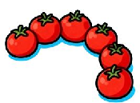
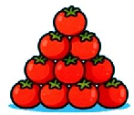
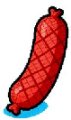
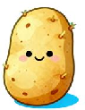
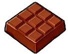
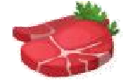
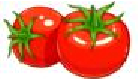
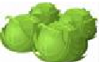
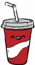

# M2U1 Food and drinks（单元自测·提高卷）牛津上海试用本 五年级下册

（建议用时：60 分钟 满分：100 分）

|题 号|Part 1| | |Part 2| | | | | | | | |总分|
|---|---|---|---|---|---|---|---|---|---|---|---|---|---|
| |Ⅰ|Ⅱ|Ⅲ|Ⅰ|Ⅱ|Ⅲ|Ⅳ|Ⅴ|Ⅵ|Ⅶ|Ⅷ|Ⅸ| |
|得 分| | | | | | | | | | | | | |

## Part 1 Listening（30 分）

### Ⅰ.Listen and choose(请听录音，选出与你所听内容相符的选项。)10%

- ( ) 1. A．candies B．vegetables C．fruits
- ( ) 2. A．soup B．juice C．water
- ( ) 3. A．fast food B．junk food C．healthy food
- ( ) 4. A．bread and eggs B．rice and meat C．noodles and juice
- ( ) 5. A．water B．milk C．juice

### Ⅱ.Listen and choose(听录音，选择与所听食材/饮品相符的图片。)10%

- ( ) 1. What kind of drink does Mum want to buy?

A． B． C．

- ( ) 2. How many tomatoes does Lele need for salad?

A． B． C．

- ( ) 3. What food does Wenbo ask to buy?

A． B． C．

- ( ) 4. Which vegetable is not available in the supermarket today?

- A． B． C．
- ( ) 5. What do they buy for dessert?

A． B． C．

- Ⅲ.Listen and number.(听录音，给下列句子排序。)10% ( ) I’d like a sandwich and some tea. ( ) What’s your favourite drink? ( ) What would you like to drink? ( ) We have beef noodles and salad today. ( ) Salad is my favourite food.

## Part 2 Reading and Writing（70 分）

### Ⅰ.Choose the best answer（选择最佳的答案）10%

- ( )1．There ______ any jam in the jar. Shall we go and buy ______? A．is; any B．are; some C．isn’t; some
- ( )2．Children can’t eat ________ sweets, because they are ________ for their teeth. A．too many; good B．too many; bad C．too much; bad
- ( )3．—What did you eat for breakfast, Jill?

—I ______ some bread this morning, but I usually ______ some cakes. A．ate; ate B．eat; ate C．ate; eat

- ( )4．—What _______ you have for dinner last night, Peter?

—I ______ some chicken. A．did; have B．do; have C．did; had

- ( )5．—Mum, can Ming _______ some cabbage?

—Of course. A．have B．has C．had

- ( )6．Healthy children eat ______ every day.

- A．a lot of sweets B．many vegetables C．a lot of meat
- ( )7．It’s time ______ dinner. Come on, Mike. A．for B．to C．into
- ( )8．When ______Tom ______ his breakfast yesterday morning? A．did; have B．does; has C．does; have
- ( )9．Kitty and Alice _______ happy this morning because they had a good meal. A．are B．weren’t C．were
- ( )10．—_______ in the kitchen?

—_______ some ham. A．What; There’s B．What’s; There’s C．What’s; There’re

- Ⅱ.Read and write（按要求写单词）10% 1．juice (同类词) 2．breakfast (同类词) 3．tomato (复数形式) 4．do (过去式) 5．have (第三人称单数形式) 6．potato (复数形式) 7．for (同音词) 8．they (名词性物主代词) 9．grapes (单数形式) 10．ours (单数形式)

- Ⅲ.Fill in the blanks with proper forms of the words given.(用所给词的适当形式填空)10%

- 1．What’s in the basket? There are some (potato) and (tomato).

- 2．— (be) there a bowl of cherries in the fridge yesterday?

—Yes, but there (be) only one in the bowl now.

- 3．Who (have) got the pineapple?

- 4．Let (me) (get) some drinks first.

- 5．My father likes (eat) apples very much. He (eat) two apples last night.

- 6．Jim can’t run (quick) because he is fat.

- Ⅳ.Look and write(看图完成句子)5%

- 1．Don’t have too much for lunch. It’s unhealthy.

- 2．We can buy some in the supermarket.

- 3．My father likes eating . They are good for our health.

- 4．We shouldn’t drink too much .

- 5．We should eat every day. They can keep us healthy.

### Ⅴ.Rewrite the sentences(按要求改写句子)10%

- 1．I had some tea with Sally yesterday afternoon. (对划线部分提问) What you with Sally yesterday afternoon?

- 2．Kitty eats some fruit every night. (用 yesterday 改写)

- 3．My grandma listened to the radio in the afternoon. (改否定句) My grandma to the radio in the afternoon.

- 4．There’s some pork in the fridge. (改成否定句)

- 5．I hear a noise every evening. (将 every evening 改为 last evening，并作相应变化)

### Ⅵ.Choose the best answer and complete the passage. (选择最恰当的单词完成短文。) 5%Nowadays more and more people in the world are 1 fatter, which troubles them a lot.

2 say that it has a lot to do with our 3 habit.

Our eating habits are very 4 for good health and a strong body. Most of us like 5 sweets and ice cream. But if we eat them before a meal, they may take away our appetite.(食欲) It is important for us to eat our meal at the same time each day. When we feel worried or excited, we may not want to eat.

- ( )1．A．get B．getting C．got
- ( )2．A．Doctors B．We C．Mum
- ( )3．A．eating B．sports C．healthy
- ( )4．A．happy B．important C．yummy
- ( )5．A．eat B．eating C．eats

### Ⅶ.Read and judge. (阅读短文，判断正(T)误(F)。)5%

Today, many children are overweight(超重). In China, one in ten children has this problem. How can we keep fit? Let’s look at Susan. Her height(身高) is 1.4 meters(米). Her weight(体重) is 50 kilograms(千克).

|<20|too thin|
|---|---|
|20-25|good|
|>25|too heavy|

So, 50➗(1.4✖1.4)=50➗1.96≈25.5. By counting( 通过计算 ), then Susan must lost weight now!

A healthy body is very important. There are many ways to keep us fit. In the morning, you must get up early, go outdoors and do morning exercise. Running and swimming can help us keep fit. You should try to make yourself happy too. If you feel happy, you can eat well, sleep well and your body is sure to be in a good condition(状况).

- 1．Susan is too thin. ( )
- 2．To keep fit, we must get up early in the morning. ( )
- 3．We can run and swim to keep us fit. ( )
- 4．Making yourself happy can’t keep your body in a good condition. ( )
- 5．Susan’s friend, Amy is 1.5 meters tall and 35 kilograms weight. By counting, she is good. ( )

- Ⅷ.Read and answer.(任务型阅读)10% The Food Guide Pyramid(金字塔) is a general guide that lets you choose a healthy diet(健康餐)

that is right for you. The pyramid calls for eating a variety of foods to get the nutrients(营养) you need and eating the right amount of calories(卡路里) to maintain a healthy weight. Most calories should come from the foods in the three lower sections of the pyramid. Each of these groups provides(提供) some, but not all of the nutrients you need. Foods in one group can not replace those in another. No one food group is more important than another. For good health, you need them all.

- 1．Read and judge. (阅读短文，判断正误，用“T”或“F”表示。)

- (1) The pyramid is a guide that lets you choose a healthy diet. ( )
- (2) We should get enough calories to maintain a healthy weight. ( )
- (3) Most calories come from the lowest section of the pyramid. ( )
- (4) Rice, bread and cereal provide all the nutrients that you need. ( )
- (5) Vegetables are more important than meat. ( )

- 2．Read and answer. (阅读短文，回答下列问题。)

- (1) What’s the pyramid about?

- (2) How much calories should we get to maintain a healthy weight?

- (3) What does each food group provide?

- (4) Do we need all the food groups to make us healthy?

- (5) How much do you know about the Food Guide Pyramid?

### Ⅸ.Write(说说自己的饮食习惯，可以提出一些建议。至少 45 个单词，3 种及以上句型)5%My eating habits(我的饮食习惯)

_________________________________________________________________________________ _________________________________________________________________________________ _________________________________________________________________________________ _________________________________________________________________________________ _________________________________________________________________________________ _________________________________________________________________________________

