# Unit 1 Art and artists 单元话题练

## （语法填空+语法选择+阅读+完形+写作）

### 一、语法选择

1 is wonderful that art can make our world more colourful. Whoever loves creating 2 can be an artist—you don’t have to be a famous painter! Our school art teacher, Mr Zhang, always encourages us

- 3 what we truly like. He is 4 patient that he often helps us fix our works after class. I 5 drawing since I was 10 years old. 6 practising every weekend, my skills have

gotten much better. Last month, I drew a picture of Shanghai’s Bund and showed it to my mum, 7 happy smile she had when she saw it! She cooked my favourite noodles for me in return.

Shanghai has many great art spots, and the Shanghai Art Museum is one of 8 for students. We often go there for school trips. How lucky we are to live in a city 9 so much beautiful art around us! Let’s keep 10 art and trying to be great little artists.

- 1．A．It B．That C．This
- 2．A．something new B．new something C．anything new
- 3．A．paint B．to paint C．painting
- 4．A．so B．such C．as
- 5．A．enjoy B．enjoyed C．have enjoyed
- 6．A．Through B．On C．In
- 7．A．How B．What C．What a
- 8．A．more popular ones B．most popular one C．the most popular ones
- 9．A．with B．for C．in
- 10．A．love B．loving C．to love

Did you join any fun clubs at school this year? There is a bamboo weaving (竹编) club in our school. The teachers in the club 1 local (当地的) artists. They always have great 2 . Students can 3 to use bamboo to make many beautiful things.

Cheng Yangyi is a 14-year-old student. He joins the club 4 his classmates. He wants to make a

bamboo fan. “I need to be very careful when I am making 5 fan,” he says. It’s not easy 6 the thin bamboo strips (竹条) together. Sometimes they are too close, and

sometimes they are too far. He often 7 mistakes. But he tries again and again with the help of his teachers. “I sometimes feel unhappy, 8 I don’t stop. When I finish my work, I jump 9 . My classmates all come to see 10 and feel so surprised.” Cheng says.

“I love our club! It’s cool to turn bamboo into beautiful things.” says Cheng.

- 1．A．am B．is C．are
- 2．A．idea B．ideas C．idea’s
- 3．A．learn B．learns C．learning
- 4．A．to B．for C．with
- 5．A．a B．an C．the
- 6．A．put B．puts C．to put
- 7．A．make B．makes C．making
- 8．A．but B．and C．because
- 9．A．happy B．happily C．happiness
- 10．A．it B．its C．it’s

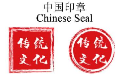

The Chinese seal is used in China to sign 1 important or valuable, such as artworks, business agreements and so on. Signing names along with seals is 2 safe way to identification (证明身份). The Chinese seals are most commonly 3 stone, they can also be plastic or metal. Seals have been a part of Chinese culture for thousands of years. The 4 known seals date from the Shang Dynasty.

Seals became widely used during the Warring States Period to sign official documents. By the time of Han Dynasty, the seals 5 a necessary part of Chinese culture.

During the history of the Chinese seals, Chinese characters have developed. Some of the changes have something to do 6 the practice of carving (雕刻) seals. For example, during the Qin Dynasty, Chinese characters are in a round shape. People were not sure 7 make the characters match the square seals perfectly. They continued to try. That led to the characters changing into a square shape.

Today, seals are still used for many purposes in China. For example, people can’t buy houses or pass the check in banks 8 they can put their own seals on. Since one seal is really difficult to copy and should

only 9 by its owner, seals are quite necessary to adults. So Chinese seal 10 disappear in a short time. We can still see them in many certain situations.

- 1．A．everything B．nothing C．something D．anything
- 2．A．/ B．an C．the D．a
- 3．A．made of B．made from C．made in D．made up of
- 4．A．earlier B．earliest C．later D．latest
- 5．A．becomes B．were becoming C．are becoming D．had become
- 6．A．on B．with C．in D．through
- 7．A．how could they B．how they could C．how can they D．how they can
- 8．A．unless B．if C．however D．although
- 9．A．used B．be used C．been used D．being used
- 10．A．mustn’t B．may not C．can’t D．shouldn’t

二、短文填空 阅读下面短文，在空格处填入一个适当的词或使用括号中词语的正确形式填空。

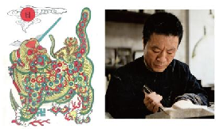

“No print, no year” is 1 old saying well-known to people in Suzhou, Jiangsu. The “print” here is Taohuawu Woodblock New Year Prints (桃花坞木刻年画).

Taohuawu Woodblock New Year Prints get 2 (they) name from the Taohuawu area in Suzhou. They 3 (know) for their bright colors, clear patterns and many different themes. In 2006, they became part of China’s national intangible cultural heritage (非物质文化遗产).

Sun Yibo, 44 years old, 4 (work) on Taohuawu prints for over 20years. “Taohuawu prints are nianhua 5 not only shows menshen (door gods), flowers and birds,” said Sun. “Now, 6 (art) also choose themes from popular culture, 7 games and films.”

Sun once made a woodblock print showing a scene in the game Paper Bride (《纸嫁衣》). He spent months 8 (work) on it-drawing the draft, carving (雕刻) it on different blocks (纸板) and then printing the blocks one by one on paper.

It takes a long time 9 (make) a woodblock print, so few people want to learn this skill. But Sun and other inheritors (传承人) in Suzhou are trying to let more young people know about it. “We have exhibitions and classes at school. I am 10 (real) happy to see some students starting to learn it in class,” said Sun.

阅读短文，在文中空白处填入 1 个适当的单词，或用括号内所给单词的正确形式填空。

The Grand Song of the Dong ethnic group (侗族大歌) is the folk song of the Dong people in China. It is performed widely in Guizhou and Guangxi now.

Hu Guanmei is one of the masters of the Grand Song. Her parents encouraged her 1 (learn) it when she was three years old. At that time, she would rather stay at home and practise the Grand Song 2 go out to play. “My parents told me that when you were happy, you could sing; when you 3 sad, you could sing too,” Hu recalled. “Singing the Grand Song could keep sadness and worries away from us,” she added.

In her 4 (twenty), Hu became famous in her village because she could sing the Grand Song well. Then she began helping spread the Grand Song. Every night, the kids 5 lived nearby met at Hu’s home to sing together. Later, Hu 6 (invite) to teach students at school.

Up to now, she has trained over 1,000 students of all 7 (age). Her students speak 8 (high) of her. “She is a totally committed (尽心尽力的) teacher. She has not only passed on the singing skills to us, but also succeeded in 9 (help) us have a much deeper understanding of Dong culture,” one of her students said.

So far, many of her students 10 (win) music competitions and given performances home and abroad. Hu hopes they can continue to pass on the traditional culture and bring joy to more people.

阅读下面短文，根据语境或所给单词的提示，在每个空格内填入一个恰当的词，要求所填的词意义准确、 形式正确，使短文意思完整、行文连贯。

There is a special club at Yangzhou Foreign Language School. It is called the Tongcao Flowers Paper Art Workshop. It just won 1 first prize at a school exhibition (展览).

The students and teachers made 2 (thousand) of beautiful tongcao flowers and the flowers filled up a 24-square-meter exhibition area.

Tongcao flowers are made from tongcao paper. This paper comes 3 a traditional Chinese medicine called tongtuo wood. Tongcao flowers are known as “the flower that never dies”. 4 , people still feel surprised that they can stay beautiful for many years.

Making tongcao flowers takes many steps. First, cut the pieces of paper into different 5 (size).

Then, shape the wet paper into paper petals (花瓣) by pinching (捏) and rubbing (揉) it. Next, put the petals together like a real flower. 6 the end, color the paper.

Ren Daiyang 7 (become) a member of the workshop in 2023. For him, shaping the petals is 8 (hard) than other steps.

“I spent over two hours 9 (make) a tongcao flower in the beginning. But it teaches 10 (I) to be patient.” said 13-year-old Zhang Shiyu. “I love this paper art and want to help keep it going.”

### 三、完形填空

The Dong people (侗族人) and their indigo cloth (靛蓝色布)

Yang Xiuying, 74, sits at a wooden loom (织布机). As her fingers pass the shuttle (梭子) back and forth through the cotton threads, the old machine comes to life.

Ever since she was a young girl, Yang has been making indigo cloth. “This type of handmade cloth is extremely rare. You can 1 buy it at the market,” she said.

For the Dong people in Guizhou, making indigo cloth has a long tradition. The 2 has been passed down from mother to daughter over generations. Nearly every family makes its own cloth.

This traditional way of making indigo cloth, unfortunately, is now in danger. It will disappear slowly in the modern industrial society. Young people show little interest in it. Some of them have 3 to big cities to find better jobs.

Local officials want to save the tradition. They are trying to change young people’s 4 towards it. One program has set up several cloth-making factories in Guizhou. After learning how to make indigo cloth, young Dong people can find jobs easily. They can also work closer to home.

The Dong people consider indigo cloth as 5 as rice. Many Dong women spend countless hours making the cloth. They rise and start working very early in the morning. To make the cloth shiny, it must be rubbed (搓) and beaten hard. The noise of cloth being beaten often 6 the whole village up.

Almost every Dong woman over 40 has a tub for indigo dye (染料). The cloth has to be put in the dye for many rounds to gain the rich colour. The process of colouring usually takes two weeks.

Yang holds out her purple and wrinkled (有皱纹的) hands. “They say she who has the darkest hands makes the best cloth,” she says proudly.

- 1．A．hardly B．usually C．easily D．often
- 2．A．story B．skill C．food D．tool

- 3．A．moved B．returned C．travelled D．walked
- 4．A．habit B．attitude C．interest D．hobby
- 5．A．interesting B．expensive C．important D．common
- 6．A．wakes B．keeps C．turns D．takes

阅读下面短文，理解大意，然后从各小题的四个选项中选出一个最佳答案，使短文连贯完整。

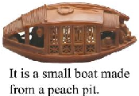

During the Ming Dynasty, there was a skilled man named Wang Shuyuan. He was good at turning a(n) 1 piece of wood into different things, like buildings, animals, trees, and even people.

One of his greatest works was a small boat made 2 just from a peach pit. This small boat had a lovely shape like a(n) 3 one. The middle part of the boat was the cabin (船舱). It had eight small

- 4 , four on each side. People could see beautiful patterns on the sides when the windows were open.

Three people sat at the front of the boat. The man in the 5 was Su Dongpo. On his right was his friend, Foyin, and on his left was Luzhi. Su Dongpo and Luzhi were 6 a long scroll Su Dongpo held one end of the scroll while resting his other hand on Luzhi’s back. Luzhi pointed at the scroll with his right hand

- as if he was 7 something interesting. Foyin looked happy and 8 , lying down on one knee and supporting himself with one arm.

The boat had many other details (细微之处). On the back of it, Wang Shuyuan even 9 his name. It is hard to believe that he could 10 so many things on such a small peach pit. Wang Shuyuan’s skill is truly amazing!

- 1．A．small B．alive C．silver D．private
- 2．A．carefully B．widely C．badly D．politely
- 3．A．empty B．real C．silent D．smooth
- 4．A．rabbits B．corners C．fields D．windows
- 5．A．end B．back C．middle D．bottom
- 6．A．looking at B．passing by C．setting off D．dealing with
- 7．A．failing B．scoring C．sharing D．mailing
- 8．A．helpful B．awful C．painful D．peaceful
- 9．A．traded B．wrote C．dared D．examined

- 10．A．cancel B．create C．announce D．nod

Art is an important part of our life. It has many different forms and can 1 our hearts in special ways. Chinese paper cutting is one of the most famous traditional folk arts. It has a long history of more than 1,500 years and is 2 in many parts of China.

To make paper cutting works, artists only need simple 3 : a pair of scissors and some red paper. Red is a lucky color in Chinese culture, so it’s the most 4 color for paper cutting. Artists cut the paper into different shapes, like flowers, animals and Chinese characters. Every shape has a special 5 , such as happiness and good luck.

The making of paper cutting is not easy. It needs great 6 and patience. Artists must practice a lot to cut the paper into perfect shapes. A good paper cutting work is always 7 and lively. When you look

- at it, you can feel the beauty of art and the warmth of Chinese culture. Now paper cutting is not only loved by Chinese people, but also becomes 8 all over the world.

Many foreign people learn to make paper cutting works and they 9 it as a great way to know about China. Art connects the world. It makes our life more colorful and 10 us to love the world around us.

- 1．A．touch B．hit C．break D．carry
- 2．A．forgotten B．popular C．expensive D．silent
- 3．A．tools B．pictures C．skills D．stories
- 4．A．boring B．difficult C．common D．strange
- 5．A．name B．meaning C．use D．shape
- 6．A．talent B．time C．money D．space
- 7．A．dark B．vivid C．cold D．quiet
- 8．A．fresh B．famous C．cheap D．clean
- 9．A．regard B．change C．turn D．take
- 10．A．teaches B．warns C．stops D．asks

### 四、任务型阅读

Chinese paper-cutting is one of the oldest handicrafts in China. It appeared during the Northern Dynasties. So it has a history of about 1,500 years. At first, paper-cuttings were only popular in the countryside, and the masters were farmers’ wives.

Traditional paper-cuttings were first put on windows for decoration. This is why they’re also called “window flowers”. Most paper-cuttings are made of red paper, because red means good luck in Chinese culture. Today, people use paper-cuttings to decorate not only windows, but also mirrors, lamps and other furniture.

Paper-cuttings are popular because of their expressions of good wishes and hopes. During the Spring Festival, for example, many people put up paper-cuttings of the Chinese character “Fu” upside down. They hope that this will bring them good luck. At wedding ceremonies, you can always see paper-cuttings of the character “Xi”. It means that the couple can enjoy double happiness together. Paper-cuttings have developed different styles in different parts of China. Paper-cuttings from the northern parts usually have interesting shapes and rich patterns. In southern China, people prefer elegant paper-cuttings. They focus more on the themes of flowers, fruit, birds and fish.

It is quite easy to learn how to make paper-cuttings. With a piece of paper and a knife or a pair of scissors, you can try to make your own paper art. You can only make one piece at a time by using a knife. But if you use scissors to cut several pieces of paper together, you can make several identical paper-cuttings at once. 根据短文内容，回答下列问题。每题答案不超过 7 个词。

- 1．How long is the history of Chinese paper-cutting?

- 2．What’s another name of paper-cuttings?

- 3．Why do people put up the Chinese character “Fu” upside down?

- 4．What do people in southern China focus more on in paper-cuttings?

- 5．What tool do you need if you want to make several identical paper-cuttings?

阅读短文，回答问题

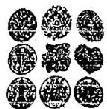

Chinese paper-cutting, or jianzhi, is a kind of folk (民间的) art. People usually use scissors (剪刀) or knives to cut paper. It has a long history (历史) of about 1500 years. Let’s learn something about paper-cutting.

Wonderful meanings (意义) Paper-cutting has wonderful meanings— happiness and good luck. At the Spring Festival, people put up fu

on doors or windows. At a wedding (婚礼), people put up xi. Why is it red? In China, people always love red. In our ideas, red is hope and life, so red is our favourite.We can see red

everywhere in China. The walls of old palaces are red. Lanterns are red.Weddings are always full of red things too. So most of the paper-cutting is red.

Black paper-cutting in Shanzhou Paper-cutting in Shanzhou, Henan Province is black. Black is the best colour there.Shanzhou is a dry (干旱

的) place. People make black paper-cutting to wish for rain.

Now, paper-cutting gets into many schools. Students can learn how to make paper-cutting at school. Li Jie, a middle school student, says,“It’s really wonderful to change paper into different kinds of pictures, such as flowers and animals. We enjoy it.”

- 1．How long is the history of Chinese paper-cutting?

- 2．Why do Chinese people love red?

- 3．What do people in Shanzhou use black paper-cutting to do?

- 4．How does Li Jie feel about paper-cutting?

- 5．Do you want to learn paper-cutting? Why or why not?

### 五、阅读理解

Ye Kaiyuan, an artist from Zhangpu, Fujian, masters Chinese art of paper-cutting. With great love for traditional literature, Eastern symbols, and Shanshui paintings, Ye creates paper artworks that bridge the past and present. Using simple tools like scissors and a knife, he turns paper into famous scenes in Chinese culture. “Paper-cutting allows me to express my understanding of life and the world,” Ye says.

Born in a place known as the “hometown of paper-cutting”, Ye developed his interest in the craft as a child.

Although he was born into a poor family, he managed to keep his hobby by using materials from paper boxes. However, when he grew up, he faced pressure to choose a career (事业) that provides enough money for living. After working different jobs—from waiter to tea seller—he gave up his job in 2011 to focus exclusively on paper-cutting. “Life is only meaningful if you do what you love,” he explains.

Ye’s journey was not easy. In 2012, his first exhibition, which he had spent tens of thousands of yuan to hold, sold only one piece for 328 yuan.“There was a moment when I thought about giving up, but I believed in the value of my craft,” he says.

His workshop, Yile Paper-Cutting Art, now creates pieces mixing tradition with modern art. Different from the traditional way of the craft, in which the drawing is done first and then the cutting, he splashes (洒) black, red or yellow ink on rice paper, then draws detailed designs and finally cuts out the paper creation. “The unexpected pattern is the most interesting part, and I think being natural is beautiful,” he says. The creative way is usually slow. It usually takes Ye at least two weeks to complete a paper-cutting work.

His hard work made him well-known around the world and UNESCO listed Zhangpu paper-cutting as intangible cultural heritage in 2010. “I want to bring paper-cutting to daily life, letting more people get to know the craft,” Ye says, showing that ancient crafts can keep alive in the modern world.

- 1．What does the underlined word “exclusively” mean in paragraph 2? A．Usually. B．Slowly. C．Carefully. D．Completely.
- 2．Why did Ye give up his job to focus on paper-cutting?

- A．Because his job didn’t provide him with enough money.
- B．Because his value in paper-cutting was well-known.
- C．Because he wanted to turn his hobby into his career.
- D．Because he was offered a job in Yile Paper-Cutting Art.

- 3．What did Ye do when he was faced with career problems at the beginning?

- A．He used the money he made to support his career.
- B．He reminded himself that his work was valuable.
- C．He asked for help from his friends and relatives.
- D．He held exhibitions to tell people about his work.

- 4．Which of the following is the correct order of Ye’s way of creating paper-cutting works according to paragraph 4?

①Design the shape of the paper. ②Draw out the lines on the paper.

③Splash ink on the rice paper. ④Cut out the shape.

A．②①③④ B．②④③① C．③②①④ D．③①②④

- 5．What is the writing purpose of the passage?

- A．To introduce a paper-cutting lover.
- B．To teach us the way to make paper-cutting.
- C．To encourage us to pass on the art—paper-cutting.
- D．To show the importance of paper-cutting.

Paper cutting is a traditional Chinese art with a history of over 1,500 years. It uses simple tools like scissors and paper to create beautiful patterns. But in modern times, fewer young people are interested in it.

Zhang Min, a 16-year-old student from Nanjing, wants to change this. She learned paper cutting from her grandma when she was 8. She thinks paper cutting is a treasure of Chinese culture and should be passed down.

To promote paper cutting, Zhang Min started an online club. She posts videos of her paper cutting process on social media. In the videos, she explains the meaning of each pattern. For example, the fish pattern stands for good luck, and the peony pattern represents wealth. She also holds offline workshops in her school and community. Many students and neighbors come to learn from her.

“Paper cutting is not old-fashioned. It can be combined with modern life,” Zhang Min said. She has designed paper cutting patterns for phone cases and bags. These creative works have attracted many young people. Now, more and more people are interested in this traditional art. Zhang Min hopes that one day, paper cutting will be known by people all over the world.

- 1．How long is the history of paper cutting? A．Over 1,000 years. B．Over 1,500 years. C．About 800 years. D．About 500 years.
- 2．Why did Zhang Min start an online club? A．To learn paper cutting. B．To sell paper cutting works. C．To promote paper cutting. D．To make friends.
- 3．What does the fish pattern stand for in paper cutting? A．Good luck. B．Wealth. C．Happiness. D．Health.
- 4．How does Zhang Min make paper cutting popular among young people? A．She sells paper cutting tools. B．She designs creative paper cutting works. C．She writes books about paper cutting. D．She travels around the world to teach paper cutting.
- 5．What’s Zhang Min’s hope?

- A．More people will learn paper cutting from her grandma.
- B．Paper cutting will become a school subject.
- C．Paper cutting will be known worldwide.
- D．She will become a famous artist.

### Chinese Paper Cutting: Art, Material and Culture

- ①Paper cutting is one of the most famous traditional arts in China. It has a history of over 1,500 years and

is popular all over the country.

- ②Paper cutting is mainly made of red paper. Red is a symbol of good luck and happiness in Chinese

culture. The production process is interesting: first, fold the red paper into different shapes; then, use sharp scissors to cut out beautiful patterns. The patterns usually include flowers, animals, and scenes from traditional stories.

- ③Paper cutting is not only a kind of art but also a carrier of culture. During the Spring Festival, people put paper cuttings on windows, doors, and walls to celebrate the festival. It’s a way to express people’s wishes for a better life.
- ④What’s interesting is that paper cutting has spread to foreign countries. In some Western countries, people are interested in this ancient Chinese art. They learn to make paper cuttings and use them to decorate their homes. It has become a bridge for cultural exchange.

- ⑤Now, paper cutting is listed as an intangible (非物质的) cultural heritage. More and more young people are learning this art. They use modern materials and methods to create new styles of paper cuttings, making this traditional art alive.

- 1．What does the underlined word “It” in Paragraph 4 refer to? A．Chinese culture. B．A foreign country. C．A traditional story. D．Paper cutting.
- 2．What is the first step in making paper cuttings? A．Cut out patterns. B．Draw patterns. C．Choose sharp scissors. D．Fold the paper.
- 3．How do young people keep paper cutting alive? A．By giving up this art. B．By selling paper cuttings abroad. C．By only making traditional patterns. D．By using modern materials and methods.
- 4．Which of the following best describes the structure of the passage?

- A．①/②③/④⑤ B．①②/③④/⑤ C．①/②/③④⑤ D．①②③/④/⑤
- 5．What can we infer from the passage? A．Paper cutting is only popular in China. B．Red paper is the only material for paper cutting. C．Paper cutting helps spread Chinese culture abroad. D．Young people are not interested in paper cutting.

Tea is no stranger to us Chinese people at all. But how much do you know about tea sets? Do you know they have changed a lot over time?

In general, tea sets become smaller and simpler after many changes throughout history. There are few records of tea sets before the Tang Dynasty. In Cha Jing (The Classic of Tea), a great book written by Lu Yu in the Tang Dynasty, 28 kinds of tools used for making and drinking tea are included.

The tea sets in the Song Dynasty were more gorgeous (华丽的). At that time, a competitive game based on tea drinking enjoyed great popularity. The tea bottle used in the game often had a big belly, a long neck and a mouth that was not straight. The mouth could help the players control water better when filling a cup. Cups made of black glaze (黑釉) were especially loved by people since the color matched the tea better and the thickness of the cup helped keep the tea warm.

In the Ming and Qing dynasties, tea sets became simple, and those made of gold and silver slowly disappeared. To test the color of the tea, white tea sets were more popular. In the Qing Dynasty, purple clay tea sets made in Yixing, Jiangsu, began to flourish and were loved widely. It's said that tea made with Yixing purple clay tea sets still tastes good after being kept in the teapot for one night, even in a hot summer.

- 1．How does the writer start the passage? A．By showing facts. B．By asking questions. C．By giving examples.D．By giving reasons.
- 2．Which dynasty saw the coming out of Cha Jing? A．The Tang Dynasty. B．The Song Dynasty. C．The Ming Dynasty. D．The Qing Dynasty.
- 3．Which tea bottle may be used in the tea game during the Song Dynasty?

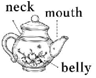

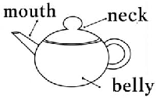

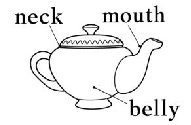

A． B． C．

D．

- 4．Which of the following in the dictionary best explains the underlined word "flourish"?

- A．to grow well (especially plants)
- B．to be healthy and happy
- C．to develop quickly and be successful, or common
- D．to wave (摇晃) sth. around in a way that makes people look at it

- 5．What's the best title for this passage? A．Tea Sets of Different Shapes B．The Development of Tea Sets C．Good Tea Sets Make Good Tea D．Tea Sets with Different Materials

- ①On my way back home, I was drawn by a familiar sweet aroma (香味) to an old man making sugar paintings on a little stool (凳子). I walked straight towards him without a second thought.
- ②Nothing is better than the sugar painting to me. Watching the process of making a sugar painting is a true feast (盛宴) for my eyes.
- ③The old man, with his great skills, created delicate sugar paintings with simple tools, including a small pot, a spoon, a table and some malt sugar (麦芽糖). The sweet smell flew into my nose slowly as the sugar was melted in the pot. After knowing what to paint, the old man scooped (挖，舀) a spoonful of sugar and put the spoon above the table. He moved the spoon a little, and then quickly moved his hands before malt sugar got hard. The golden liquid was scattered (分散) accordingly, thick or thin. It was shortly after the old man moved his hands up or down, fast or slowly that a wonderful painting appeared in front of me. Amazing!
- ④Can you imagine such a lively painting being finished in such a short time? Before malt sugar was completely cold, a thin stick was pressed on the sugar, making it easy to hold.
- ⑤I bought two sugar paintings—a monkey (for my son) and a heart (for me). Taking a bite, I was reminded of my childhood. In those days, I held Mom’s hand, squeezed through (挤过) crowds in the park, and watched the amazing sugar painting process. Mom always bought me a dragon one, the biggest and sweetest. Filled with joy,

we went back home. Sugar paintings have always been sweet, my mother’s hand has always been warm, and I’ve always felt her love.

- 1．What caught her attention? A．An old man. B．A familiar sweet aroma. C．A little stool. D．A dragon.
- 2．In Paragraph 3, we know ________.

- A．the maker used simple tools to create sugar paintings, including a spoon, a table, and some malt sugar
- B．the last action the maker took was to scoop a spoonful of sugar and place it above the marble-topped table
- C．the final appearance of the sugar painting was not influenced by the maker’s movements
- D．the writer expressed amazement at the finished sugar painting

- 3．We can infer (推断) from the passage that the writer ________.

- A．could make sugar paintings
- B．just liked eating sugar paintings best
- C．could give the sugar painting of a monkey to her son
- D．was an artist

- 4．Which of the following best shows the structure (结构) of the passage?

A． B． C． D．

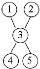

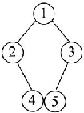

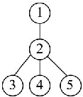

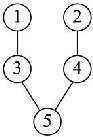

- 5．The passage is mainly about ________.

- A．the importance of childhood
- B．all kinds of sugar paintings
- C．a unique place of sugar paintings in my heart
- D．Chinese culture

### 六、书面表达

1．假如你是李明，本周美术课上老师让大家介绍自己最喜欢的一种艺术形式（如剪纸、皮影戏、绘 画、音乐等），请你写一篇不少于 80 词左右的英语短文，介绍你最喜欢的艺术形式，说明你喜欢它的原因， 并谈谈它的特点。

要求：

- 1. 语句通顺，语意连贯，可适当发挥；
- 2. 至少使用一次 so...that/such...that 句型。 ___________________________________________________________________________________________ ___________________________________________________________________________________________ ___________________________________________________________________________________________ ___________________________________________________________________________________________ ___________________________________________________________________________________________ ___________________________________________________________________________________________ ___________________________________________________________________________________________ ___________________________________________

1．近月，“国潮”文化席卷重庆，无论是磁器口古镇国庆期间的“庙会”，还是校园里的汉服，吟诵古 典诗词，写毛笔字等活动，处处彰显中国传统文化的魅力。学校英语社团正在组织题为“Spreading Traditional Chinese Culture”的征文活动，请你选择一种传统文化的形式，写一篇短文投稿。 要求：

- 1. 注意文字整体性；
- 2. 80—120 词，开头已给出，不计入总词数；
- 3. 文中不能出现自己的姓名和所在学校的名称。

参考信息：calligraphy n.书法，paper-cutting n.剪纸，sugar-painting n.糖画，opera n.京剧

### Spreading Traditional Chinese Culture

Nowadays, with the popularity of Chinese style, more people show great interest in traditional Chinese culture. ___________________________________________________________________________________________ ___________________________________________________________________________________________ ___________________________________________________________________________________________

___________________________________________________________________________________________ ___________________________________________________________________________________________ ___________________________________________________________________________________________ __________________________________________________________________

