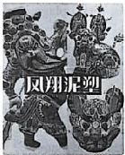

# 2025-2026 学年八年级下册英语单元测试

## Unit1·提升卷

#### 学校:___________班级：___________姓名：___________分数：___________

（考试时间：90 分钟 试卷满分：100 分）

##### 注意： 本卷试题均采用连续编号，所有答案务必按照规定在答题纸上完成，做在练习卷上不给分。

一、语法选择(共 10 分) 根据短文内容，从 A、B、C 三个选项中选出一个语法正确的答案，并把答题卡上对应题目的答案标号涂黑。

On the streets of France, people can often see a pretty Chinese girl. She is playing the guzheng 1 , wearing traditional Chinese hanfu. Her music sounds beautiful. And her performances are very popular 2 the people there. In their eyes, she is famous as a Transcultural Music Ambassador (跨文化音乐使者) there. The 3 name is Peng Jingxuan.

Peng was born in Huaihua, Hunan Province in 1995. She started to learn the guzheng at 4 age of seven. In 2017, Peng graduated ( 毕 业 ) from Wuhan Conservatory of Music. In 2018, she went to France to continue studying music by 5 .

“ 6 I first came to study in France, I found street performances were very common, but few people were playing Chinese musical instruments (乐器). That’s why I took my guzheng to the streets,” said Peng. Many people watched her performance. 7 popular she was!

Since 2018, Peng 8 many countries around Europe to play the guzheng. She expects 9 the traditional Chinese music to more foreigners. “To get more people to know about it, understand it and love it ... is one of 10 wishes of Chinese artists,” she said.

- 1．A．happy B．happily C．happiness
- 2．A．with B．for C．about
- 3．A．girl B．girls C．girl’s
- 4．A．a B．an C．the
- 5．A．her B．herself C．hers
- 6．A．When B．Though C．Because
- 7．A．What B．What a C．How
- 8．A．visits B．visited C．has visited

- 9．A．show B．to show C．showing
- 10．A．big B．bigger C．the biggest

二、选词填空(共 5 分) 阅读下面短文，从方框内的选项中选出可以填入空白处的最佳选项。

|A．by hand B．sounds easy C． ask for help D．such as E. is famous|
|---|

Different parts of China have their own special forms of traditional art, 11 sky lanterns, paper cutting, and Chinese clay art.

According to Chinese history, Zhuge Kongming first used sky lanterns to 12 . But today they are used at festivals and other celebrations and are seen as symbols of happiness and good wishes. They are usually made of bamboo and covered with paper.

Paper cutting 13 , but it can be quite difficult. Chinese clay art 14 for its tiny figures that look very real. The figures usually show cute children or beloved characters from Chinese folk tales or history. They are carefully shaped 15 before drying. Then they are fired at a very high heat, polished and painted. It takes several weeks to complete everything.

###### 三、用单词的适当形式填空（共 8 分）

- 16．By next year, he ________ (learn) art for ten years.
- 17．The ________ (value) of art lies not only in its beauty but also in its spirit.
- 18．The ________ (artist) works are on display in the national museum.
- 19．The ________ (modern) of this art style is very obvious.
- 20．The ________ (meaning) of this artwork is deeply thought-provoking.
- 21．The ________ (skill) of the craftsman is admired by everyone.
- 22．The art exhibition ________ (last) for two weeks next month.
- 23．The ________ (culture) background of the art work is worth studying.

### 四、按要求填写句子，补全对话（每题 2 分，共 10 分） (Amy and Bob are talking about Zootopia 2 after school.)

- A: Hi Bob! I watched Zootopia 2 last weekend. It’s really amazing!
- B: Hi Amy! I’ve been wanting to watch it, but I haven’t had the time. 24 ?（变特殊疑问句）

- A: It’s about Judy and Nick—they help a snake named Gary who was tricked by bad animals, and together they save Zootopia.
- B: That sounds interesting! 25 ?（对划线部分提问）

- A: It’s amazing because Judy and Nick had some conflicts at first, but they learned to listen to each other and work together.

- B: 26 ?（对划线部分提问）

- A: My favorite part is when they sneak into the old factory to get evidence of the bad guys’ plan. It’s so thrilling!

- B: 27 ?（变一般疑问句）

- A: Yes, he does. Gary becomes a hero in the end—he helps fix the traffic system he messed up.
- B: That’s so cool about Gary! 28 ?（变特殊疑问句）

- A: It’s about two hours long—just the right length for a cartoon movie.
- B: Wow! I can’t wait to watch it. 29 ?（表提出建议） A: Sure! Let’s go to the cinema this Saturday afternoon.

### 五、阅读理解 (共 20 分)

- A. (每题 2 分，共 10 分) A-F 分别是六位名人的简介。有五位想借阅名人传记书籍的同学，请为每位同学选择符合他们兴趣的名人简 介，以此帮助他们进一步了解相关信息。

|30 Tom is curious about the universe. His  dream is to be a physicist. He wants to understand how the world works from now on.  31 Linda loves reading and writing. She  dreams of creating her own stories and poems one day and wants to learn from the best.  32 David believes good qualities and   |A．Charlie Chaplin-A great comic actor who brought  people laughter without saying a word in the film. His humor helped people go through hard times.  B．Albert Einstein-One of the greatest scientists of  the 20th century. His theories help us understand how the universe works.  C ． Confucius-An ancient Chinese teacher and |
|---|---|

|moral values are very important. He is looking for a role model who taught about life and wisdom.  33 Sarah enjoys making people laugh and  is a fan of silent movies. She hopes to share her humor by expressing herself.  34 Kevin is very interested in medicine.   He wants to learn how ancient medical scientists helped sick people.|philosopher. He spent his life teaching and sharing wise ideas about life and learning.  D．Li Shizhen-A great medical scientist from ancient China. After years of medical research, he wrote Ben Cao Gang Mu to help and save people.  E. Jane Goodall-A famous expert on animals. She  lived in the forest to study and protect chimpanzees, showing us how to respect animals and nature.  F. William Shakespeare-A great playwright and poet   who wrote over 30 plays and hundreds of poems. His stories teach us about human nature.|
|---|---|

- B.根据短文内容选择最恰当的答案。 (每题 2 分，共 10 分) When we think of art, we probably think of painting a picture on strong cloth or special paper, even on the

walls of a city. However, in many cultures, people paint on their faces instead.

①______ In fact, face painting may be the very first form of art. Painted faces are in different colors and patterns. This

has been part of people’s traditions for thousands of years. The way that people painted their faces can tell stories and lessons from the past.

②______ People still paint their faces for lots of reasons. Patterns on faces connect people to a tribal (部落的) family

and can show who is the most important in the family. For fighters, it is a way to make their enemies afraid. Face painting is also used in many ceremonies and special celebrations.

How is face painting important in theater? Face painting was important in ancient Japanese and Chinese ceremonies. It was also used in traditional

theaters to change the actors’ roles. Actors in those countries still wear white, black, and red face paint today to show feelings and make the bad people look dramatic (戏剧性的) and awful.

③______ Tribal people make face paint from the natural colors in plants and earth. Plant parts are used to make

different colorings. The ingredients are dried over a fire and then made into a powder (粉末). This is then mixed with animal fat. 阅读以上材料，根据其内容回答其后各个小题。

- 35．Match the title with each part.

- a. Is face painting art?
- b. Why do they paint their faces?
- c. Where does the paint come from? A．①-a, ②-b, ③-c B．①-b, ②-a, ③-c C．①-a, ②-c, ③-b D．①-b, ②-c, ③-a

- 36．How long has face painting been part of people’s traditions? A．For a few years. B．For three centuries. C．For about 100 years. D．For thousands of years.
- 37．Why did fighters paint their faces when they fought? A．To look friendly. B．To look scary. C．To look proud. D．To look painful.
- 38．What can we know about face painting?

- A．Painting on the walls is the first form of art.
- B．Animal fat is used to make different colorings.
- C．Patterns on faces can show people’s ages in a family.
- D．Face paint in colors can show actors’ feelings in China.

- 39．Which of the following can be the best title? A．Face Art B．Traditional Painters C．Wall Paintings D．Tribal Celebrations

六、完形填空(共 12 分) Choose the words or expressions and complete the passage (选择最恰当的单词或短语完成短文)

The History and Future of Comic Strips

Have you ever read a comic strip in a newspaper or online? You know, those funny little stories with pictures and speech bubbles? They might seem simple, but comic strips have a rich history and a bright future. Let’s dive into their story and see how they have 40 over time!

Comic strips started over a century ago. At first, they were short, funny stories in newspapers. People loved them because they were easy to read and made them laugh. Early comic strips often had regular 41 who often got into silly situations. These strips became so popular that they helped sell more newspapers.

As time went on, comic strips changed gradually. They weren’t just funny anymore. Some told 42 stories or explored deep themes. Artists experimented with different styles, and new characters were created. Comic strips became a way to entertain people, share ideas and even express opinions on society.

However, in recent years, the comic strip market has become weaker. Fewer people read newspapers, which used to be the main home for comic strips. Many newspapers have reduced the 43 for comics or stopped printing them at all. This has made it harder for artists to earn money from their work. Some people worry that traditional comic strips might disappear, replaced by faster, shorter forms of entertainment like videos.

But don’t worry! Comic strips are still alive! Today, they’ve found a new home. Many artists create digital comic strips and share them 44 . This has made comic strips easier to find than ever. People from all over the world can enjoy them with just a click.

What about the future? Comic strips will likely keep changing. With new technology, we might see more interactive comic strips. Readers can click or swipe to create the story. Some artists use AI to bring their strips to life. The 45 are endless!

So, whether you’re a longtime fan or new to comic strips, there’s something for everyone. What’s your favorite comic strip? Let me know. I’d love to hear about it!

- 40．A．developed B．appeared C．succeeded D．linked
- 41．A．enemies B．readers C．characters D．directors
- 42．A．amusing B．serious C．creative D．essential
- 43．A．cost B．waste C．space D．stress
- 44．A．on the internet B．through magazines C．on TV D．by E-mail
- 45．A．responsibilitiesB．celebrations C．discussions D．possibilities

七、任务型阅读(共 10 分) 请认真阅读下面的短文，并根据短文内容回答问题。

Fengxiang clay figurines are a well-known form of traditional Chinese folk art from Fengxiang County, Shaanxi Province. With a history of thousands of years—dating back to the Neolithic Age, these vivid and colorful sculptures are not only works of art but also an important symbol of Shaanxi’s rich culture, deeply loved by people both at home and abroad.

In the early days, local people used clay to make simple daily tools and objects for worship. As pottery-making skills continued to develop, the art of clay figurine-making slowly took shape. It finally reached its golden age during the Ming and Qing dynasties, becoming popular among common people and widely used in festivals, weddings and other important events to bring joy and good wishes.

Their production process is complex and needs great patience. First, artisans choose high-quality local clay. Next, they knead, pound and filter it to take out impurities (杂质). Then, they shape the clay into lively forms like tigers and historical characters by hand or simple tools. After that, the shaped clay goes through natural drying and high-temperature firing. Finally, the most important step—painting—is carried out, with bold, bright colors to create strong visual contrast.

These clay figurines carry deep cultural meanings. For example, tiger-shaped figurines are believed to drive off evil spirits and bring good luck to families. To protect this valuable traditional art, the local government has set up training centres to teach young people the making skills, while some young artisans are trying new things through mixing traditional styles with modern designs to attract more young people.

- 46．Where are Fengxiang clay figurines from?

- 47．When did Fengxiang clay figurines enter their golden age?

- 48．How many steps are required to make Fengxiang clay figurines?

- 49．What does the local government do to protect Fengxiang clay figurines?

- 50．How can you keep traditional arts like Fengxiang clay figurines alive? （自拟一句话回答）

- 八、书面表达(共 25 分)
- 51．你们学校的英语俱乐部正在举办题为“Art Helps Me Grow”的征文活动。假如你是王林，根据以下内容 提示，写一篇短文投稿。要点如下：

- 1. A teenage problem you once had.
- 2. An art form you tried, and how it helped you with the problem.
- 3. What you have learned from this experience. 注意事项：

- 1. 短文内容须根据以上要点自拟，语句通顺、意义连贯、符合题意；
- 2. 词数不少于 90，开头已给出，不计入总词数；
- 3. 短文中不得出现真实人名、校名等个人信息。 Art Helps Me Grow

Hey, there! I’m Wang Lin. I’d like to share my story about art with you.

____________________________________________________________________________________________ ____________________________________________________________________________________________ ____________________________________________________________________________________________ ____________________________________________________________________________________________ ____________________________________________________________________________________________

