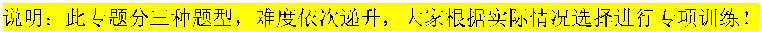
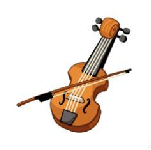

学校:___________姓名：___________班级：___________考号：___________

# Unit 1 Everyone is different

## 重点单词及词性转换进阶练 80 题（三题型）

说明：此专题分三种题型，难度依次递升，大家根据实际情况选择进行专项训练！

一、用单词的适当形式填空，每小题 2 分，满分 40 分

- 1．The peacock has beautiful (feather).
- 2．Without any (doubt), he is a (wisdom) leader.
- 3．The (colour) flowers make the garden look (lovely).
- 4．More and more teenagers are interested in tests. (person)
- 5．My sister is good at (dance) because she practices her (skill) every day.
- 6．Please be aware of the rules before you begin the project. (follow)
- 7．She is a musician who can play several instruments beautifully. (talent)
- 8．The new theme park ride was so that everyone couldn’t stop talking about it. (excite)
- 9．The principal will the winners of the art competition during the school assembly. (announcement)
- 10．Michael has the to get a big prize in the competition. (able)
- 11．She keeps a journal to record her thoughts and experiences.(person)
- 12．Linda enjoys her school life very much. (colour)
- 13．What does the word “mind” in this sentence? (meaning)
- 14．If you keep on reading, you will (success) in the end.
- 15．She (take) some photos in the park tomorrow.
- 16．English is from Chinese. (difference)
- 17．Grandma and I will at the airport in three hours. (arrival)
- 18．After months of regular exercise, she became much (slim) than her sister.
- 19．Listen! The song (sound) so beautiful.
- 20．Her (hobby) include (包括) music and painting.

二、根据首字母填空，每小题 1 分，满分 30 分

- 21．How much does this v cost, Miss?
- 22．You can see an old d under Mr Li’s bed.
- 23．Sorry, I am unable to a your kind invitation. I have to enjoy a musical with my mother.
- 24．It’s impolite (不礼貌的) to l at the people who are in trouble. We should never do that.
- 25．The sweater is not the right s for me. I’d like a bigger one.
- 26．—Why do you like to watch the show?

—Because the h always makes his speech lively (生动的) and interesting.

- 27．I can find s to help me with my homework.
- 28．My parents bought me a lantern in the s of a lovely rabbit to wish me a bright future.
- 29．I like the TV p Readers best. I think we should spend as much time as we can reading books in our free time.
- 30．He is very s and tall with short curly hair.
- 31．The four-year-old girl can count the n from 1 to 100.
- 32．You should keep your back s when you sit on a chair.
- 33．Cooking is an important life s for teenagers.
- 34．The ugly duckling turned into a white s .
- 35．She has a sweet v and loves singing.
- 36．My sister’s h is singing.
- 37．Elephants have very thick s which can protect them.
- 38．She feels sorry that she isn’t able to a her friend’s kind invitation (邀请).
- 39．Today is a s day for me because I will give a talk at school.
- 40．The bird is very proud of its f because they look very beautiful.
- 41．My sister is quieter t me. She doesn’t want to talk with strangers.
- 42．—Do you know where the bank is?

—Sure. Go s and turn left at the first corner. You can find it on your left.

- 43．She is a talented musician, known for her a to play the piano.
- 44．Being creative means trying new things and finding u ways to express oneself.
- 45．This store sells many clothes. They are sweaters, skirts, T-shirts and j .

- 46．Do you know who is the richest p in China in 2023?
- 47．The little girl wants to run after a b in the garden. But it flies away.
- 48．Hi, Fu Xing, w you like to be my friend?
- 49．My dream is to be a hero like Yuan Longping in the f .
- 50．It is w of him to choose to study in a middle school near his home.

三、根据汉语提示填空，每小题 1 分，满分 30 分

- 51．We will (参观) the Great Wall next week.
- 52．I want to buy a pair of (牛仔裤).
- 53．My brother likes playing the (鼓) very much. He wants to be a drummer in the future.
- 54．Their flat is (不同的) from ours.
- 55．It’s great to hear your (声音). How’s everything going there?
- 56．He walked (直接) into the meeting room.
- 57．Don’t worry. I’ll give you my address and phone (号码).
- 58．To have a good life, we should have some life (技能).
- 59．That is a very (特别的) experience for me.
- 60．I saw a beautiful white (天鹅) swim across the lake.
- 61．Wechat is changing our way of life, some people can buy things (没有) paper money.
- 62．—Where is my (小提琴), Steve?

—Oh, it’s on the table.

- 63．The football game was really (令人兴奋的). Everyone was cheering loudly.
- 64．The (数量) of the visitors to the park is becoming larger and larger now.
- 65．The school trip to the amusement park was so (令人兴奋的).
- 66．We Chinese often shake hands and (微笑) when we meet friends.
- 67．The wild geese fly in a V (形状) formation when migrating.
- 68．She said she (将会) help me with my project.
- 69．He always gives us (明智的) advice. He is really a clever person.
- 70．I can’t see (任何事物) because it’s dark here.
- 71．Mary writes better (比) her twin sister Kate.
- 72．We had a great time at the (社团招募展), and made many new friends.

- 73．Don’t (大笑) at the library.
- 74．There are lots of beautiful pictures on these (布告板).
- 75．Look! The students are talking about their (业余爱好) in the classroom.
- 76．— What does Lucy look like?

— She is tall and (苗条的).

- 77．Being (智慧的) with money is more valuable than money.
- 78．Everyone has the (能力) to study and create (创新).
- 79．—Is David in the classroom?

—No, he isn’t. He is in the music (礼堂).

- 80．These cakes come in all (形状) and sizes. Children like to eat them.

