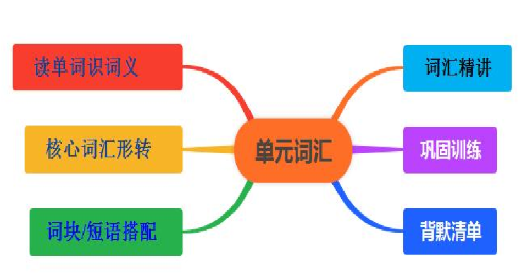

# Unit1 Music 单元词汇讲与练

读单词识词义

||古典的；经典的|
|---|
  |单词（含词性音标）|
|---|
  |中文释义|
|---|
  |单词（含词性音标）|
|---|
  |中文释义|
|---|
  |1. musician /mjuˈzɪʃn/ n.|
|---|
  |音乐家；作曲家|
|---|
  |2. playlist /ˈpleɪlɪst/ n.|
|---|
  |音乐播放清单|
|---|
  |3. download /ˌdaʊnˈləʊd/ v.|
|---|
  |下载|
|---|
  |4. folk /fəʊk/ n.|
|---|
  |民间音乐|
|---|
  |5. classical /ˈklæsɪkl/ adj.|
|---|
  |6. theme /θiːm/ n.|
|---|
  |(乐曲的) 主题，主旋律|
|---|
  |7. beauty /ˈbjuːti/ n.|
|---|
  |美；美丽|
|---|
  |8. lyrics /ˈlɪrɪks/ n.(pl.)|
|---|
  |歌词|
|---|
  |9. jasmine /ˈdʒæzmɪn/ n.|
|---|
  |茉莉|
|---|
  |10. rock /rɒk/ n.|
|---|
  |摇滚乐|
|---|
  |11. pop /pɒp/ n.|
|---|
  |流行音乐|
|---|
  |12. title /ˈtaɪtl/ n.|
|---|
  |(乐曲等的) 名称，标题|
|---|
  |13. popularity /ˌpɒpjuˈlærəti/ n.|
|---|
  |流行|
|---|
  |14. unknown /ˌʌnˈnəʊn/ adj.|
|---|
  |不出名的；无名的|
|---|
  |15. well-known /ˌwel ˈnəʊn/ adj.|
|---|
  |众所周知的|
|---|
  |16. best-known /ˌbest ˈnəʊn/ adj.|
|---|
  |最知名的|
|---|
  |17. melody /ˈmelədi/ n.|
|---|
  |旋律；曲调|
|---|
  |18. preference /ˈprefrəns/ n.|
|---|
  |偏爱；偏好|
|---|
  |19. chorus /ˈkɔːrəs/ n.|
|---|
  |合唱团；歌唱队|
|---|
  |20. charity /ˈtʃærəti/ n.|
|---|
  |慈善|
|---|
|
|---|

||主动提出；自愿给 予|
|---|
  |单词（含词性音标）|
|---|
  |中文释义|
|---|
  |单词（含词性音标）|
|---|
  |中文释义|
|---|
  |21. choose /tʃuːz/ v.|
|---|
  |选择；挑选|
|---|
  |22. actually /ˈæktʃuəli/ adv.|
|---|
  |的确；真实地；事实上|
|---|
  |23. raise /reɪz/ v.|
|---|
  |提升；筹集|
|---|
  |24. homeless /ˈhəʊmləs/ adj.|
|---|
  |无家的|
|---|
  |25. stutter /ˈstʌtə(r)/ n.&v.|
|---|
  |口吃；结巴|
|---|
  |26. smoothly /ˈsmuːðli/ adv.|
|---|
  |连续而流畅地|
|---|
  |27. silent /ˈsaɪlənt/ adj.|
|---|
  |不说话的；沉默的|
|---|
  |28. advise /ədˈvaɪz/ v.|
|---|
  |劝告；忠告；建议|
|---|
  |29. rhythm /ˈrɪðəm/ n.|
|---|
  |节奏；韵律|
|---|
  |30. calmly /ˈkɑːmli/ adv.|
|---|
  |沉着地|
|---|
  |31. shy /ʃaɪ/ adj.|
|---|
  |羞怯的；腼腆的|
|---|
  |32. relax /rɪˈlæks/ v.|
|---|
  |放松；休息|
|---|
  |33. gain /ɡeɪn/ v.|
|---|
  |获得；得到|
|---|
  |34. confidence /ˈkɒnfɪdəns/ n.|
|---|
  |信心；信任|
|---|
  |35. courage /ˈkʌrɪdʒ/ n.|
|---|
  |勇气|
|---|
  |36. solo /ˈsəʊləʊ/ n.|
|---|
  |独唱；独奏|
|---|
  |37. describe /dɪˈskraɪb/ v.|
|---|
  |描述；形容|
|---|
  |38. recommendation /ˌrekəmenˈdeɪʃn/ n.|
|---|
  |正式建议；提议|
|---|
  |39. offer /ˈɒfə(r)/ v.|
|---|
  |40. widely /ˈwaɪdli/ adv.|
|---|
  |普遍地；广泛地|
|---|
  |41. spirit /ˈspɪrɪt/ n.|
|---|
  |精神；心灵|
|---|
  |42. athlete /ˈæθliːt/ n.|
|---|
  |运动员|
|---|
  |43. both...and...|
|---|
  |不仅…… 而 且……|
|---|
  |44. not only...but also...|
|---|
  |不仅…… 而且……|
|---|
  |45. what’s more|
|---|
  |而且；另外|
|---|
  |—|
|---|
  |—|
|---|
|
|---|

## 核心词汇形转

||原词|
|---|
  |词性|
|---|
  |转换形式|
|---|
  |释义 / 用法|
|---|
  |例句 / 搭配|
|---|
  |advise|
|---|
  |v. 建议|
|---|
  |advice (n. 建议)|
|---|
  |名词：不可数名 词，“忠告；建议”|
|---|
  |He gave me some useful advice on learning music.|
|---|
|
|---|

||calm (adj. 冷静的； v. 使平静)|
|---|
  |原词|
|---|
  |词性|
|---|
  |转换形式|
|---|
  |释义 / 用法|
|---|
  |例句 / 搭配|
|---|
  |choose|
|---|
  |v. 选择|
|---|
  |choice (n. 选择)|
|---|
  |名词：“选择；抉 择”|
|---|
  |It’s a difficult choice between pop music and classical music.|
|---|
  |popularity|
|---|
  |n. 流行|
|---|
  |popular (adj. 流行 的)|
|---|
  |形容词：“受欢迎 的；流行的”|
|---|
  |This folk song is very popular among young people.|
|---|
  |unknown|
|---|
  |adj. 无名的|
|---|
  |known (adj. 知名的)|
|---|
  |反义词：“已知 的；知名的”，常 用搭配 be known for （因…… 闻名）|
|---|
  |The singer was unknown last year, but now she is well-known.|
|---|
  |well-known|
|---|
  |adj. 众所周 知的|
|---|
  |better-known (比较 级)；best-known (最 高级)|
|---|
  |形容词比较级 / 最高级：“更知名 的”；“最知名的”|
|---|
  |Beethoven is one of the best-known composers in the world.|
|---|
  |smoothly|
|---|
  |adv. 流畅地|
|---|
  |smooth (adj. 流畅 的；光滑的)|
|---|
  |形容词：“平滑 的；流畅的”|
|---|
  |The melody of this song is smooth and beautiful.|
|---|
  |calmly|
|---|
  |adv. 沉着地|
|---|
  |形容词 / 动词： “冷静的”；“使平 静”|
|---|
  |She stayed calm when she forgot the lyrics and sang calmly.|
|---|
  |widely|
|---|
  |adv. 广泛地|
|---|
  |wide (adj. 宽的； adv. 宽阔地)|
|---|
  |形容词 / 副词： “宽的”；“充分地”|
|---|
  |This classical piece is widely played in concerts.|
|---|
  |silent|
|---|
  |adj. 沉默的|
|---|
  |silence (n. 沉默；v. 使沉默)|
|---|
  |名词 / 动词：“沉 默”；“使安静”|
|---|
  |He broke the silence by playing a solo on the violin.|
|---|
  |relax|
|---|
  |v. 放松|
|---|
  |relaxed (adj. 感到放 松的)；relaxing (adj. 令人放松的)；  relaxation (n. 放松)|
|---|
  |-ed 形容词：描述 人的感受；-ing 形容词：描述事 物性质；名词： “放松”|
|---|
  |Listening to classical music is relaxing, and we feel relaxed after listening. Reading is a good way of relaxation.|
|---|
  |confidence|
|---|
  |n. 信心|
|---|
  |confident (adj. 自信|
|---|
  |形容词：“自信|
|---|
  |She is confident in her solo performance|
|---|
|
|---|

||gain (n. 收获；利益)|
|---|
  |原词|
|---|
  |词性|
|---|
  |转换形式|
|---|
  |释义 / 用法|
|---|
  |例句 / 搭配|
|---|
  |的)|
|---|
  |的”，搭配 be confident in （对…… 自信）|
|---|
  |because she has enough confidence.|
|---|
  |courage|
|---|
  |n. 勇气|
|---|
  |courageous (adj. 勇 敢的)|
|---|
  |形容词：“勇敢 的”|
|---|
  |It’s courageous of him to sing in front of thousands of people with his stutter.|
|---|
  |describe|
|---|
  |v. 描述|
|---|
  |description (n. 描述)|
|---|
  |名词：“描述；描 写”|
|---|
  |Can you give a detailed description of your favorite melody?|
|---|
  |recommend ation|
|---|
  |n. 建议|
|---|
  |recommend (v. 推 荐；建议)|
|---|
  |动词：“推荐”， 搭配 recommend doing sth.（建议 做某事）|
|---|
  |The music teacher recommended listening to more folk music.|
|---|
  |athlete|
|---|
  |n. 运动员|
|---|
  |athletic (adj. 运动 的；健壮的)|
|---|
  |形容词：“运动 的；体格健壮的”|
|---|
  |The athletic boy not only likes sports but also has a talent for music.|
|---|
  |gain|
|---|
  |v. 获得|
|---|
  |名词：“所得；利 益”|
|---|
  |She gained a lot of confidence from the music competition, and the gain is more than just a prize.|
|---|
|
|---|

## 词块/短语搭配

||序 号|
|---|
  |短语或句型|
|---|
  |意思|
|---|
  |例句|
|---|
  |1|
|---|
  |folk music|
|---|
  |民间音乐|
|---|
  |My grandma likes listening to folk music in her free time. 我奶 奶空闲时喜欢听民间音乐。|
|---|
  |2|
|---|
  |classical music|
|---|
  |古典音乐|
|---|
  |Many people think classical music is full of beauty. 很多人认为 古典音乐充满美感。|
|---|
  |3|
|---|
  |rock music|
|---|
  |摇滚乐|
|---|
  |Rock music usually has a strong rhythm. 摇滚乐通常有强烈的|
|---|
|
|---|

||Do you know the title of this classical piece? 你知道这首古典 乐曲的标题吗？|
|---|
  |序 号|
|---|
  |短语或句型|
|---|
  |意思|
|---|
  |例句|
|---|
  |节奏。|
|---|
  |4|
|---|
  |pop music|
|---|
  |流行音乐|
|---|
  |Pop music enjoys great popularity among teenagers. 流行音乐 在青少年中非常受欢迎。|
|---|
  |5|
|---|
  |music playlist|
|---|
  |音乐播放清 单|
|---|
  |I made a playlist of my favorite songs for the trip. 我为这次旅 行制作了一个喜爱歌曲的播放清单。|
|---|
  |6|
|---|
  |download music|
|---|
  |下载音乐|
|---|
  |You can download music from this app for free. 你可以从这个 应用免费下载音乐。|
|---|
  |7|
|---|
  |the theme of the song|
|---|
  |歌曲的主旋 律|
|---|
  |The theme of this song is about friendship. 这首歌的主旋律是 关于友谊的。|
|---|
  |8|
|---|
  |beautiful lyrics|
|---|
  |优美的歌词|
|---|
  |I often memorize songs with beautiful lyrics. 我经常记住歌词 优美的歌曲。|
|---|
  |9|
|---|
  |jasmine flower|
|---|
  |茉莉花|
|---|
  |The song "Jasmine Flower" is a famous folk song. 《茉莉花》是 一首著名的民间歌曲。|
|---|
  |10|
|---|
  |the title of the piece|
|---|
  |乐曲的标题|
|---|
  |11|
|---|
  |solo performance|
|---|
  |独奏；独唱 表演|
|---|
  |She gave a wonderful solo performance at the concert. 她在音乐 会上进行了精彩的独奏表演。|
|---|
  |12|
|---|
  |chorus singing|
|---|
  |合唱|
|---|
  |The chorus singing at the charity event moved everyone. 慈善活 动上的合唱感动了所有人。|
|---|
  |13|
|---|
  |charity event|
|---|
  |慈善活动|
|---|
  |They held a music concert as a charity event to raise money. 他 们举办了一场音乐会作为慈善活动来筹款。|
|---|
  |14|
|---|
  |raise money|
|---|
  |筹集资金|
|---|
  |The musicians raised a lot of money for homeless people. 音乐 家们为无家可归的人筹集了很多资金。|
|---|
  |15|
|---|
  |homeless people|
|---|
  |无家可归的 人|
|---|
  |We should show kindness to homeless people. 我们应该对无家 可归的人表示善意。|
|---|
  |16|
|---|
  |speak smoothly|
|---|
  |说话流畅|
|---|
  |After practicing a lot, he can speak smoothly without stuttering.|
|---|
|
|---|

||She gained confidence through every music competition. 她通过 每次音乐比赛获得了信心。|
|---|
  |序 号|
|---|
  |短语或句型|
|---|
  |意思|
|---|
  |例句|
|---|
  |经过大量练习，他可以不结巴地流畅说话。|
|---|
  |17|
|---|
  |remain silent|
|---|
  |保持沉默|
|---|
  |She remained silent when asked about her preference for music. 当被问及音乐偏好时，她保持沉默。|
|---|
  |18|
|---|
  |advise sb. to do sth.|
|---|
  |建议某人做 某事|
|---|
  |The teacher advised me to listen to more classical music to relax. 老师建议我多听古典音乐来放松。|
|---|
  |19|
|---|
  |the rhythm of the music|
|---|
  |音乐的节奏|
|---|
  |Dancers usually follow the rhythm of the music. 舞者通常跟着 音乐的节奏跳舞。|
|---|
  |20|
|---|
  |act calmly|
|---|
  |沉着行事|
|---|
  |Even when the microphone broke, the singer acted calmly. 即使 麦克风坏了，这位歌手也沉着行事。|
|---|
  |21|
|---|
  |shy of speaking|
|---|
  |羞于开口|
|---|
  |The shy girl was shy of speaking in public but sang bravely. 这 个腼腆的女孩羞于在公众面前说话，但勇敢地唱了歌。|
|---|
  |22|
|---|
  |relax oneself|
|---|
  |放松自己|
|---|
  |Listening to soft music helps us relax oneself after work. 听轻音 乐有助于我们下班后放松自己。|
|---|
  |23|
|---|
  |gain confidence|
|---|
  |获得信心|
|---|
  |24|
|---|
  |the courage to do sth.|
|---|
  |做某事的勇 气|
|---|
  |He has the courage to perform solo in front of a large crowd. 他 有勇气在大批观众面前进行独奏表演。|
|---|
  |25|
|---|
  |describe...as...|
|---|
  |把…… 描 述为……|
|---|
  |People describe this melody as "the sound of nature". 人们把这 段旋律描述为 “大自然的声音”。|
|---|
  |26|
|---|
  |give a recommendation|
|---|
  |给出建议|
|---|
  |Can you give me a recommendation for good folk music? 你能 给我推荐一些好听的民间音乐吗？|
|---|
  |27|
|---|
  |offer help|
|---|
  |主动提供帮 助|
|---|
  |The musician offered help to young singers who just started. 这 位音乐家主动帮助刚起步的年轻歌手。|
|---|
  |28|
|---|
  |not only...but also...|
|---|
  |不仅…… 而且……|
|---|
  |He not only plays the piano well but also writes his own lyrics. 他不仅钢琴弹得好，还自己写歌词。|
|---|
  |29|
|---|
  |both...and...|
|---|
  |不仅……|
|---|
  |Both pop music and classical music have their own beauty. 流行|
|---|
|
|---|

||This singer is known for her unique voice and moving lyrics. 这 位歌手因她独特的嗓音和动人的歌词而闻名。|
|---|
  |序 号|
|---|
  |短语或句型|
|---|
  |意思|
|---|
  |例句|
|---|
  |而且……|
|---|
  |音乐和古典音乐都有各自的美感。|
|---|
  |30|
|---|
  |what’s more|
|---|
  |而且；另外|
|---|
  |This song is catchy, and what’s more, its lyrics are meaningful. 这首歌很 catchy，而且歌词很有意义。|
|---|
  |31|
|---|
  |widely known|
|---|
  |众所周知的|
|---|
  |It is widely known that Mozart was a child prodigy in music. 众 所周知，莫扎特是音乐神童。|
|---|
  |32|
|---|
  |sports spirit|
|---|
  |体育精神|
|---|
  |Athletes should have the sports spirit of never giving up. 运动员 应该有永不放弃的体育精神。|
|---|
  |33|
|---|
  |musical spirit|
|---|
  |音乐精神|
|---|
  |The musical spirit of this composer inspires many young musicians. 这位作曲家的音乐精神激励着许多年轻音乐家。|
|---|
  |34|
|---|
  |have a preference for|
|---|
  |偏爱……|
|---|
  |She has a preference for jazz music over pop music. 比起流行 音乐，她更偏爱爵士乐。|
|---|
  |35|
|---|
  |break the silence|
|---|
  |打破沉默|
|---|
  |The sound of the violin broke the silence of the night. 小提琴的 声音打破了夜晚的寂静。|
|---|
  |36|
|---|
  |be known for|
|---|
  |因…… 而 闻名|
|---|
  |37|
|---|
  |solo singer|
|---|
  |独唱歌手|
|---|
  |The solo singer received a lot of applause after her performance. 这位独唱歌手表演后获得了热烈的掌声。|
|---|
  |38|
|---|
  |charity donation|
|---|
  |慈善捐赠|
|---|
  |All the money from the concert is used for charity donation. 音 乐会的所有收入都用于慈善捐赠。|
|---|
  |39|
|---|
  |relaxing music|
|---|
  |令人放松的 音乐|
|---|
  |I like to listen to relaxing music before going to bed. 我喜欢睡 前听令人放松的音乐。|
|---|
  |40|
|---|
  |confident in|
|---|
  |对…… 有 信心|
|---|
  |He is confident in his ability to win the music competition. 他对 自己赢得音乐比赛的能力有信心。|
|---|
|
|---|

## 重点词汇精讲

- 1. musician /mjuˈzɪʃn/ n. 释义：音乐家；作曲家例句：Beethoven is a great musician who created many classic works.（贝多芬是一位伟 大的音乐家，创作了许多经典作品。） 搭配：a famous musician（著名音乐家）；a folk musician（民间音乐家）；a classical musician（古典音乐家）
- 2. playlist /ˈpleɪlɪst/ n. 释义：音乐播放清单例句：I sorted out my favorite songs and made a playlist for the long drive.（我整理了喜爱 的歌曲，为长途驾驶做了一个播放清单。） 搭配：create a playlist（创建播放清单）；edit a playlist（编辑播放清单）；a travel playlist（旅行播放清单）
- 3. download /ˌdaʊnˈləʊd/ v. 释义：下载例句：You can download this music app for free and listen to millions of songs.（你可以免费下载这 个音乐应用，收听数百万首歌曲。） 搭配：download music/songs（下载音乐 / 歌曲）；download from the Internet（从网上下载）；download files （下载文件）
- 4. classical /ˈklæsɪkl/ adj. 释义：古典的；经典的例句：Classical music has a long history and is loved by people of all ages.（古典音乐历 史悠久，受到各年龄段人们的喜爱。） 拓展：classical music（古典音乐）；classical literature（古典文学）；classical art（古典艺术），与 pop music （流行音乐）、rock music（摇滚乐）形成音乐类型对比。
- 5. lyrics /ˈlɪrɪks/ n. (pl.) 释义：歌词例句：The lyrics of this song are so touching that many people cry when listening to it.（这首歌的歌 词非常感人，很多人听的时候都哭了。） 搭配：memorize the lyrics（记歌词）；write lyrics（写歌词）；beautiful lyrics（优美的歌词）
- 6. melody /ˈmelədi/ n. 释义：旋律；曲调例句：The melody of this folk song is simple but beautiful, and it’s easy to sing.（这首民歌的 旋律简单而优美，很容易唱。） 搭配：a catchy melody（朗朗上口的旋律）；the melody of a song（歌曲的旋律）；hum the melody（哼唱旋 律）

- 7. charity /ˈtʃærəti/ n. 释义：慈善例句：Many musicians hold concerts for charity to help those in need.（许多音乐家举办慈善音乐会 来帮助有需要的人。） 搭配：charity event（慈善活动）；charity concert（慈善音乐会）；charity donation（慈善捐赠）；do charity （做慈善）
- 8. choose /tʃuːz/ v. (chose, chosen) 释义：选择；挑选例句：It’s hard to choose between the two playlists because both have great songs.（在两个播 放清单之间很难选择，因为都有很棒的歌曲。） 搭配：choose to do sth.（选择做某事）；choose between A and B（在 A 和 B 之间选择）；choose as（选 为）；make a choice（做选择，名词形式）
- 9. raise /reɪz/ v. 释义：提升；筹集例句：The students raised a lot of money for homeless children by singing in the street.（学生 们通过在街上唱歌为无家可归的孩子筹集了很多钱。） 拓展：常见含义①“筹集”，搭配 raise money/funds（筹款）；②“提升”，如 raise one’s voice（提高声音）；

③“举起”，如 raise hands（举手）。

- 10. homeless /ˈhəʊmləs/ adj. 释义：无家的例句：The charity organization provides food and shelter for homeless people.（慈善组织为无家可 归的人提供食物和住所。） 派生：homelessness n. 无家可归；相关表达：homeless children（无家可归的孩子）；a homeless shelter（收 容所）
- 11. advise /ədˈvaɪz/ v. 释义：劝告；忠告；建议例句：My music teacher advised me to practice the piano for an hour every day.（我的 音乐老师建议我每天练习一小时钢琴。） 搭配：advise sb. to do sth.（建议某人做某事）；advise doing sth.（建议做某事）；advise sb. against doing sth. （建议某人不要做某事）词转：advice n. 建议（不可数名词），如 give advice（提建议）
- 12. relax /rɪˈlæks/ v. 释义：放松；休息例句：Listening to soft classical music helps me relax after a busy day.（忙碌一天后，听轻柔 的古典音乐能帮助我放松。） 词转：relaxed adj. 感到放松的（主语为人）；relaxing adj. 令人放松的（主语为事物）；relaxation n. 放松 搭配：relax oneself（放松自己）；relax in the sun（在阳光下放松）；a relaxing holiday（令人放松的假期）

- 13. gain /ɡeɪn/ v. 释义：获得；得到例句：She gained a lot of confidence through participating in music competitions.（通过参加 音乐比赛，她获得了很多信心。） 搭配：gain confidence（获得信心）；gain experience（获得经验）；gain success（获得成功）；gain knowledge （获得知识）
- 14. confidence /ˈkɒnfɪdəns/ n. 释义：信心；信任例句：With the support of her family, she has the confidence to perform solo on stage.（在家 人的支持下，她有信心在舞台上进行独奏表演。） 搭配：have confidence in（对…… 有信心）；build up confidence（建立信心）；lose confidence（失去信心）； full of confidence（充满信心）词转：confident adj. 自信的
- 15. courage /ˈkʌrɪdʒ/ n. 释义：勇气例句：It takes a lot of courage to sing in front of thousands of people, especially if you have a stutter. （在数千人面前唱歌需要很大的勇气，尤其是如果你有口吃的话。） 搭配：have the courage to do sth.（有做某事的勇气）；take courage（鼓起勇气）；show courage（展现勇气） 词转：courageous adj. 勇敢的
- 16. solo /ˈsəʊləʊ/ n. 释义：独唱；独奏例句：The violin solo at the end of the concert was unforgettable.（音乐会结尾的小提琴独奏 令人难忘。） 搭配：a piano solo（钢琴独奏）；a vocal solo（声乐独唱）；solo performance（独奏 / 独唱表演）
- 17. describe /dɪˈskraɪb/ v. 释义：描述；形容例句：Can you describe the melody of that song in your own words?（你能用自己的话描述那 首歌的旋律吗？） 搭配：describe...as...（把…… 描述为……）；describe in detail（详细描述）；describe the scene（描述场景） 词转：description n. 描述
- 18. offer /ˈɒfə(r)/ v. 释义：主动提出；自愿给予例句：The famous musician offered to teach the homeless children to play musical instruments for free.（这位著名的音乐家主动提出免费教无家可归的孩子演奏乐器。） 搭配：offer to do sth.（主动提出做某事）；offer help（提供帮助）；offer sth. to sb.（向某人提供某物）
- 19. spirit /ˈspɪrɪt/ n.

- 释义：精神；心灵例句：The spirit of never giving up in his music inspires many young people.（他音乐中永不 放弃的精神激励着许多年轻人。） 搭配：sports spirit（体育精神）；musical spirit（音乐精神）；the spirit of teamwork（团队精神）；in spirit （在精神上）
- 20. athlete /ˈæθliːt/ n. 释义：运动员例句：This athlete not only excels in sports but also has a talent for playing the guitar.（这位运动员 不仅在体育方面出色，还在弹吉他方面有天赋。） 搭配：a professional athlete（职业运动员）；an Olympic athlete（奥运运动员）；sports athlete（体育运动员） 词转：athletic adj. 运动的；健壮的
- 21. well-known /ˌwel ˈnəʊn/ adj. 释义：众所周知的例句：Mozart is a well-known composer who started composing music at a very young age.（莫 扎特是一位众所周知的作曲家，很小就开始创作音乐。） 搭配：be well-known for（因…… 而闻名）；be well-known as（作为…… 而闻名）比较级 / 最高级： better-known（更知名的）；best-known（最知名的）
- 22. rhythm /ˈrɪðəm/ n. 释义：节奏；韵律例句：Rock music is famous for its strong and exciting rhythm.（摇滚乐以其强烈而令人兴奋 的节奏而闻名。） 搭配：the rhythm of the music（音乐的节奏）；follow the rhythm（跟着节奏）；a fast/slow rhythm（快 / 慢 节奏）
- 23. beauty /ˈbjuːti/ n. 释义：美；美丽例句：The beauty of classical music lies in its deep emotion and elegant melody.（古典音乐的美 在于其深沉的情感和优美的旋律。） 搭配：the beauty of nature（自然之美）；the beauty of music（音乐之美）；inner beauty（内在美）
- 24. stutter /ˈstʌtə(r)/ n.&v. 释义：口吃；结巴例句：He used to stutter when speaking, but now he can sing smoothly.（他以前说话结巴， 但现在唱歌很流畅。） 搭配：have a stutter（有口吃）；stutter when speaking（说话结巴）
- 25. preference /ˈprefrəns/ n. 释义：偏爱；偏好例句：Everyone has their own preference for music—some like pop, others like folk.（每个人 对音乐都有自己的偏好 —— 有些人喜欢流行音乐，有些人喜欢民间音乐。）

搭配：have a preference for（偏爱……）；personal preference（个人偏好）；music preference（音乐偏好）

## 词汇巩固训练

一：根据汉语释义，写出英文单词、音标及词性（基础默写） 要求：完整写出单词、国际音标和词性，每空 1 分，共 10 分

- 1. 音乐家；作曲家 ________________________
- 2. 音乐播放清单 ________________________
- 3. 下载 ________________________
- 4. 古典的；经典的 ________________________
- 5. 歌词 ________________________
- 6. 旋律；曲调 ________________________
- 7. 慈善 ________________________
- 8. 选择；挑选 ________________________
- 9. 无家的 ________________________
- 10. 信心；信任 ________________________

二：单项选择题（词义辨析 + 固定搭配） 要求：从 A、B、C、D 中选出最佳答案，将序号填在括号内，每小题 1 分，共 10 分

- 1. Beethoven is one of the world’s __________ composers, and his works are still popular today. ( )A. well-known B. unknown C. shy D. homeless
- 2. I need to __________ some folk music for my grandmother’s birthday party. ( )A. raise B. download C. choose D. offer
- 3. The __________ of this song is so catchy that I can’t stop humming it. ( )A. lyrics B. title C. melody D. rhythm
- 4. Many stars hold concerts to __________ money for poor children in rural areas. ( )A. gain B. raise C. choose D. advise
- 5. Listening to classical music is __________, and it helps me calm down after work. ( )A. relaxing B. relaxed C. exciting D. excited

- 6. My teacher __________ me to practice singing every morning to improve my voice. ( )A. describes B. offers C. advises D. gains
- 7. She has a __________ for jazz music, and she collects many jazz CDs. ( )A. preference B. confidence C. courage D. spirit
- 8. It takes great __________ to perform solo in front of thousands of people. ( )A. beauty B. rhythm C. stutter D. courage
- 9. This singer is __________ for her unique voice and moving lyrics. ( )A. known as B. well-known for C. famous to D. good at
- 10. __________ pop music __________ classical music has its own charm; I like both. ( )A. Either; or B. Neither; nor C. Both; and D. Not only; but also

三：用所给单词的适当形式填空（词性转换专项） 要求：根据句意变换单词形式，每空 1 分，共 10 分

- 1. My brother wants to be a __________ (music) when he grows up.
- 2. She gave me some useful __________ (advise) on how to choose music for the party.
- 3. This is a __________ (relax) song that can help you sleep better.
- 4. After the competition, she became more __________ (confidence) in her singing.
- 5. It’s __________ (courage) of him to face his stutter and sing in public.
- 6. Can you give a detailed __________ (describe) of your favorite music style?
- 7. Pop music is very __________ (popularity) among teenagers around the world.
- 8. He speaks more __________ (smooth) than before after a lot of practice.
- 9. The __________ (choose) between the two playlists is really difficult for me.
- 10. We should show kindness to __________ (home) people and help them as much as possible.

四：英汉互译（单词 + 短语 + 短句） 要求：精准翻译，每空 1 分，共 10 分

- 1. 流行音乐 ________________________
- 2. 独奏；独唱 ________________________
- 3. 筹款 ________________________
- 4. 对…… 有信心 ________________________

- 5. 不仅…… 而且…… ________________________
- 6. chorus /ˈkɔːrəs/ n. ________________________
- 7. actually /ˈæktʃuəli/ adv. ________________________
- 8. spirit /ˈspɪrɪt/ n. ________________________
- 9. classical music ________________________
- 10. have a preference for ________________________

五：语境选词填空（从词库选词，可变形） 要求：每词限用一次，必要时变换形式，每空 1 分，共 10 分

||musician, playlist, download, choose, raise, confident, courage, solo, describe, popular|
|---|
|
|---|

- 1. I spent an hour making a __________ of my favorite English songs.
- 2. Many young people like to __________ music from the Internet for free.
- 3. She is a talented __________ who can play both the piano and the violin.
- 4. We need to __________ more money to help the homeless children.
- 5. It’s hard to __________ which song to sing at the school concert.
- 6. He has the courage to perform a __________ in front of the whole school.
- 7. The singer feels __________ about her performance because she practiced a lot.
- 8. This folk song is very __________ in the countryside.
- 9. Can you __________ what your favorite melody sounds like?
- 10. With the support of her family and teachers, the shy girl finally found the __________ to sing in public.

## 背默清单

|序号|词汇|音标|词性|中文释义|
|---|---|---|---|---|
|1|confident|/'kɒnfɪdənt/|adj.| |
|2|recommendation|/rekəmen'deɪʃn/|n.| |
|3|offer|/'ɒfə(r)/|v.| |

|4|what's more| | | |
|---|---|---|---|---|
|5|widely|/'waɪdli/|adv.| |
|6|spirit|/'spɪrɪt/|n.| |
|7|athlete|/'æθli:t/|n.| |
|8|beauty|/'bju:ti/|n.| |
|9|lyrics|/'lɪrɪks/|n.| |
|10|jasmine|/ˈdʒæzmɪn/|n.| |
|11|rock|/rɒk/|n.| |
|12|pop|/pɒp/|n.| |
|13|title|/'taɪtl/|n.| |
|14|popularity|/pɒpju'lærəti/|n.| |
|15|unknown|/ʌn'nəun/|adj.| |
|16|well-known| |adj.| |
|17|both...and...| | | |
|18|best-known| |adj.| |
|19|melody|/'melədi/|n.| |
|20|preference|/'prefrəns/|n.| |
|21|chorus|/'kɔ:rəs/|n.| |
|22|charity|/'tʃærəti/|n.| |
|23|choose|/tʃu:z/|v.| |
|24|actually|/'æktʃuəli/|adv.| |
|25|raise|/reɪz/|v.| |
|26|homeless|/'həumləs/|adj.| |
|27|stutter|/'stʌtə(r)/|n. & v| |
|28|smoothly|/'smu:ðli/|adv.| |
|29|silent|/'saɪlənt/|adj.| |
|30|advise|/əd'vaɪz/|v.| |
|31|not only...but also...| | | |
|32|rhythm|/'rɪðəm/|n.| |

|33|calmly|/'kɑ:mli/|adv.| |
|---|---|---|---|---|
|34|shy|/ʃaɪ/|adj.| |
|35|relax|/rɪ'læks/|v.| |
|36|gain|/ɡeɪn/|v.| |
|37|confidence|/'kɒnfɪdəns/|n.| |
|38|courage|/'kʌrɪdʒ/|n.| |
|39|solo|/'səuləu/|n.| |
|40|describe|/dɪ'skraɪb/|v.| |
|41|musician|/mju'zɪʃn/|n.| |
|42|playlist|/'pleɪlɪst/|n.| |
|43|video|/'vɪdiəu/|n.| |
|44|download|/daun'ləud/|v.| |
|45|folk|/fəuk/|n.| |
|46|classical|/'klæsɪkl/|adj.| |
|47|theme|/θi:m/|n.| |

|序号|词汇|音标|词性|中文释义|
|---|---|---|---|---|
|1| |/'kɒnfɪdənt/|adj.|自信的；有自信心的|
|2| |/rekəmen'deɪʃn/|n.|正式建议；提议|
|3| |/'ɒfə(r)/|v.|主动提出；自愿给予|
|4| | | |而且；另外|
|5| |/'waɪdli/|adv.|普遍地；广泛地|
|6| |/'spɪrɪt/|n.|精神；心灵|
|7| |/'æθli:t/|n.|运动员|
|8| |/'bju:ti/|n.|美；美丽|
|9| |/'lɪrɪks/|n.|歌词|
|10| |/ˈdʒæzmɪn/|n.|茉莉|
|11| |/rɒk/|n.|摇滚乐|
|12| |/pɒp/|n.|流行音乐|

|13| |/'taɪtl/|n.|(乐曲等的)名称，标题，题目|
|---|---|---|---|---|
|14| |/pɒpju'lærəti/|n.|流行|
|15| |/ʌn'nəun/|adj.|不出名的；无名的|
|16| | |adj.|众所周知的|
|17| | | |不仅……而且……|
|18| | |adj.|最知名的|
|19| |/'melədi/|n.|旋律；曲调|
|20| |/'prefrəns/|n.|偏爱；偏好|
|21| |/'kɔ:rəs/|n.|合唱团；歌唱队|
|22| |/'tʃærəti/|n.|慈善|
|23| |/tʃu:z/|v.|选择；挑选|
|24| |/'æktʃuəli/|adv.|的确；真实地；事实上|
|25| |/reɪz/|v.|提升；筹集|
|26| |/'həumləs/|adj.|无家的|
|27| |/'stʌtə(r)/|n. & v|口吃；结巴|
|28| |/'smu:ðli/|adv.|连续而流畅地|
|29| |/'saɪlənt/|adj.|不说话的；沉默的|
|30| |/əd'vaɪz/|v.|劝告；忠告；建议|
|31| | | |不仅……而且……|
|32| |/'rɪðəm/|n.|节奏；韵律|
|33| |/'kɑ:mli/|adv.|沉着地|
|34| |/ʃaɪ/|adj.|羞怯的；腼腆的|
|35| |/rɪ'læks/|v.|放松；休息|
|36| |/ɡeɪn/|v.|增加；增添|
|37| |/'kɒnfɪdəns/|n.|信心；信任|
|38| |/'kʌrɪdʒ/|n.|勇气|
|39| |/'səuləu/|n.|独唱；独奏|
|40| |/dɪ'skraɪb/|v.|描述；形容|
|41| |/mju'zɪʃn/|n.|音乐家；作曲家|

|42| |/'pleɪlɪst/|n.|音乐播放清单|
|---|---|---|---|---|
|43| |/'vɪdiəu/|n.|音乐短片；视频|
|44| |/daun'ləud/|v.|下载|
|45| |/fəuk/|n.|民间音乐|
|46| |/'klæsɪkl/|adj.|古典的；经典的|
|47| |/θi:m/|n.|(乐曲的)主题，主旋律|

### （一）核心名词（20 个）

||/rɒk/|
|---|
  |单词|
|---|
  |音标|
|---|
  |释义|
|---|
  |/mjuˈzɪʃn/|
|---|
  |n. 音乐家；作曲家|
|---|
  |/ˈpleɪlɪst/|
|---|
  |n. 音乐播放清单|
|---|
  |/fəʊk/|
|---|
  |n. 民间音乐|
|---|
  |/θiːm/|
|---|
  |n. (乐曲的) 主题，主旋律|
|---|
  |/ˈbjuːti/|
|---|
  |n. 美；美丽|
|---|
  |/ˈlɪrɪks/|
|---|
  |n. (pl.) 歌词|
|---|
  |/ˈdʒæzmɪn/|
|---|
  |n. 茉莉|
|---|
  |n. 摇滚乐|
|---|
  |/pɒp/|
|---|
  |n. 流行音乐|
|---|
  |/ˈtaɪtl/|
|---|
  |n. (乐曲等的) 名称，标题|
|---|
  |/ˌpɒpjuˈlærəti/|
|---|
  |n. 流行|
|---|
  |/ˈmelədi/|
|---|
  |n. 旋律；曲调|
|---|
  |/ˈprefrəns/|
|---|
  |n. 偏爱；偏好|
|---|
  |/ˈkɔːrəs/|
|---|
  |n. 合唱团；歌唱队|
|---|
  |/ˈtʃærəti/|
|---|
  |n. 慈善|
|---|
  |/ˈrɪðəm/|
|---|
  |n. 节奏；韵律|
|---|
  |/ˈkɒnfɪdəns/|
|---|
  |n. 信心；信任|
|---|
  |/ˈkʌrɪdʒ/|
|---|
  |n. 勇气|
|---|
|
|---|

||单词|
|---|
  |音标|
|---|
  |释义|
|---|
  |/ˈsəʊləʊ/|
|---|
  |n. 独唱；独奏|
|---|
  |/ˌrekəmenˈdeɪʃn/|
|---|
  |n. 正式建议；提议|
|---|
  |/ˈspɪrɪt/|
|---|
  |n. 精神；心灵|
|---|
  |/ˈæθliːt/|
|---|
  |n. 运动员|
|---|
|
|---|

（二）核心动词（10 个）

||/dɪˈskraɪb/|
|---|
  |单词|
|---|
  |音标|
|---|
  |释义|
|---|
  |/ˌdaʊnˈləʊd/|
|---|
  |v. 下载|
|---|
  |/tʃuːz/|
|---|
  |v. 选择；挑选|
|---|
  |/reɪz/|
|---|
  |v. 提升；筹集|
|---|
  |/ˈstʌtə(r)/|
|---|
  |v. 口吃；结巴|
|---|
  |/ədˈvaɪz/|
|---|
  |v. 劝告；忠告；建议|
|---|
  |/rɪˈlæks/|
|---|
  |v. 放松；休息|
|---|
  |/ɡeɪn/|
|---|
  |v. 获得；得到|
|---|
  |v. 描述；形容|
|---|
  |/ˈɒfə(r)/|
|---|
  |v. 主动提出；自愿给予|
|---|
  |/ˈstʌtə(r)/|
|---|
  |n.&v. 口吃；结巴|
|---|
|
|---|

（三）核心形容词（10 个）

||单词|
|---|
  |音标|
|---|
  |释义|
|---|
  |/ˈklæsɪkl/|
|---|
  |adj. 古典的；经典的|
|---|
  |/ˌʌnˈnəʊn/|
|---|
  |adj. 不出名的；无名的|
|---|
  |/ˌwel ˈnəʊn/|
|---|
  |adj. 众所周知的|
|---|
  |/ˌbest ˈnəʊn/|
|---|
  |adj. 最知名的|
|---|
  |/ˈhəʊmləs/|
|---|
  |adj. 无家的|
|---|
|
|---|

||单词|
|---|
  |音标|
|---|
  |释义|
|---|
  |/ˈsaɪlənt/|
|---|
  |adj. 不说话的；沉默的|
|---|
  |/ʃaɪ/|
|---|
  |adj. 羞怯的；腼腆的|
|---|
  |/ˈpɒpjələr/|
|---|
  |adj. 流行的；受欢迎的（派生自 popularity）|
|---|
  |/ˈkɒnfɪdənt/|
|---|
  |adj. 自信的（派生自 confidence）|
|---|
  |/kəˈreɪdʒəs/|
|---|
  |adj. 勇敢的（派生自 courage）|
|---|
  |/æθˈletɪk/|
|---|
  |adj. 运动的；健壮的（派生自 athlete）|
|---|
|
|---|

### （四）核心副词（5 个）

||单词|
|---|
  |音标|
|---|
  |释义|
|---|
  |/ˈæktʃuəli/|
|---|
  |adv. 的确；真实地；事实上|
|---|
  |/ˈsmuːðli/|
|---|
  |adv. 连续而流畅地|
|---|
  |/ˈkɑːmli/|
|---|
  |adv. 沉着地|
|---|
  |/ˈwaɪdli/|
|---|
  |adv. 普遍地；广泛地|
|---|
|
|---|

