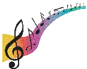
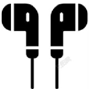

# Unit1 Music 单元测试卷

# 【 B 卷 ◆ 对接新中考】

（时间： 90 分钟，满分： 100 分）

# （第二部分 语法和词汇）

# Ⅱ. Choose the best answer （选择最恰当的答案，每题只有一个正确答案）（本大题共 10 题， 每题 1 分，共 10 分）

Do you know how to make music? Do you want to make music by yourself? In fact, there 1 many ways of making music in the world. You can use almost anything that will make a sound, even a piece of fruit! Some people use food and a computer to make music. They can play music with 2 kinds of fruit.

It is not just people with 3 and food who can make music. The Blue Man Group uses usual ( 平常 的 ) things to tell stories with 4 music. The group is famous for their music shows. In their shows, the group uses a really long pipe ( 管子 ). They move it around to make music. It is very big, 5 they need two people in their group to take it. 6 group also makes music by moving a long stick ( 木棍 ) up and down.

Alot of people 7 different things to play music, such as food, computers, and water. You can also make music 8 home. You can put dry beans into a cup and shake it. Even a glass of water can help you make music. It's easy 9 music, right?

10 do you use to make music? Tell us.

1 ． A ． am

2 ． A ． different

B ． is

B ． differently

3 ． A ． computer

4 ． A ． them

5 ． A ． but

6 ． A ． A

7 ． A ． use

8 ． A ． at

9 ． A ． to make

10 ． A ． When

B ． computers

B ． their

B ． or

B ． An

B ． used

B ． by

B ． made

B ． What

C ． are

C ． difference

C ． computer's

C ． they

C ． so

C ． The

C ． will use

C ． on

C ． making

C ． Why

# Ⅲ. Choose the proper words or phrases in the box to complete the following passage. Each word or phrase can be used only once . （本大题共 5 题，每题 1 分，共 5 分）

选择最恰当的选项填入空格，每题只有一个正确选 项，每个选项只能使用一次。

A ． makes B ． the C ． in D ． because E. poor

$$
F. but
$$

Music Star is a music show. I enjoy watching the show very much 11 I can learn a lot from many excellent singers. My favorite singer is Laura, who is a true winner in singing 12 my heart. She has a talent for singing and she can sing many songs. There are a lot of people loving her singing.

Laura comes from a 13 family. She couldn't afford ( 支付得起 ) to take singing lessons, so she taught herself, like listening to her favorite singers and artists and practicing every day when she was in college ( 大学 ).

After college, she taught people how to sing in music clubs and took part in some music shows to show her singing skills ( 技能 ). She faced many difficult problems along the way, 14 she never gave up. She worked hard to sing better than before. Her hard work finally paid off, and now she is one of the most popular singers in our town. Everybody likes her.

Her singing always 15 people excited. She thinks that everyone should enjoy good music. Laura's story shows that anything can come true if you work hard. She also gives me a lot of power ( 力量 ) to try to live my life. I am happy to meet her in my life.

# Ⅳ. Complete the following dialogue as required. （本大题共 5 小题，每题 1 分，共 5 分） 根据所给要求完成对话 。

(Yiming and his friend Ben are talking about their favourite music after class. They start the conversation with music taste.)

Yiming: 16____________________ _. ( 用特殊疑问句询问对方喜欢的音乐类型 )

Ben: I really love classical music. 17____________________ _. ( 承接喜爱古典音乐的话题，描述对其的感受并

# 说明日常聆听的频率 )

Yiming: What about pop music? Do you like it?

Ben: Yes, but not so much as classical music. How about you?

Yiming: Well, I'm interested in pop music. I like it very much.

Ben: 18____________________ ( 用一般疑问句询问对方是否是韩国流行音乐的粉丝 )

Yiming: Yes, certainly.

Ben: But can you understand it?

回应能否听懂的问题，说明仅能听懂一点但并不影响欣赏 )

Yiming: 19____________________ _ (

Ben: How about soft music? Do you like it, too?

Yiming: Yes, I do. It's very beautiful.

Ben: Really? I don't like it at all. 20____________________ ( 结合 ' 觉得轻音乐无聊 ' ，具体表达对其的负面感

受

受

)

)

Yiming: No worries! Everyone has their own taste of music!

# Part 3 Reading and Writing

# （第三部分 读写）

Ⅴ. Reading comprehension （阅读理解）（本大题共 20 题，共 40 分）

Choose the best answer （根据以下内容，选择最恰当的答案）（每题 2 分，共 16 分）

（ A ）

# MUSIC FESTIVALEnjoy days of music and performances!

JUNE 23rd, THURSDAY-

JUNE 26th, SUNDAY

CONCERTS CAN'T MISS!

# COUNTRYMUSICTime

Thursday 7: 00 p.m. -9: 00 p.m.

Place the Central Square

ROCKTime

Sunday 7:00 p.m. -9:00 p.m.

Place the Sports Center

Price $10/ an adult

$5/a child

FOLK MUSIC

Time

Friday 5:00 p.m. -7:00 p.m.

Place

the Grand Park

Free for all

For more information,

please contact Katie at 5463-7943

Price $20/ an adult

$10/a child

JAZZ

Time

Saturday 6:00 p.m. -8: 00 p.m.

Place

the Riverside Music Hall

Price

$25/ an adult

$10/a child

21 ． If Jim is free on Sunday night, what kind of music can he enjoy?

A ． Country music. B ． Folk music.

C ． Jazz.

D ． Rock.

22 ． How much will Mr. Green pay if he goes to enjoy jazz music with his two kids?

A ． $ 20.

B ． $ 45.

C ． $ 35.

D ． $ 40.

23 ． The information above may come from a ________.

A ． poster

B ． letter

C ． map

D ． report

（ B ）

Do you feel more energetic when listening to your favorite songs? Do you study better with background music? There's real science behind why music has such a powerful influence on teenage brains.

During the teenage years, your brain is going through big changes. It's growing and forming new connections every day. Music can actually help this process ( 过程 ). When you listen to music, many different areas of your brain work together-the parts that control hearing, memory, emotions ( 情绪 ), and even movement. This 'workout' makes your brain stronger and more connected.

Music also helps teenagers deal with stress and strong emotions. The teenage years can be challenging, with

school pressure, friendship problems, and family problems. Studies show that listening to music releases dopamine, a chemical that makes you feel good. It can calm you down when you're angry or lift your spirits when you're sad. Many teenagers use music as a healthy way to express and manage their feelings.

Learning to play a musical instrument brings even more benefits. It improves your memory, attention, and problem-solving skills. Musicians often do better in subjects like math and languages because music training strengthens the brain's ability to recognize patterns and deal with information quickly.

However, it's important to listen to music wisely. Playing music too loudly through headphones can damage your hearing. Experts suggest keeping the volume ( 音量 ) at 60% or lower and taking breaks every hour.

Music can also influence your sleep. While calm music helps you relax before bed, loud or exciting music might make it harder to fall asleep. Choose your music carefully, depending on what you need.

The teenage brain is special-it's flexible ( 灵活的 ) and ready to learn. Music is a powerful tool that can help you grow smarter, happier, and healthier. So next time you press play, remember: you're not just enjoying a song; you're training your brain ！

# 根据材料内容选择最佳答案

24 ． In the second paragraph, listening to music is like a (n) ________ for your brain.

A ． rest

B ． test

C ． dream

25 ． What does dopamine do when you listen to music?

D ． exercise

A ． It hurts your ears.

C ． It makes you feel tired.

B ． It makes you feel good.

D ． It makes you hungry.

26 ． How does the writer show the benefits of learning a musical instrument?

A ． By telling a story.

B ． By asking questions.

C ． By giving examples.

D ． By listing numbers.

27 ． According to the text, improper listening habits may be bad for our ________.

A ． hearing and sleep

C ． eyes and ears

28 ． What is the theme ( 主题 ) of the text?

A ． Culture.

B ． Science.

B ． memory and feelings

D ． study and sports

C ． Sports.

D ． History.

# B. Choose the best answer and complete the passage （选择最恰当的选项完成短文）（每题 2 分，共 12 分）

Music is everywhere in our lives. It makes our days more colorful. Different people like different 29 of music. Some love pop music because it's easy to sing along with. Others prefer classical music for its 30 sound.

Music can also change our feelings. When we are sad, soft music can make us feel 31 . It's like a warm hug. And when we are happy, energetic music can make us even 32 . We may start dancing to the rhythm.

Music is a great way to communicate, too. People can share their 33 through songs. A song can tell a story or express love. We can understand the singer's feelings 34 we listen carefully.

In a word, music is full of magic. It brings us joy and helps us connect with others. Let's enjoy music every day.

|29 ．|A ．|names|B ．|kinds|C ．|colors|D ．|prices|
|---|---|---|---|---|---|---|---|---|
|30 ．|A ．|noisy|B ．|quiet|C ．|strange|D ．|loud|
|31 ．|A ．|better|B ．|worse|C ．|colder|D ．|hotter|
|32 ．|A ．|sadder|B ．|angrier|C ．|happier|D ．|busier|
|33 ．|A ．|money|B ．|food|C ．|feelings|D ．|toys|
|34 ．|A ．|if|B ．|but|C ．|or|D ．|so|

# C. Read the passage and answer the following questions. （每题 2 分，共 12 分）

Answer the questions ( 根据短文内容，回答下列问题 )

As we know music can not only bring us wonderful enjoyment, but also happiness when we are tired or sad. And many people have the habit of enjoying music when they are free. But to our surprise, one English school allows children to listen to music or even to have the TV on while they are studying, and they find it is helpful to improve the students' grades.

According to a research at Millfield School, about 20% of teenagers work best with background music, 10% excellent when allowed to finish their work with short walks around the room while up to 80% can concentrate better if allowed to play with a small object.

The research has made the school use a very new way, encouraging students to discover which learning

styles suit them best, and then let them do their homework listening to music or even lying down. Some parents don't believe, but many are now accepting it at home where children are allowed to do their work with the television on.

'I prefer to work on the floor with music on low,' said Sam, a 13-year-old girl. 'At first my parents thought I didn't study hard, but my teacher asked them to look at my homework and when they saw it was okay, they agreed at last.'

35 ． What can the music bring us?

.

36 ． Which school allows children to listen to music while they are studying?

37 ． How did 80% of teenagers work best?

.

.

38 ． The research has made Millfield School different from other schools, hasn't it?

39 ． How old is Sam?

.

.

40 ． Tell your ideas about listening to music while doing homework.

.

# Ⅵ. Writing （作文）（本大题共 2 大题，共 20 分）

A. Translation ( 第一题 1 分；第二、三题各分，共 5 分 )

1 ．音乐节每年夏天在我们城市举行。 (hold)

________________________________________________________________.

2 ．你能推荐城里的一家好餐馆吗 ? (recommend)

________________________________________________________________.

3 ．这个最知名的旋律不仅鼓励了我而且给了我信心。（ not only… but also… ）

________________________________________________________________.

# B ． Please write a short passage of at least 60 words ( 请写一篇不少于 60 词的短文 ) （共 15 分）

某英文论坛以 ' 音乐和我 ' 为主题向大家征帖，作为一个音乐迷的你看到了也跃跃欲试。请你根据以下 要点提示，用英语写一篇短文，分享音乐给你带来了什么，并向大家推荐你最喜欢的歌曲。

要求：

内容须包含提示中的要点，可适当增加细节，以使行文连贯；

语言表达要准确，语意要通顺；

词数 60 词左右，短文开头已给出，不计入总词数。

What music brings me:

give me energy

My favorite song:

Name/Kind/Singer

Reasons why I like it

I have been a music fan since I was a little girl. Over the years, music has brought so many beautiful things into my life.

____________________________________________________________________________________________

____________________________________________________________________________________________

____________________________________________________________________________________________

____________________________________________________________________________________________

____________________________________________________________________________________________

____________________________________________________________________________________________

