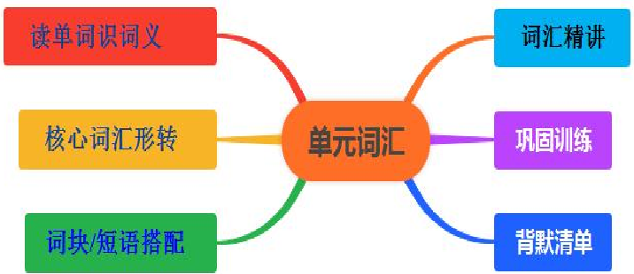

# Unit1 Music 单元词汇讲与练

# 读单词识词义

|单词（含词性音标）|中文释义|单词（含词性音标）|中文释义|
|---|---|---|---|
|1. musician /mjuˈzɪʃn/ n.|音乐家；作曲家|2. playlist /ˈpleɪlɪst/ n.|音乐播放清单|
|3. download /ˌdaʊnˈləʊd/ v.|下载|4. folk /fəʊk/ n.|民间音乐|
|5. classical /ˈklæsɪkl/ adj.|古典的；经典的|6. theme /θiːm/ n.|( 乐曲的 ) 主题，主旋律|
|7. beauty /ˈbjuːti/ n.|美；美丽|8. lyrics /ˈlɪrɪks/ n.(pl.)|歌词|
|9. jasmine /ˈdʒæzmɪn/ n.|茉莉|10. rock /rɒk/ n.|摇滚乐|
|11. pop /pɒp/ n.|流行音乐|12. title /ˈtaɪtl/ n.|( 乐曲等的 ) 名称，标题|
|13. popularity /ˌpɒpjuˈlærəti/ n.|流行|14. unknown /ˌʌnˈnəʊn/ adj.|不出名的；无名的|
|15. well-known /ˌwel ˈnəʊn/ adj.|众所周知的|16. best-known /ˌbest ˈnəʊn/ adj.|最知名的|
|17. melody /ˈmelədi/ n.|旋律；曲调|18. preference /ˈprefrəns/ n.|偏爱；偏好|
|19. chorus /ˈkɔːrəs/ n.|合唱团；歌唱队|20. charity /ˈtʃærəti/ n.|慈善|

|单词（含词性音标）|中文释义|单词（含词性音标）|中文释义|
|---|---|---|---|
|21. choose /tʃuːz/ v.|选择；挑选|22. actually /ˈæktʃuəli/ adv.|的确；真实地；事实上|
|23. raise /reɪz/ v.|提升；筹集|24. homeless /ˈhəʊmləs/ adj.|无家的|
|25. stutter /ˈstʌtə(r)/ n.&v.|口吃；结巴|26. smoothly /ˈsmuːðli/ adv.|连续而流畅地|
|27. silent /ˈsaɪlənt/ adj.|不说话的；沉默的|28. advise /ədˈvaɪz/ v.|劝告；忠告；建议|
|29. rhythm /ˈrɪðəm/ n.|节奏；韵律|30. calmly /ˈkɑːmli/ adv.|沉着地|
|31. shy /ʃaɪ/ adj.|羞怯的；腼腆的|32. relax /rɪˈlæks/ v.|放松；休息|
|33. gain /ɡeɪn/ v.|获得；得到|34. confidence /ˈkɒnfɪdəns/ n.|信心；信任|
|35. courage /ˈkʌrɪdʒ/ n.|勇气|36. solo /ˈsəʊləʊ/ n.|独唱；独奏|
|37. describe /dɪˈskraɪb/ v.|描述；形容|38. recommendation /ˌrekəmenˈdeɪʃn/ n.|正式建议；提议|
|39. offer /ˈɒfə(r)/ v.|主动提出；自愿给 予|40. widely /ˈwaɪdli/ adv.|普遍地；广泛地|
|41. spirit /ˈspɪrɪt/ n.|精神；心灵|42. athlete /ˈæθliːt/ n.|运动员|
|43. both...and...|不仅 …… 而 且 ……|44. not only...but also...|不仅 …… 而且 ……|
|45. what's more|而且；另外|-|-|

# 核心词汇形转

|原词|词性|转换形式|释义 / 用法|例句 / 搭配|
|---|---|---|---|---|
|advise|v. 建议|advice (n. 建议 )|名词：不可数名 词， ' 忠告；建议 '|He gave me some useful advice on learning music.|

|原词|词性|转换形式|释义 / 用法|例句 / 搭配|
|---|---|---|---|---|
|choose|v. 选择|choice (n. 选择 )|名词： ' 选择；抉 择 '|It's a difficult choice between pop music and classical music.|
|popularity|n. 流行|popular (adj. 流行 的 )|形容词： ' 受欢迎 的；流行的 '|This folk song is very popular among young people.|
|unknown|adj. 无名的|known (adj. 知名的 )|反义词： ' 已知 的；知名的 ' ，常 用搭配 be known for （因 …… 闻名）|The singer was unknown last year, but now she is well-known.|
|well-known|adj. 众所周 知的|better-known ( 比较 级 ) ； best-known ( 最 高级 )|形容词比较级 / 最高级： ' 更知名 的 ' ； ' 最知名的 '|Beethoven is one of the best-known composers in the world.|
|smoothly|adv. 流畅地|smooth (adj. 流畅 的；光滑的 )|形容词： ' 平滑 的；流畅的 '|The melody of this song is smooth and beautiful.|
|calmly|adv. 沉着地|calm (adj. 冷静的； v. 使平静 )|形容词 / 动词： ' 冷静的 ' ； ' 使平 静 '|She stayed calm when she forgot the lyrics and sang calmly.|
|widely|adv. 广泛地|wide (adj. 宽的； adv. 宽阔地 )|形容词 / 副词： ' 宽的 ' ； ' 充分地 '|This classical piece is widely played in concerts.|
|silent|adj. 沉默的|silence (n. 沉默； v. 使沉默 )|名词 / 动词： ' 沉 默 ' ； ' 使安静 '|He broke the silence by playing a solo on the violin.|
|relax|v. 放松|relaxed (adj. 感到放 松的 ) ； relaxing (adj. 令人放松的 ) ； relaxation (n. 放松 )|-ed 形容词： 描述 人的感受； -ing 形容词：描述事 物性质；名词： ' 放松 '|Listening to classical music is relaxing, and we feel relaxed after listening. Reading is a good way of relaxation.|
|confidence|n. 信心|confident (adj. 自信|形容词： ' 自信|She is confident in her solo performance|

|原词|词性|转换形式|释义 / 用法|例句 / 搭配|
|---|---|---|---|---|
| | |的 )|的 ' ，搭配 be confident in （对 …… 自信）|because she has enough confidence.|
|courage|n. 勇气|courageous (adj. 勇 敢的 )|形容词： ' 勇敢 的 '|It's courageous of him to sing in front of thousands of people with his stutter.|
|describe|v. 描述|description (n. 描述|) 名词： ' 描述；描 写 '|Can you give a detailed description of your favorite melody?|
|recommend ation|n. 建议|recommend (v. 推 荐；建议 )|动词： ' 推荐 ' ， 搭配 recommend doing sth. （建议 做某事）|The music teacher recommended listening to more folk music.|
|athlete|n. 运动员|athletic (adj. 运动 的；健壮的 )|形容词： ' 运动 的；体格健壮的 '|The athletic boy not only likes sports but also has a talent for music.|
|gain|v. 获得|gain (n. 收获；利益 )|名词： ' 所得；利 益 '|She gained a lot of confidence from the music competition, and the gain is more than just a prize.|

# 词块/短语搭配

|序 号|短语或句型|意思|例句|
|---|---|---|---|
|1|folk music|民间音乐|My grandma likes listening to folk music in her free time. 我奶 奶空闲时喜欢听民间音乐。|
|2|classical music|古典音乐|Many people think classical music is full of beauty. 很多人认为 古典音乐充满美感。|
|3|rock music|摇滚乐|Rock music usually has a strong rhythm. 摇滚乐通常有强烈的|

|序 号|短语或句型|意思|例句|
|---|---|---|---|
|4|pop music|流行音乐|Pop music enjoys great popularity among teenagers. 流行音乐 在青少年中非常受欢迎。|
|5|music playlist|音乐播放清 单|I made a playlist of my favorite songs for the trip. 我为这次旅 行制作了一个喜爱歌曲的播放清单。|
|6|download music|下载音乐|You can download music from this app for free. 你可以从这个 应用免费下载音乐。|
|7|the theme of the song|歌曲的主旋 律|The theme of this song is about friendship. 这首歌的主旋律是 关于友谊的。|
|8|beautiful lyrics|优美的歌词|I often memorize songs with beautiful lyrics. 我经常记住歌词 优美的歌曲。|
|9|jasmine flower|茉莉花|The song "Jasmine Flower" is a famous folk song. 《茉莉花》是 一首著名的民间歌曲。|
|10|the title of the piece|乐曲的标题|Do you know the title of this classical piece? 你知道这首古典 乐曲的标题吗？|
|11|solo performance|独奏；独唱 表演|She gave a wonderful solo performance at the concert. 她在音乐 会上进行了精彩的独奏表演。|
|12|chorus singing|合唱|The chorus singing at the charity event moved everyone. 慈善活 动上的合唱感动了所有人。|
|13|charity event|慈善活动|They held a music concert as a charity event to raise money. 他 们举办了一场音乐会作为慈善活动来筹款。|
|14|raise money|筹集资金|The musicians raised a lot of money for homeless people. 音乐 家们为无家可归的人筹集了很多资金。|
|15|homeless people|无家可归的 人|We should show kindness to homeless people. 我们应该对无家 可归的人表示善意。|
|16|speak smoothly|说话流畅|After practicing a lot, he can speak smoothly without stuttering.|

|序 号|短语或句型|意思|例句|
|---|---|---|---|
|17|remain silent|保持沉默|She remained silent when asked about her preference for music. 当被问及音乐偏好时，她保持沉默。|
|18|advise sb. to do sth.|建议某人做 某事|The teacher advised me to listen to more classical music to relax. 老师建议我多听古典音乐来放松。|
|19|the rhythm of the music|音乐的节奏|Dancers usually follow the rhythm of the music. 舞者通常跟着 音乐的节奏跳舞。|
|20|act calmly|沉着行事|Even when the microphone broke, the singer acted calmly. 即使 麦克风坏了，这位歌手也沉着行事。|
|21|shy of speaking|羞于开口|The shy girl was shy of speaking in public but sang bravely. 这 个腼腆的女孩羞于在公众面前说话，但勇敢地唱了歌。|
|22|relax oneself|放松自己|Listening to soft music helps us relax oneself after work. 听轻音 乐有助于我们下班后放松自己。|
|23|gain confidence|获得信心|She gained confidence through every music competition. 她通过 每次音乐比赛获得了信心。|
|24|the courage to do sth.|做某事的勇 气|He has the courage to perform solo in front of a large crowd. 他 有勇气在大批观众面前进行独奏表演。|
|25|describe...as...|把 …… 描 述为 ……|People describe this melody as "the sound of nature". 人们把这 段旋律描述为 ' 大自然的声音 ' 。|
|26|give a recommendation|给出建议|Can you give me a recommendation for good folk music? 你能 给我推荐一些好听的民间音乐吗？|
|27|offer help|主动提供帮 助|The musician offered help to young singers who just started. 这 位音乐家主动帮助刚起步的年轻歌手。|
|28|not only...but also...|不仅 …… 而且 ……|He not only plays the piano well but also writes his own lyrics. 他不仅钢琴弹得好，还自己写歌词。|
|29|both...and...|不仅 ……|Both pop music and classical music have their own beauty. 流行|

|序 号|短语或句型|意思|例句|
|---|---|---|---|
| | |而且 ……|音乐和古典音乐都有各自的美感。|
|30|what's more|而且；另外|This song is catchy, and what's more, its lyrics are meaningful. 这首歌很 catchy ，而且歌词很有意义。|
|31|widely known|众所周知的|It is widely known that Mozart was a child prodigy in music. 众 所周知，莫扎特是音乐神童。|
|32|sports spirit|体育精神|Athletes should have the sports spirit of never giving up. 运动员 应该有永不放弃的体育精神。|
|33|musical spirit|音乐精神|The musical spirit of this composer inspires many young musicians. 这位作曲家的音乐精神激励着许多年轻音乐家。|
|34|have a preference for|偏爱 ……|She has a preference for jazz music over pop music. 比起流行 音乐，她更偏爱爵士乐。|
|35|break the silence|打破沉默|The sound of the violin broke the silence of the night. 小提琴的 声音打破了夜晚的寂静。|
|36|be known for|因 …… 而 闻名|This singer is known for her unique voice and moving lyrics. 这 位歌手因她独特的嗓音和动人的歌词而闻名。|
|37|solo singer|独唱歌手|The solo singer received a lot of applause after her performance. 这位独唱歌手表演后获得了热烈的掌声。|
|38|charity donation|慈善捐赠|All the money from the concert is used for charity donation. 音 乐会的所有收入都用于慈善捐赠。|
|39|relaxing music|令人放松的 音乐|I like to listen to relaxing music before going to bed. 我喜欢睡 前听令人放松的音乐。|
|40|confident in|对 …… 有 信心|He is confident in his ability to win the music competition. 他对 自己赢得音乐比赛的能力有信心。|

# 重点词汇精讲

# 1. musician /mjuˈzɪʃn/ n.

释义：音乐家；作曲家例句： Beethoven is a great musician who created many classic works. （贝多芬是一位伟 大的音乐家，创作了许多经典作品。）

搭配： a famous musician （著名音乐家）； a folk musician （民间音乐家）； a classical musician （古典音乐家） 2. playlist /ˈpleɪlɪst/ n.

释义：音乐播放清单例句： I sorted out my favorite songs and made a playlist for the long drive. （我整理了喜爱 的歌曲，为长途驾驶做了一个播放清单。）

搭配： create a playlist （创建播放清单）； edit a playlist （编辑播放清单）； a travel playlist

（旅行播放清单）

# 3. download /ˌdaʊnˈləʊd/ v.

释义：下载例句： You can download this music app for free and listen to millions of songs. （你可以免费下载这 个音乐应用，收听数百万首歌曲。）

搭配： download music/songs （下载音乐 / 歌曲）； download from the Internet （从网上下载）； download files （下载文件）

# 4. classical /ˈklæsɪkl/ adj.

释义：古典的；经典的例句： Classical music has a long history and is loved by people of all ages. （古典音乐历 史悠久，受到各年龄段人们的喜爱。）

拓展： classical music （古典音乐）； classical literature （古典文学）； classical art （古典艺术），与 pop music （流行音乐）、 rock music （摇滚乐）形成音乐类型对比。

# 5. lyrics /ˈlɪrɪks/ n. (pl.)

释义：歌词例句： The lyrics of this song are so touching that many people cry when listening to it. （这首歌的歌 词非常感人，很多人听的时候都哭了。）

搭配： memorize the lyrics （记歌词）； write lyrics （写歌词）； beautiful lyrics （优美的歌词）

# 6. melody /ˈmelədi/ n.

释义：旋律；曲调例句： The melody of this folk song is simple but beautiful, and it's easy to sing. （这首民歌的 旋律简单而优美，很容易唱。）

搭配： a catchy melody （朗朗上口的旋律）； the melody of a song （歌曲的旋律）； hum the melody （哼唱旋 律）

# 7. charity /ˈtʃærəti/ n.

释义：慈善例句： Many musicians hold concerts for charity to help those in need. （许多音乐家举办慈善音乐会 来帮助有需要的人。）

搭配： charity event （慈善活动）； charity concert （慈善音乐会）； charity donation （慈善捐赠）； do charity （做慈善）

# 8. choose /tʃuːz/ v. (chose, chosen)

释义：选择；挑选例句： It's hard to choose between the two playlists because both have great songs. （在两个播 放清单之间很难选择，因为都有很棒的歌曲。）

搭配： choose to do sth. （选择做某事）； choose between A and B （在 A 和 B 之间选择）； choose as （选 为）； make a choice （做选择，名词形式）

# 9. raise /reɪz/ v.

释义：提升；筹集例句： The students raised a lot of money for homeless children by singing in the street. （学生 们通过在街上唱歌为无家可归的孩子筹集了很多钱。）

拓展：常见含义① ' 筹集 ' ，搭配 raise money/funds （筹款）；② ' 提升 ' ，如 raise one's voice （提高声音）； ③ ' 举起 ' ，如 raise hands （举手）。

# 10. homeless /ˈhəʊmləs/ adj.

释义：无家的例句： The charity organization provides food and shelter for homeless people. （慈善组织为无家可 归的人提供食物和住所。）

派生： homelessness n. 无家可归；相关表达： homeless children （无家可归的孩子）； a homeless shelter （收 容所）

# 11. advise /ədˈvaɪz/ v.

释义：劝告；忠告；建议例句： My music teacher advised me to practice the piano for an hour every day. （我的 音乐老师建议我每天练习一小时钢琴。）

搭配： advise sb. to do sth. （建议某人做某事）； advise doing sth. （建议做某事）； advise sb. against doing sth. （建议某人不要做某事）词转： advice n. 建议（不可数名词），如 give advice （提建议）

# 12. relax /rɪˈlæks/ v.

释义：放松；休息例句： Listening to soft classical music helps me relax after a busy day. （忙碌一天后，听轻柔 的古典音乐能帮助我放松。）

词转： relaxed adj. 感到放松的（主语为人）； relaxing adj. 令人放松的（主语为事物）； relaxation n. 放松 搭配： relax oneself （放松自己）； relax in the sun （在阳光下放松）； a relaxing holiday （令人放松的假期）

# 13. gain /ɡeɪn/ v.

释义：获得；得到例句： She gained a lot of confidence through participating in music competitions. （通过参加 音乐比赛，她获得了很多信心。）

搭配： gain confidence （获得信心）； gain experience （获得经验）； gain success （获得成功）； gain knowledge （获得知识）

# 14. confidence /ˈkɒnfɪdəns/ n.

释义：信心；信任例句： With the support of her family, she has the confidence to perform solo on stage. （在家 人的支持下，她有信心在舞台上进行独奏表演。）

搭配： have confidence in （对 …… 有信心）； build up confidence （建立信心）； lose confidence （失去信心） ； full of confidence （充满信心）词转： confident adj. 自信的

# 15. courage /ˈkʌrɪdʒ/ n.

释义：勇气例句： It takes a lot of courage to sing in front of thousands of people, especially if you have a stutter. （在数千人面前唱歌需要很大的勇气，尤其是如果你有口吃的话。）

搭配： have the courage to do sth. （有做某事的勇气）； take courage （鼓起勇气）； show courage （展现勇气） 词转： courageous adj. 勇敢的

# 16. solo /ˈsəʊləʊ/ n.

释义：独唱；独奏例句： The violin solo at the end of the concert was unforgettable. （音乐会结尾的小提琴独奏 令人难忘。）

搭配： a piano solo （钢琴独奏）； a vocal solo （声乐独唱）； solo performance （独奏 / 独唱表演）

# 17. describe /dɪˈskraɪb/ v.

释义：描述；形容例句： Can you describe the melody of that song in your own words? （你能用自己的话描述那 首歌的旋律吗？）

搭配： describe...as... （把 …… 描述为 …… ）； describe in detail （详细描述）； describe the scene （描述场景） 词转： description n. 描述

# 18. offer /ˈɒfə(r)/ v.

释义：主动提出；自愿给予例句： The famous musician offered to teach the homeless children to play musical instruments for free. （这位著名的音乐家主动提出免费教无家可归的孩子演奏乐器。）

搭配： offer to do sth. （主动提出做某事）； offer help （提供帮助）； offer sth. to sb. （向某人提供某物）

# 19. spirit /ˈspɪrɪt/ n.

释义：精神；心灵例句： The spirit of never giving up in his music inspires many young people. （他音乐中永不 放弃的精神激励着许多年轻人。）

搭配： sports spirit （体育精神）； musical spirit （音乐精神）； the spirit of teamwork （团队精神）； in spirit （在精神上）

# 20. athlete /ˈæθliːt/ n.

释义：运动员例句： This athlete not only excels in sports but also has a talent for playing the guitar. （这位运动员 不仅在体育方面出色，还在弹吉他方面有天赋。）

搭配： a professional athlete （职业运动员）； an Olympic athlete （奥运运动员）； sports athlete （体育运动员） 词转： athletic adj. 运动的；健壮的

# 21. well-known /ˌwel ˈnəʊn/ adj.

释义：众所周知的例句： Mozart is a well-known composer who started composing music at a very young age. （莫 扎特是一位众所周知的作曲家，很小就开始创作音乐。）

搭配： be well-known for （因 …… 而闻名）； be well-known as （作为 …… 而闻名）比较级 / 最高级： better-known （更知名的）； best-known （最知名的）

# 22. rhythm /ˈrɪðəm/ n.

释义：节奏；韵律例句： Rock music is famous for its strong and exciting rhythm. （摇滚乐以其强烈而令人兴奋 的节奏而闻名。）

搭配： the rhythm of the music （音乐的节奏）； follow the rhythm （跟着节奏）； a fast/slow rhythm （快 / 慢 节奏）

# 23. beauty /ˈbjuːti/ n.

释义：美；美丽例句： The beauty of classical music lies in its deep emotion and elegant melody. （古典音乐的美 在于其深沉的情感和优美的旋律。）

搭配： the beauty of nature （自然之美）； the beauty of music （音乐之美）； inner beauty （内在美）

# 24. stutter /ˈstʌtə(r)/ n.&v.

释义：口吃；结巴例句： He used to stutter when speaking, but now he can sing smoothly. （他以前说话结巴， 但现在唱歌很流畅。）

搭配： have a stutter （有口吃）； stutter when speaking （说话结巴）

# 25. preference /ˈprefrəns/ n.

释义：偏爱；偏好例句： Everyone has their own preference for music-some like pop, others like folk. （每个人 对音乐都有自己的偏好 --有些人喜欢流行音乐，有些人喜欢民间音乐。）

搭配： have a preference for （偏爱 …… ）； personal preference （个人偏好）； music preference （音乐偏好）

# 词汇巩固训练

# 一：根据汉语释义，写出英文单词、音标及词性（基础默写）

要求：完整写出单词、国际音标和词性，每空 1 分，共 10 分

音乐家；作曲家

________________________

音乐播放清单

________________________

下载 ________________________

古典的；经典的 ________________________

歌词 ________________________

旋律；曲调

________________________

慈善 ________________________

选择；挑选 ________________________

无家的 ________________________

信心；信任

________________________

# 二：单项选择题（词义辨析 + 固定搭配）

要求：从 A 、 B 、 C 、 D 中选出最佳答案，将序号填在括号内，每小题 1 分，共 10 分

Beethoven is one of the world's __________ composers, and his works are still popular today.

( )A. well-known B. unknown C. shy D. homeless

I need to __________ some folk music for my grandmother's birthday party.

( )A. raise B. download C. choose D. offer

The __________ of this song is so catchy that I can't stop humming it.

( )A. lyrics B. title C. melody D. rhythm

Many stars hold concerts to __________ money for poor children in rural areas.

( )A. gain B. raise C. choose D. advise

Listening to classical music is __________, and it helps me calm down after work.

( )A. relaxing B. relaxed C. exciting D. excited

My teacher __________ me to practice singing every morning to improve my voice.

( )A. describes B. offers C. advises D. gains

She has a __________ for jazz music, and she collects many jazz CDs.

( )A. preference B. confidence C. courage D. spirit

It takes great __________ to perform solo in front of thousands of people.

( )A. beauty B. rhythm C. stutter D. courage

This singer is __________ for her unique voice and moving lyrics.

( )A. known as B. well-known for C. famous to D. good at

__________ pop music __________ classical music has its own charm; I like both.

( )A. Either; or B. Neither; nor C. Both; and D. Not only; but also

# 三：用所给单词的适当形式填空（词性转换专项）

要求：根据句意变换单词形式，每空 1 分，共 10 分

My brother wants to be a __________ (music) when he grows up.

She gave me some useful __________ (advise) on how to choose music for the party.

This is a __________ (relax) song that can help you sleep better.

After the competition, she became more __________ (confidence) in her singing.

It's __________ (courage) of him to face his stutter and sing in public.

Can you give a detailed __________ (describe) of your favorite music style?

Pop music is very __________ (popularity) among teenagers around the world.

He speaks more __________ (smooth) than before after a lot of practice.

The __________ (choose) between the two playlists is really difficult for me.

We should show kindness to __________ (home) people and help them as much as possible.

# 四：英汉互译（单词 + 短语 + 短句）

要求：精准翻译，每空 1 分，共 10 分

流行音乐 ________________________

独奏；独唱 ________________________

筹款 ________________________

对 …… 有信心 ________________________

不仅 …… 而且 ……________________________

chorus /ˈkɔːrəs/ n. ________________________

actually /ˈæktʃuəli/ adv. ________________________

8.

spirit /ˈspɪrɪt/ n. ________________________

classical music ________________________

have a preference for ________________________

# 五：语境选词填空（从词库选词，可变形）

要求：每词限用一次，必要时变换形式，每空 1 分，共 10 分

musician, playlist, download, choose, raise, confident, courage, solo, describe, popular

I spent an hour making a __________ of my favorite English songs.

Many young people like to __________ music from the Internet for free.

She is a talented __________ who can play both the piano and the violin.

We need to __________ more money to help the homeless children.

It's hard to __________ which song to sing at the school concert.

He has the courage to perform a __________ in front of the whole school.

The singer feels __________ about her performance because she practiced a lot.

This folk song is very __________ in the countryside.

Can you __________ what your favorite melody sounds like?

With the support of her family and teachers, the shy girl finally found the __________ to sing in public.

背默清单

|序号|词汇|音标|词性|中文释义|
|---|---|---|---|---|
|1|confident|/'kɒnfɪdənt/|adj.| |
|2|recommendation|/rekəmen'deɪʃn/|n.| |
|3|offer|/'ɒfə(r)/|v.| |

|4|what's more| | |
|---|---|---|---|
|5|widely|/'waɪdli/|adv.|
|6|spirit|/'spɪrɪt/|n.|
|7|athlete|/'æθli:t/|n.|
|8|beauty|/'bju:ti/|n.|
|9|lyrics|/'lɪrɪks/|n.|
|10|jasmine|/ ˈ dʒæzmɪn/|n.|
|11|rock|/rɒk/|n.|
|12|pop|/pɒp/|n.|
|13|title|/'taɪtl/|n.|
|14|popularity|/pɒpju'lærəti/|n.|
|15|unknown|/ʌn'nəun/|adj.|
|16|well-known| |adj.|
|17|both...and...| | |
|18|best-known| |adj.|
|19|melody|/'melədi/|n.|
|20|preference|/'prefrəns/|n.|
|21|chorus|/'kɔ:rəs/|n.|
|22|charity|/'tʃærəti/|n.|
|23|choose|/tʃu:z/|v.|
|24|actually|/'æktʃuəli/|adv.|
|25|raise|/reɪz/|v.|
|26|homeless|/'həumləs/|adj.|
|27|stutter|/'stʌtə(r)/|n. &v|
|28|smoothly|/'smu:ðli/|adv.|
|29|silent|/'saɪlənt/|adj.|
|30|advise|/əd'vaɪz/|v.|
|31|not only...but also...| | |
|32|rhythm|/'rɪðəm/|n.|

|33|calmly|/'k ɑ :mli/|adv.|
|---|---|---|---|
|34|shy|/ʃaɪ/|adj.|
|35|relax|/rɪ'læks/|v.|
|36|gain|/ ɡ eɪn/|v.|
|37|confidence|/'kɒnfɪdəns/|n.|
|38|courage|/'kʌrɪdʒ/|n.|
|39|solo|/'səuləu/|n.|
|40|describe|/dɪ'skraɪb/|v.|
|41|musician|/mju'zɪʃn/|n.|
|42|playlist|/'pleɪlɪst/|n.|
|43|video|/'vɪdiəu/|n.|
|44|download|/daun'ləud/|v.|
|45|folk|/fəuk/|n.|
|46|classical|/'klæsɪkl/|adj.|
|47|theme|/θi:m/|n.|

|序号|音标|词性|中文释义|
|---|---|---|---|
|1|/'kɒnfɪdənt/|adj.|自信的；有自信心的|
|2|/rekəmen'deɪʃn/|n.|正式建议；提议|
|3|/'ɒfə(r)/|v.|主动提出；自愿给予|
|4| | |而且；另外|
|5|/'waɪdli/|adv.|普遍地；广泛地|
|6|/'spɪrɪt/|n.|精神；心灵|
|7|/'æθli:t/|n.|运动员|
|8|/'bju:ti/|n.|美；美丽|
|9|/'lɪrɪks/|n.|歌词|
|10|/ ˈ dʒæzmɪn/|n.|茉莉|
|11|/rɒk/|n.|摇滚乐|
|12|/pɒp/|n.|流行音乐|

|13|/'taɪtl/|n.|( 乐曲等的 ) 名称，标题，题目|
|---|---|---|---|
|14|/pɒpju'lærəti/|n.|流行|
|15|/ʌn'nəun/|adj.|不出名的；无名的|
|16| |adj.|众所周知的|
|17| | |不仅……而且……|
|18| |adj.|最知名的|
|19|/'melədi/|n.|旋律；曲调|
|20|/'prefrəns/|n.|偏爱；偏好|
|21|/'kɔ:rəs/|n.|合唱团；歌唱队|
|22|/'tʃærəti/|n.|慈善|
|23|/tʃu:z/|v.|选择；挑选|
|24|/'æktʃuəli/|adv.|的确；真实地；事实上|
|25|/reɪz/|v.|提升；筹集|
|26|/'həumləs/|adj.|无家的|
|27|/'stʌtə(r)/|n. &v|口吃；结巴|
|28|/'smu:ðli/|adv.|连续而流畅地|
|29|/'saɪlənt/|adj.|不说话的；沉默的|
|30|/əd'vaɪz/|v.|劝告；忠告；建议|
|31| | |不仅……而且……|
|32|/'rɪðəm/|n.|节奏；韵律|
|33|/'k ɑ :mli/|adv.|沉着地|
|34|/ʃaɪ/|adj.|羞怯的；腼腆的|
|35|/rɪ'læks/|v.|放松；休息|
|36|/ ɡ eɪn/|v.|增加；增添|
|37|/'kɒnfɪdəns/|n.|信心；信任|
|38|/'kʌrɪdʒ/|n.|勇气|
|39|/'səuləu/|n.|独唱；独奏|
|40|/dɪ'skraɪb/|v.|描述；形容|
|41|/mju'zɪʃn/|n.|音乐家；作曲家|

|42|/'pleɪlɪst/|n.|音乐播放清单|
|---|---|---|---|
|43|/'vɪdiəu/|n.|音乐短片；视频|
|44|/daun'ləud/|v.|下载|
|45|/fəuk/|n.|民间音乐|
|46|/'klæsɪkl/|adj.|古典的；经典的|
|47|/θi:m/|n.|( 乐曲的 ) 主题，主旋律|

# （一）核心名词（ 20 个）

|单词|音标|释义|
|---|---|---|
| |/mjuˈzɪʃn/|n. 音乐家；作曲家|
| |/ˈpleɪlɪst/|n. 音乐播放清单|
| |/fəʊk/|n. 民间音乐|
| |/θiːm/|n. ( 乐曲的 ) 主题，主旋律|
| |/ˈbjuːti/|n. 美；美丽|
| |/ˈlɪrɪks/|n. (pl.) 歌词|
| |/ˈdʒæzmɪn/|n. 茉莉|
| |/rɒk/|n. 摇滚乐|
| |/pɒp/|n. 流行音乐|
| |/ˈtaɪtl/|n. ( 乐曲等的 ) 名称，标题|
| |/ˌpɒpjuˈlærəti/|n. 流行|
| |/ˈmelədi/|n. 旋律；曲调|
| |/ˈprefrəns/|n. 偏爱；偏好|
| |/ˈkɔːrəs/|n. 合唱团；歌唱队|
| |/ˈtʃærəti/|n. 慈善|
| |/ˈrɪðəm/|n. 节奏；韵律|
| |/ˈkɒnfɪdəns/|n. 信心；信任|
| |/ˈkʌrɪdʒ/|n. 勇气|

|单词|音标|释义|
|---|---|---|
| |/ˈsəʊləʊ/|n. 独唱；独奏|
| |/ˌrekəmenˈdeɪʃn/|n. 正式建议；提议|
| |/ˈspɪrɪt/|n. 精神；心灵|
| |/ˈæθliːt/|n. 运动员|

# （二）核心动词（ 10 个）

|单词|音标|释义|
|---|---|---|
| |/ˌdaʊnˈləʊd/|v. 下载|
| |/tʃuːz/|v. 选择；挑选|
| |/reɪz/|v. 提升；筹集|
| |/ˈstʌtə(r)/|v. 口吃；结巴|
| |/ədˈvaɪz/|v. 劝告；忠告；建议|
| |/rɪˈlæks/|v. 放松；休息|
| |/ɡeɪn/|v. 获得；得到|
| |/dɪˈskraɪb/|v. 描述；形容|
| |/ˈɒfə(r)/|v. 主动提出；自愿给予|
| |/ˈstʌtə(r)/|n.&v. 口吃；结巴|

# （三）核心形容词（ 10 个）

|单词|音标|释义|
|---|---|---|
| |/ˈklæsɪkl/|adj. 古典的；经典的|
| |/ˌʌnˈnəʊn/|adj. 不出名的；无名的|
| |/ˌwel ˈnəʊn/|adj. 众所周知的|
| |/ˌbest ˈnəʊn/|adj. 最知名的|
| |/ˈhəʊmləs/|adj. 无家的|

|音标|释义|
|---|---|
|/ˈsaɪlənt/|adj. 不说话的；沉默的|
|/ʃaɪ/|adj. 羞怯的；腼腆的|
|/ˈpɒpjələr/|adj. 流行的；受欢迎的（派生自 popularity ）|
|/ˈkɒnfɪdənt/|adj. 自信的（派生自 confidence ）|
|/kəˈreɪdʒəs/|adj. 勇敢的（派生自 courage ）|
|/æθˈletɪk/|adj. 运动的；健壮的（派生自 athlete ）|

# （四）核心副词（ 5 个）

|单词|音标|释义|
|---|---|---|
| |/ˈæktʃuəli/|adv. 的确；真实地；事实上|
| |/ˈsmuːðli/|adv. 连续而流畅地|
| |/ˈkɑːmli/|adv. 沉着地|
| |/ˈwaɪdli/|adv. 普遍地；广泛地|

