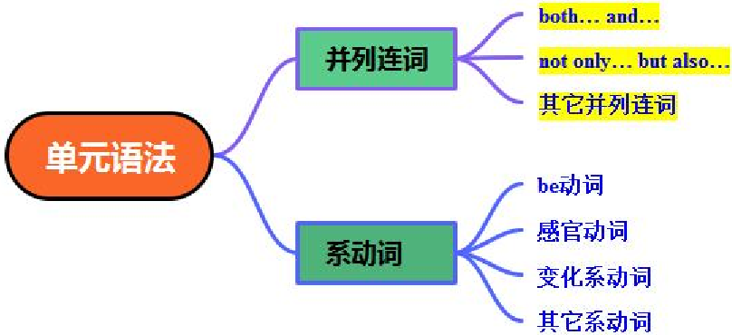

# Unit1 Music 单元语法讲与练

and

both

but also.-

not only

单元语法精讲

# ( 一 ) 并列连词

# 1.both… and…

是一个常用的并列连词短语，用于连接两个并列的成分，强调两个事物之间的联系。

# (1) 连接两个并列主语

连接两个主语时，谓语动词通常用复数形式，遵循 ' 复数主语 + 复数谓语 ' 的原则。

Both Tom and Jerry are going to join the art club. 汤姆和杰瑞都打算加入艺术俱乐部。

# (2) 连接两个并列宾语

连接两个名词、代词等作宾语。

I like both apples and bananas. 我既喜欢苹果又喜欢香蕉。

# (3) 连接两个并列表语

连接两个描述主语特征或状态的成分作表语。

The film is both interesting and educational. 这部电影既有趣又有教育意义。

# (4) 连接两个并列的谓语动词或动词短语

She both sings and dances very well. 她唱歌和跳舞都很棒。

# (5) 连接两个并列的状语

连接两个表示时间、地点、方式等的状语。

He works hard both at school and at home. 他在学校和家里都学习很努力。

注意： both... and... 的否定形式部分否定，通常用 'not both... and...' ；完全否定，常用 'neither... nor...' 。

Not both the students are right. 并非两个学生都对。

Neither the students nor the teachers are in the classroom. 学生和老师都不在教室里。

# 2.not only… but also…

是一个常用的并列连词短语，用于连接两个并列的成分，强调后者。

# (1) 连接两个并列主语

谓语动词的单复数遵循就近原则：即谓语动词要与靠近它的主语在人称和数上保持一致。

Not only the students but also the teacher is enjoying the movie. 不仅学生们，而且老师也在欣赏这 部电影。

Not only Tom but also his parents have been to Beijing. 不仅汤姆，而且他的父母也去过北京。

# (2) 连接两个并列的宾语

连接两个名词、代词等作宾语，表明这两个对象都与前面的动作相关。

She likes not only music but also art. 她不仅喜欢音乐，而且喜欢艺术。

# (3) 连接两个并列的表语

连接两个描述主语特征或状态的成分作表语。

He is not only handsome but also kind-hearted. 他不仅英俊，而且心地善良。

# (4) 连接两个并列的谓语动词或动词短语

He not only reads books but also writes articles. 他不仅读书，而且写文章。

# (5) 连接两个并列的状语

You should do exercise not only in the morning but also in the evening. 你不仅应该在早上锻炼，还 应该在晚上锻炼。

# (6) 连接两个并列的句子

当连接两个句子时， not only 后面的句子要用部分倒装结构 ( 即把助动词、情态动词或系动词提 到主语前面 ) ，但 but also 后面的句子不用倒装。

Not only did he finish his homework on time, but also he helped his mother do some housework. 他

不仅按时完成了作业，而且还帮他妈妈做了些家务。

# 注意：

- ①省略情况： but also 中的 also 有时可以省略，变成 not only... but... ，意思不变。
- ②强调作用： not only… but also… 着重强调 but also 后面的内容。

He is not only smart but also hard-working. 他不仅聪明，而且勤奋。 ( 更强调 ' 勤奋 ' 这一特点。 )

# 3. 其他常见并列连词

and, or, so, either… or…, neither… nor…, as well as 等。

He is tall and he can play basketball well. 他个子高，而且篮球打得好。

Do you want tea or coffee? 你想要茶还是咖啡？

Hurry up, or you'll be late. 快点，否则你会迟到的。

It was raining heavily, so we stayed at home. 雨下得很大，所以我们待在家里。

Either you or he has to clean the classroom. 要么你要么他得打扫教室。

Neither Tom nor Jack likes playing football. 汤姆和杰克都不喜欢踢足球。

The teacher as well as the students likes the game. 老师和学生们一样喜欢这个游戏。

# ( 二 ) 系动词

也称连系动词，本身有词义，但不能单独用作谓语，其后必须跟表语，构成系表结构，说明主 语的状况、性质、特征等情况。

系动词有时态和人称变化。

系动词无被动语态。

She will be happy tomorrow. 她明天会很开心的。

The flower looks beautiful. 这花看起来很漂亮。

# 1.be 动词

(1)am, is, are 三种形式，说明主语的状态或特征。

I am a student. 我是一名学生。

He is tall and strong. 他又高又壮。

They are happy. 他们很开心。

(2)am, is 的过去式是 was ， are 的过去式是 were 。

I was at home yesterday. 我昨天在家。

They were in the park last Sunday. 他们上周日在公园。

# 2. 感官动词

和我们的五官感觉相关，用来表示主语给人的感觉或者状态。如： look, appear, feel, smell, taster 和 sound 。

这个蛋糕闻起来很香。

The cake smells delicious.

这种丝绸摸起来很柔软。

This silk feels soft.

我今天感觉很累。

I feel tired today.

你的主意听起来很棒。

Your idea sounds great.

# 3. 变化系动词

表示主语的状态、性质等发生了变化。

天气变得越来越冷了。

It's becoming colder and colder.

Leaves turn yellow in autumn. 秋天树叶变黄了。

It's growing dark. 天渐渐黑了。

(2) 表示主语保持某种状态。

Keep quiet, please. 请保持安静。

我们应该保持健康。

We should keep healthy.

在危险中你应该保持冷静。

You should stay calm in danger.

# 【单元核心语法小结】 ：

|并列连词|功能|结构示例|主谓一致 规则|单元例句|
|---|---|---|---|---|
|both...and...|连接两个并列 成分，表 ' 两者 都 '|1. 连接名词： both Aand B2. 连接形 容词： both + adj. and + adj.3. 连接动 词： both + v. and + v.|谓语动词 用复数形 式|- Both Beethoven and Mozart are famous musicians. （连接名词） - This song is both moving and inspiring. （连接形容词） - She both sings and plays the piano well. （连接动词）|
|not only...but also...|连接两个并列 成分，表 ' 不 仅 …… 而 且 ……' ，强调 后者|1. 连接名词： not only Abut also B2. 连接形容词： not only + adj. but also + adj.3. 连接动词：|谓语动词 遵循 ' 就近 原则 ' （与 靠近的主 语保持一|- Not only my parents but also my sister likes this song. （靠近主语 my sister 为单 数， 谓语用 likes ） - The concert is not only wonderful but also meaningful. （连接形 容词） - He not only writes songs but also|

|并列连词|功能|结构示例|主谓一致 规则|单元例句|
|---|---|---|---|---|
| | |not only + v. but also + v.|致）|sings them himself. （连接动词）|

|系动词|①本身有词义 ②不能单独做谓语 ③后加表语 ④说明主语的状态、性 质、特征或身份。|状态系动词： be|I am happy.|
|---|---|---|---|
| | |感官系动词： look,sound,taste,smell,feel|Sounds good.|
| | |变化系动词： turn,get,become|It's getting hot.|
| | |持续系动词： keep|Keep silent.|
| | |表像系动词： seem|He seems sad.|

# 语法巩固训练

# 一、单项选择

1 ． We all like Mrs. Wang _________ she is very knowledgeable and patient.

A ． because

B ． but

C ． so

2 ． -Do you want to go shopping ________ swimming?

D ． or

-Swimming. It's great to be in the water on such a hot day.

A ． or

B ． and

C ． but

D ． so

3 ． You can choose to take the bus ________ ride a bike to school. Both are green ways of traveling.

A ． and

B ． or

C ． but

D ． so

4 ． She likes both singing ______ dancing. She often takes part in singing and dancing competitions.

A ． or

B ． but

C ． and

5 ． Wednesday is my favorite day ______ I have art and biology.

A ． or

B ． but

C ． because

D ． so

D ． so

6 ． The weather in spring is pleasant, ________ sometimes it can be windy and rainy.

A ． and

B ． so

C ． or

D ． but

7 ． ________ my father ________ my mother is a doctor. They are both teachers.

A ． Both; and

．

B

Not only; but also

C ． Either; or

D ． Neither; nor

8 ． You can ________ take the bus ________ ride a bike to the park. Both ways are convenient.

A ． either; or

B ． neither; nor

C ． both; and

D ． not only; but

9 ． Both George's school ________ Mark's school begin at 8:00 a.m. ________ end at 4:00 p.m.

A ． and, and

B ． or, but

C ． and, but

D ． or, and

10 ． My mum is very busy with her work, ________ she still reads me a story every night. This special time means a lot to me.

A ． and

B ． but

C ． because

D ． so

11 ． The job is challenging, ________ he will never regret choosing it.

A ． and

B ． but

C ． or

D ． so

12 ． ________ Lucy ________ Mary will go with you, because one of them must be at home.

A ． Neither; nor

B ． Both; and

C ． Either; or

13 ． -Tim, how do your parents like pop music?

D ． As well; as

-________ my dad ________ my mom likes it. They both prefer classical music.

A ． Either; or

B ． Both; and

C ． Neither; nor

D ． Not only; but also

14 ． -Would you like to join the music club or the drama club this term?

-To be honest, ______ music ______ drama interests me. I prefer playing ball games after class.

A ． both; and

B ． either; or

C ． neither; nor

15 ． ________ my dad ________ my mum cooks breakfast for me. I always buy some bread and milk.

A ． Either…or…

B ． Neither…nor…

C ． Both…and…

D ． Not only…but also…

16 ． Making short videos is popular. ________ the young, ________ the old are interested in it.

．

A

Between; and

．

B

Not only; but also

C ． Neither; nor

D ． Either; or

17 ． Moyan is really a great writer. ________ his readers ________ his child loves him very much.

A ． Either; or

B ． Neither; nor

C ． Both; and

18 ． -Jim, do your parents like country music?

D ． Not only; but also

-Yes. ________ my dad ________ my mom likes it very much.

A ． Both; and

B ． Either; or

C ． Neither; nor

D ． Not only; but also

19 ． Beijing has made history in winning the bids to host both the summer ________winter Olympic games.

A ． but

B ． or

C ． so

20 ． -Can I go to Tom's birthday party tomorrow?

D ． and

第 6 页 共 8 页

-Of course. ________ you ________ your brother is invited. Have a nice time then.

A ． Neither; nor B ． Both; and

C ． Not only; but also D ． Either; or

# 二、完成句子

1 ． Maths is difficult. It is useful. ( 用 but 连接句子 )

Maths difficult useful.

2 ．我和妹妹都擅长踢足球。

my sister

I are good at playing football.

3 ．不仅个人，企业也应该为社会发展做贡献。

individuals enterprises should contribute to social development.

4 ． Tom is in the music club. I am in the music club too. ( 合并为一句 )

Tom I are in the music club.

5 ．李明不仅跑得快，而且跳得高。

Li Ming runs fast, jump high.

6 ．我最好的朋友不仅和我一起玩，而且帮助我学习。

My best friend plays with me, me with my studies.

7 ．我们在打球时不仅感到开心，而且彼此之间变得更亲近。

We feel happy during the game, become closer to each other.

8 ．他会游泳，但他不会滑冰。

He can swim, he skate.

9 ．不仅学生，老师也喜欢在空闲时间阅读。

students

teachers like reading in their free time.

10 ． You can stay at home. You can go with us instead. ( 合并成一句 )

You can

stay at home

go with us.

11 ． You and your friend are both ready and calm. （改为否定句）

You and your friend are ready calm.

12 ．我们所有人在场内外都是好朋友。

All of us are good friends, on off the field.

13 ．约翰不仅钢琴弹得好，而且还会作曲。

John plays the piano well writes music.

14 ．她爸爸不仅支持她，而且帮她练习踢足球。

Her father supported her, helped her practise playing football.

15 ．这件连衣裙很漂亮，而且它还不贵。

This dress is beautiful, it's not expensive.

16 ．不仅你，他也需要注意健康。

you he need to pay attention to your health.

17 ．不仅科学家，游客也对这片湿地充满好奇。

scientists tourists are curious about this wetland.

18 ． They speak English not only in class but also in the dormitory. ( 保持句意基本不变 )

They speak English in class in the dormitory.

19 ．我认为这部电影值得一看，因为它不仅情节吸引人，而且传递了积极的价值观。

I think the film is worth watching because it has an attractive plot spreads positive values.

20 ．她不仅通过学习语法来提升学习，而且还看电影和唱英文歌。

She improves her learning by studying grammar, by watching movies and singing English songs.

