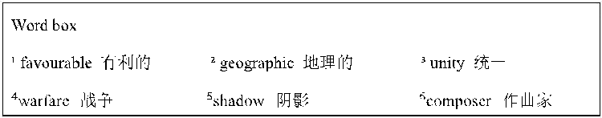
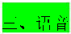
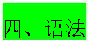
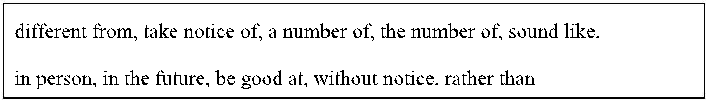
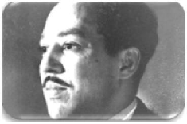

### 【课前热身】

# 6B Unit1 everyone is different 单元知识梳理&测试题

（学生版）

语法选择 阅读下面短文，从每题所给的 A、B、C、D 四个选项中，选出可以填入空白处的最佳选项。 Helen Keller was a very bright and beautiful girl. At the age of 19 months, a serious illness (1) ______ her blind

and deaf. Before her illness, she could see and hear like other children. But after that, she could (2) ______ see or hear. So she couldn't learn to speak.

Her parents were very sad. They didn't know (3) ______ to help her. Then, when Helen was seven years old, they met a young teacher named Anne Sullivan. Anne came to live with Helen's family and became her teacher. She taught Helen (4) ______ words by touching things and others' lips.

Helen was a very clever girl and she learned very quickly. Soon, she could read books and write. Later, she learned to speak, too. She went to college and became a famous writer and speaker. She wrote many books, including *The Story of My Life*. She also traveled around the world and gave talks to people. She wanted to help other people who were blind and deaf.

Helen Keller is a great example for all of us. She showed us that even if we are in a bad situation, we can still be strong and (5) ______. She said, “Keep your face to the sunshine and you cannot see the shadow.”

- 1. A. make B. makes C. made D. making
- 2. A. not longer B. no longer C. not more D. no more
- 3. A. what B. how C. when D. where
- 4. A. learn B. to learn C. learning D. learned
- 5. A. success B. successfully C. successful D. succeed

情景对话 Situation: Tom 和 Jack 在谈论自己的性格，发现两人的性格差异很大。 Tom: Jack, I find we are quite different from each other. Jack: Really? 1. _______________________________? (询问具体哪里不同) Tom: I am very outgoing and like making new friends, but you always like staying at home. Jack: You’re right. 2. _______________________________? (询问 Tom 周末通常做什么) Tom: I usually go to the park with my friends or play sports. 3. ______________________? (反问 Jack 的周末活动)

1

Tom: 4. _________________. ( 表达认同，逻辑承接 ) Different people have different hobbies.

# 【知识梳理】

Unit 1 Everyone is different 知识点梳理

# P4-5 Viewing and Listening

|1|notice differences different be different from ... difference the differences between A and B 拓： be the same as ... be similar to ...|注意不同点 adj. 不同的 与 ... 不同 n. 不同点 A 和 B 之间的不同 和 ... 相同 和 ... 相似|
|---|---|---|
|2|share with sb.|和某人分享|
|3|visiting students|来访学生|
|4|partner school|搭档学校|
|5|sizes and shapes: tall short/ big small/ thin slim fat hair: curly straight/short long/dark brown hair skin colour: fair skin/ dark skin clothes: T-shirt T 恤衫 trousers 长裤 jeans 牛仔裤|尺寸和形状 高的矮的 / 大的小的 / 瘦的胖的 头发： 卷的直的 / 短的长的 / 黑色棕色 皮肤颜色 白皮 / 黑皮 衣服：|
|6|what do they look like ? what is your school day like ?|提问某人的外貌 提问某人 / 物的品质，性质|
|7|wear put on|穿着 穿上|

| |in...|穿着 ...( 颜色）|
|---|---|---|
|8|no need to compare|不需要比较|
|9|laugh|v. 大笑|
| |smile|v. 微笑|
|10|have fun=have a good time=enjoy + 反身代词|玩得开心|

# P6-7 Speaking

|1|find differences|发现不同点|
|---|---|---|
|2|talent show|才艺秀|
|3|prepare for sth|为 .. 做准备|
|4|offer offer to do sth|V. 主动提供 V. 主动提供做某事|
|5|play the violin tell the story shoot in one minute sing a song play The Butterfly Lovers|拉小提琴 讲故事 一分钟投篮 唱歌 演奏梁祝|
|6|感官动词 sound look taste +adj. smell feel|听起来 看起来 尝起来 闻起来 摸起来|
|7|That is what I am good at.|这就是我擅长的|
|8|How about doing==What about doing...|... 怎么样|
|9|have a beautiful voice|有一个美丽的嗓音|
|10|voice sound noise|嗓音 泛指自然界的一切声音 噪音|
|11|drum--drummer|v. 击鼓 --n. 击鼓者|

#  P8-9 Reading

|1|accept differences accept receive|接受不同 v. 接受 v 接收|
|---|---|---|
|2|tell a fable in the talent show|在才艺秀上讲一个寓言|
|3|learn from sb. learn to do sth. learner|向某人学习 学习做某事 学习者|
|4|look sad|看起来很悲伤|
|5|say to sb|对某人说|
|6|a lovely voice a loud voice|甜美的嗓音 大声的嗓音|
|7|sing well( 副词 well 修饰动词）|唱得好|
|8|in a few years in+ 一段时间|在几年后 在 .... 年后|
|9|colour colourful Your feathers are colourful.|n. 颜色 adj. 彩色的 你的羽毛是彩色的|
|10|in the future in the past|在将来 在过去|
|11|sing--singer dance--dancer paint--painter drum--drum m er|v. 唱歌 --n. 歌手 v. 跳舞 --n. 舞者 v. 画画 --n. 画家 v. 击鼓 --n. 鼓者|
|12|without any doubt|毫无疑问|
|13|dancing skills| |
| | |舞蹈技能|
|15|strong points|优点|

|16|teach a lesson|给以教训|
|---|---|---|

#  P10-11 Grammar

|1|get a big prize for doing|做某事获得一个大奖|
|---|---|---|
|2|borrow some books|借 ( 入 ) 书|
|3|on Friday afternoon 在具体某一天的上 / 下 / 晚上用 on|在星期五下午|
|4|a success successful|一个成功 adj. 成功的|
|5|make a decision deci de --deci sion|做一个决定 v. 决定 --n. 决定|
|6|at the moment of|在 ... 的时刻|
|7|host the class meeting|主持班会|

#  P12-13 Writing--Project

|1|introduce--introduction introduce a to b self-introduction|v. 介绍 --n. 介绍 把 a 介绍给 b 自我介绍|
|---|---|---|
|2|note down everyone's special points|记下每个人的特别之处|
|3|form a good habit|养成好习惯|
|4|be able to speak English well|能够说英语很好|
|5|spend much time on computer games|花很多时间在电脑游戏上|
|6|get hurt|受伤|
|7|one of the most famous Chinese books about warfare|中国最著名的战争题材的书籍之 一|
|8|become a famous writer and speaker|成为著名的作家和演说家|

Unit 1 Everyone is different 语法填空 1（课文 Reading 改编） The peacock and the wise old tree

In a forest live a peacock and a nightingale. They are good friends. But one day the peacock looks sad and says to the wise old tree, “Wise old tree, my friend the nightingale has a lovely voice. She sings so (1) ______ (good). Without any doubt, she will be a singer in a few years. I have a loud voice. But when I sing, everyone will laugh (2) ______ me.”

The wise old tree smiles and says, “But you’re beautiful. Your (3) ______ (feather) are colourful.” “What can I do in the future? Can I be a singer?” the peacock (4) ______ (worry). The wise old tree pats him, “Not everyone will be a singer. You can be a good dancer with your beautiful feathers

and (5) ______ (dance) skills. Different people are good at different things. The elephant is strong. The monkey is clever. The tiger jumps far. Everyone is (6) ______ (uniquely).”

The peacock finally understands that he doesn’t need to be like the nightingale. He can be (7) ______ (he).

Unit 1 Everyone is different 语法填空 2（课文 Discovery 改编） What qualities do they have? Sun Bin

"Favourable¹ weather conditions, geographic² advantages and the unity³ of the people all must be in place. If not, victory will be costly."

He could not walk after his knees got hurt, but he wrote *Sun Bin: The Art of War*, one of the most famous Chinese books (1) ______ warfare⁴.

Helen Keller "Keep your face to the sunshine and you cannot see the shadow⁵." She was blind and deaf when she was 19 months old. She started (2) ______ (learn) words by touching things and

(3) ______ (other) lips. She became a famous writer and speaker.

Ludwig van Beethoven "There are and will be thousands of princes. There is only one Beethoven!" He wrote some of his most famous (4) ______ (piece) after he was (5) ______ (complete) deaf. He was one of the

greatest (6) ______ (composer) of all time. These three people all faced big challenges in their lives, but they didn’t give (7) ______. They showed us that

everyone can be strong and (8) ______ (success) if they try their best. Word box ¹ favourable 有利的 ² geographic 地理的 ³ unity 统一 ⁴warfare 战争 ⁵shadow 阴影 ⁶composer 作曲家

## Unit 1 Everyone is different 单元基础知识精讲

一、词汇 1.different /ˈdɪfrənt/ adj. 不平常；与众不同；不同的；有区别的 反义词：___________adj. 相同的；一模一样 拓展： ___________ n. 差异；不同 ___________ adv. 不同地；差异 短语： ______________________与……不同，不同于 different than 不同于 ______________________ 以不同方式；用不同的方法 例句： Let's play a different game.让我们玩一个与众不同的游戏。 Cars are different from buses.小汽车不同于公交车。 You look different than before.你看上去与之前不一样了。 They respond in different ways.他们的反应各不相同。

2.notice /ˈnəʊtɪs/ v. 注意 n. 通知；注意 现在分词：___________ 拓展： ___________ adj. 显著的；显而易见的 短语： ___________ 注意到；留意 ___________没有事先通知

例句： I hope you'll take notice of his advice.我希望你会注意他的建议。 He was fired without notice.他没得到事先通知就被解雇了。

- 3.swan /swɒn/ n. 天鹅 复数：___________ 短语： ___________ 黑天鹅；珍品 例句： The swan is flying over a lake.天鹅正在湖面上飞翔。 Look! That's a beautiful black swan.看！那是一只漂亮的黑天鹅。
- 4.partner /ˈpɑːtnə(r)/ n. 搭档；同伴 拓展：___________ n. 合伙；合作关系 短语： ___________ 商业伙伴 例句： Can I be your partner?我可以做你的搭档吗？ Mike is my business partner.迈克是我的商业伙伴。
- 5.slim /slɪm/ adj. 苗条的；纤细的 近义词：___________adj. 苗条的；狭窄的 短语： ___________消瘦；减肥 ___________ 个矮又苗条 例句： Judy needs to slim down.朱迪需要减肥。 My mother is short and slim.我妈妈个矮又苗条。
- 6.fat /fæt/ adj. 肥的；胖的

- 拓展： ___________adj. 脂肪的；肥胖的 短语： fat man 胖人 例句： This dress makes me look fat.这衣服我穿着显胖。 The fat man likes jam.这个胖男人喜欢吃果酱。
- 7.curly /ˈkɜːli/ adj. 卷曲状的 比较级：___________ 最高级：___________ 短语：___________卷发；自然卷发 例句： Do you want it straight or curly?你想要直发还是要卷曲的呢？ I'm short and I have curly hair.我长得不太高，并且有一头卷发。
- 8.straight /streɪt/ adj. 直的 短语：

___________直走 ___________直线 例句：

You have to turn right and go straight.你需要右转再直走。 In the ideal case it's this straight line.在理想情况下这是直线。

9.T-shirt /ˈtiː ʃɜːt/ n. T 恤衫；短袖汗衫 短语： a new T-shirt 一件新 T 恤衫 例句： Who is the man in blue T-shirt?穿蓝色 T 恤衫的男人是谁？ I need a new T-shirt.我需要一件新 T 恤衫。

- 10.jeans /dʒiːnz/ n. 牛仔裤 短语： ___________牛仔裤；蓝色牛仔裤 例句： We can't wear jeans at work.我们工作时不准穿牛仔裤。 Your jacket matches the blue jeans.你的夹克和蓝色牛仔裤很相称。
- 11.size /saɪz/ n. 大小；尺码 拓展： ___________ adj. 有……大小的 短语： ___________小号；小码 ___________ 大号；大码 例句： I want a small size.我想要个小号的。 Jack is fat, so he needs large size clothes.杰克是个胖子，所以他需要大码衣服。
- 12.shape /ʃeɪp/ n. 形状；外形 拓展：___________ adj. 合适的；有计划的 短语： ___________在外形上；处于良好状态 ___________体型；身形 例句： Their bodies were in shape.他们的身体都处于良好状态。 His body shape has changed greatly.他的体型发生了很大的变化。
- 13.skin /skɪn/ n. 皮肤 短语： ___________干性皮肤

___________肤色 例句：

There are many levels of dry skin.干性皮肤分为好多种。 People all over the world have different skin colours.全世界的人们拥有不同的肤色。

14.special /ˈspeʃ(ə)l/ adj. 特殊的；特别的 拓展：___________adv. 特别地；专门地 ___________ adj. 专家的；专业的 n. 专家

短语： ___________ 特殊的 例句： We don't want any special treatment.我们不需要任何特殊待遇。 He teaches his students in special ways.他用特殊的方法教他的学生。

15.number /ˈnʌmbə(r)/ n. 编号；数字；数量 短语：

___________电话号码 ___________总共；总数 例句： What's your telephone number?你的电话号码是多少？ We are sixty in number.我们总共 60 人。

#### 辨析：a number of 和 the number of 的区别

- ①a number of +可数名词复数，表示“许多；大量”。谓语动词用___________。 A number of students are singing in the park.许多学生正在公园里唱歌。

- ②the number of+可数名词复数，表示“……的数量”。谓语动词用___________。 The number of the students in our class is 40.我们班的学生人数是 40 人。

16.than /ðæn; ðən/ prep. 比

短语： less than ___________ rather than ___________ no more than ___________ 例句： I eat lots less than I used to.我比以前吃的少多了。 She prefers to act rather than direct.她宁愿当演员，而不愿当导演。 There is a room for no more than three cars.这个地方只能停三辆车。

- 17.fair /feə(r)/ adj. (头发或皮肤)浅色的；白皙的 短语： ___________ 浅色的头发 ______________________白皙的肤色 例句： All of her children have fair hair.她的孩子们都长着浅色的头发。 She has a fair complexion.她肤色白皙。
- 18.talent /ˈtælənt/ n. 天才；天赋 短语： ______________________天才；有……的天赋 ___________才艺表演会 例句： They have talent for learning math.他们有学习数学的天赋。 Frank did great job at the talent show.弗兰克在才艺表演上做得很好。
- 19.programme /ˈprəʊɡræm/ n. 节目单；计划；方案；活动安排 注意：该单词的美式写法为 program。 短语： ___________电视节目 例句：

What's your favourite TV programme?你最喜欢的电视节目是什么？ I usually watch the news programme.我通常看新闻节目。

20.hall /hɔːl/ n. 礼堂；大厅 短语：

___________在大厅里，在饭厅 ___________ 音乐厅 例句： Smoking is not allowed in the hall.大厅内不准吸烟。 Is there a music hall around here?这附近有音乐厅吗？

- 21.butterfly /ˈbʌtəflaɪ/ n. 蝴蝶 复数：___________ 短语：___________ 蝴蝶效应 例句： The butterfly is flying to us.蝴蝶正飞向我们。 Do you know the "Butterfly Effect"?你知道“蝴蝶效应”吗？
- 22.violin /ˌvaɪəˈlɪn/ n. 小提琴 拓展：___________ n. 小提琴家 短语： ______________________ 拉小提琴 例句： She has a violin lesson this afternoon.她今天下午有一节小提琴课。 He can play the violin.他会拉小提琴。
- 23.host /həʊst/ n. 节目主持人 拓展：___________n. 女主人 短语：___________ 主办国；所在国 例句：

- He is an excellent host.他是一位优秀的主持人。 China is the host country of the event.中国是这场活动的主办国。
- 24.sound /saʊnd/ v. 听起来 n. 声音 近义词：___________ n. 声音 短语： sound like 听起来像 __________ 音响系统 例句： It might sound like a word you know.它可能听起来像一个你知道的词。 Your car's sound system is amazing.你的车载音响系统实在太震撼了。
- 25.excite /ɪkˈsaɪt/ v. 使激动；使兴奋 拓展：___________adj. 令人兴奋的；使人激动的 短语： ___________使兴奋；激动 例句： What would excite me?什么会使我激动？ ______________________.似乎没有一件事能使她兴奋。
- 26.exciting /ɪkˈsaɪtɪŋ/ adj. 令人兴奋的；令人激动的 短语： be very exciting 令人兴奋的；使人愉悦的 ______________________ 平平淡淡；不令人激动 例句： ______________________.那一定很精彩。 Nothing exciting happened this year.这一年没有什么令人激动的事情。

辨析：exciting 和 excited 的区别

①exciting：强调事物本身令人兴奋的性质。 Let's do something exciting.让我们做一些激动人心的事吧。

②excited: 强调人对事物的兴奋感受。 Travelling makes people excited.旅行使人们感受到兴奋。

- 27.anything /ˈeniθɪŋ/ pron. 任何东西；任何事物 巧记：any(任何的) + thing(事情) = anything 短语： anything but ___________ if anything ___________ 例句： _________________________________.这家旅馆根本不便宜。 _________________________________.如果出了什么事，请保持冷静。
- 28.someone /ˈsʌmwʌn/ pron. 某人 巧记：some(一些) + one(一个) = someone 同义词：somebody 短语：______________________特别的人 例句：There is someone at the door.门口有个人。 Today, we're shopping for someone special.今天我们要为一个特别的人购物。
- 29.drum /drʌm/ v. 打鼓 n. 鼓 短语：Drum Tower 鼓楼 drum for 鼓吹 例句：We are around the Drum Tower.我们在鼓楼附近。 ______________________.他们鼓吹自由。
- 30.voice /vɔɪs/ n. 嗓音；说话声；歌唱声 拓展：___________adj. 无声的；清音的；沉默的 短语：___________低声地；低声说 例句：_________________________________.她的声音出人意料地平静。 _________________________________.他低声地告诉了我这个消息。

- 31.person /ˈpɜːs(ə)n/ n. 人；个人 拓展：___________ adj. 个人的；身体的；亲自的 短语：___________亲自；外貌上 one person 一人，单人住户 例句：Why not have a talk with her in person?为什么不亲自和她谈一谈呢？ One person should always be awake.一个人应该永远保持清醒。
- 32.hobby /ˈhɒbi/ n. 业余爱好 复数：___________ 短语：the same hobby 相同的爱好 例句：His hobby is planting flowers.他的爱好是种花。 Do your parents have the same hobby?你的父母有着同样的爱好吗？
- 33.personality /ˌpɜːsəˈnæləti/ n. 性格；个性 复数：___________ 短语：______________________ 健康人格 例句：______________________.她有着可爱活泼的性格。 Teenagers should form a healthy personality.青少年应该形成健康人格。
- 34.ability /əˈbɪləti/ n. 才能；本领；能力 复数：abilities 短语：______________________学习能力 例句：Almost everyone has some musical ability.几乎人人都有一些音乐才能。 ____________________________________________.有很多方法来提高你的学习能力。
- 35.easy-going /ˌiːzi ˈɡəʊɪŋ/ adj. 随和的 短语：______________________ 一个随和的人 例句：It's an interesting and easy-going way.这是一种有趣且随和的方式。 I'm an easy-going person.我是一个随和的人。

36.accept /əkˈsept/ v. 接受；同意 反义词：___________v. 拒绝；回绝 拓展：___________ adj. 可接受的；可忍受的 短语：accept of 接受；承兑 例句：She won't accept advice from anyone.她不会接受任何人的忠告。 I cannot accept of your proposal.我不能接受你的建议。

辨析：accept 与 receive 的区别

- ①accept 表示主观上的接受，多指抽象的东西，如：想法、表扬、道歉、帮助、邀请等。 She accepted my apology.她接受了我的道歉。
- ②receive 表示客观上的收到，多指接受具体的东西，如：信件、礼物等，常与 from 连用。 I received a gift from him.我收到了来自他的礼物。

37.peacock /ˈpiːkɒk/ n. 孔雀 短语：___________孔雀蓝 例句：He finally found the peacock at the zoo.他最终在动物园找到了孔雀。

Abby pointed out a peacock blue dress.艾比指着一件孔雀蓝的连衣裙。

- 38.wise /waɪz/ adj. 充满智慧的；明智的 近义词：___________ adj. 聪明的；智能的 拓展：___________ adv. 明智地；聪明地 ___________ n. 智慧；才智；明智 短语：wise choice 明智的选择 例句：She made a very wise decision.她做了一个非常明智的决定。 Trying again is a wise choice.再试一次是明智的选择。
- 39.nightingale /ˈnaɪtɪŋɡeɪl/ n. 夜莺 短语：______________________ 像夜莺一样 例句：There are many nightingales in the zoo.动物园里有许多夜莺。 _________________________________.她唱歌像夜莺一样甜美。 40.without /wɪˈðaʊt/ prep. 没有；缺乏

巧记：with(和) + out(外面) = without 短语：do without 没有……也行；摒弃 go without 没有；没有得到 例句：We can do without fish.我们没有鱼也行。 Five days is too long to go without having a break.五天当中没有太长时间可以休息。

- 41.doubt /daʊt/ n. 疑惑；疑问 拓展：___________adj. 可疑的；令人生疑的 短语：___________无疑地；很可能地 ___________ 可怀疑的；不能肯定的 ______________________ 毫无疑问 ___________无疑地；毫无疑问 例句：There seemed to be no doubt about it.此事似乎毫无疑问。 When in doubt, throw it out.一旦怀疑，就把它丢掉。 ____________________________________________.毫无疑问我们做得对。 ____________________________________________.毫无疑问，袁隆平是一位真正的超级英雄。
- 42.laugh /lɑːf/ v. 笑；发笑 短语：___________嘲笑；因……而发笑 ___________大声笑 例句：All my classmates will laugh at me.所有的同学都会嘲笑我。 The joke made all laugh loudly.这个笑话使所有人开怀大笑。
- 43.smile /smaɪl/ v. 微笑；笑 现在分词：smiling 短语：___________对……微笑 keep smile 保持微笑 例句：Everyone stopped to look and smile at us.每个人停止看并且对我们微笑。 Keep smile while feeling down.当难过时保持微笑。
- 44.feather /ˈfeðə(r)/ n. 羽毛 拓展：___________ adj. 有羽毛的；羽状的 短语：___________羽绒被；羽毛被 ___________一丘之貉 例句：He likes to cover the feather quilt.他喜欢盖羽绒被。

- They are birds of a feather.他们是一丘之貉。
- 45.colourful /ˈkʌləf(ə)l/ adj. 颜色鲜艳的；五彩缤纷的 近义词：___________adj. 生动的；鲜艳的 短语：colourful life 多彩的生活 例句：Children's world is colourful.孩子们的世界是多姿多彩的。 It brings me a colourful life.它让我的生活丰富多彩。
- 46.future /ˈfjuːtʃə(r)/ n. 将来；未来 短语：in the future ___________ in future ___________ for the future ___________ 例句：We expect better of you in the future.我们期待你将来有更好的表现。 In future, don't forget to lock the door.从今以后，千万别忘记锁门。 We need to plan for the future.我们需要为将来做好打算。
- 47.pat /pæt/ v. 轻拍 现在分词：___________ 过去式：___________ 短语：______________________鼓励；表扬 例句：Pat it dry with a soft towel.用柔软的毛巾将它轻轻拍干。 _________________________________.运动员们值得表扬。
- 48.skill /skɪl/ n. 技巧；技艺 拓展：___________adj. 熟练的；有技能的 ___________ adj. 熟练的；巧妙的 短语：___________ 基本技能；基本功 例句：Save is a skill that everyone needs.节约是每个人都需要的技能。 I have a basic skill of English.我有良好的英语基础。
- 49.unique /juˈniːk/ adj. 唯一的；独一无二的

- 短语：___________独特的风格 ___________绝招；绝技 例句：As a writer he has his unique style.作为作家，他有自己独特的风格。 Making noises seems to be his unique skill.制造各种声音正是他的绝招。
- 50.mean /miːn/ v. 意思是 拓展：___________adj.意味深长的 n. 意义；含义___________ adv. 有意义地；有意图地 短语：___________同时 ___________ 意思是…… 例句：I'm cleaning the house. In the mean time, my sister is washing.我在打扫房间，同时，我妹妹在洗衣服。 What do you mean by that?你这话是什么意思？
- 51.noticeboard /ˈnəʊtɪsbɔːd/ n. 布告栏；布告板

巧记：notice(注意) + board(板) = noticeboard 短语：______________________在布告栏上 例句：Look at the noticeboard. It's so big.看这个布告栏，它很大。

_________________________________?你能不能把这个贴到布告栏上？

52.would /wʊd/ modal v. (客气地建议或邀请)将；将会 短语：would like 愿意；想要 would like to do sth. 想要做某事 ___________宁愿；宁肯 例句：I would like a place I could call my own.我想要一个只属于我自己的地方。 She would like to talk to people one to one.她想和人们一对一地谈话。 Kids would rather play than study.孩子们宁愿玩而不愿学习。

二、常见表达 1.What do/does sb. look like? 某人长什么样？ 解析：

- ①此句用来询问某人的外貌特征。其中 do/does 为助动词，随主语的变化而变化；look like 为固定搭配，意为看 起来像。
- ②回答时，可以具体描述高矮、胖瘦、发型等。 例句：— What does your father look like? 你父亲长什么样？

— He has a round face and a big nose. 他有一张圆脸和一个大鼻子。

2.主语 + need/needs sb. to do sth. 某人/某物需要某人做某事。 解析：此句型是某人需要他人帮忙的常用表达。to do sth.是动词不定式，做宾语补足语，补充说明宾语“sb.”需 要执行的具体行为。 例句：They need us to give them some advice. 他们需要我们给他们一些建议。 You need him to bring some water. 你需要他去拿些水来。

辨析：

- ①主语 + need/needs sb. to do sth. 中强调主语需要他人来做某事。 He needs me to clean the room. 他需要我去打扫房间。
- ②主语 + need/needs to do sth. 中，主语是直接需要做某事的主体。 He needs to clean room. 他需要打扫房间。

3.Is there anything + 主语 + can do + 目的状语? 有没有……能做的，以……？ 解析：此句型用来寻求帮助或建议。目的状语通常由不定式 to do 或介词短语 for sth.充当，表明做某事是为了 达到什么目标或起到什么作用。 例句：Is there anything I can do to make you feel better? 有什么我能做的让你感觉好点吗？ Is there anything I can do to help? 有什么我能帮忙做的吗？

拓展：

其他表示提供帮助的句型： Do you want me to give you a hand? 要我帮你吗？ Can I be of any help to you? 我能帮你什么忙吗？ What can I do for you? 我能为您做些什么？ Just ask me for any help, anytime. 随时找我帮忙。

4.Sb. be good at doing sth. 某人擅长做某事。 解析：

- ①此句型用来表达某人擅长做某件事情。be 动词随主语的变化而变化。
- ②同义表达：Sb. do well in doing sth. 例句：He is good at playing basketball. (=He does well in playing basketball.) 他很擅长打篮球。

三、语音 1.清辅音/f/ 发音技巧：

- ①上齿轻轻接触在下唇上。
- ②把口腔中的空气透过唇齿间的缝隙，挤压出来引起气流和牙齿摩擦。
- ③/f/是个清辅音，声带不震动，产生的声音不是声带而是气流。 例词：

f：fish、leaf、face、fruit ph：phone、elephant、dolphin、photo gh：laugh、cough 例句： I want some fish and fruit for lunch.我午餐想吃一些鱼和水果。 There are elephants and dolphins in the zoo.动物园里有大象和海豚。 He had a cough last night and didn't get much rest.他昨天晚上一直在咳嗽，没休息好。

四、语法

(一)一般将来时 1.一般将来时的定义

- (1)表示将来某个时间要发生的动作或存在的状态。 I will go to work next week. 我下周要去上班。
- (2)表示在最近或将来计划、打算做某事。 I am going to have a picnic tomorrow. 我打算明天去野餐。

2.一般将来时的结构

(1)will 型

- ①肯定句：主语 + will + 动词原形 + 其他. He will go tomorrow. 他明天会走。
- ②否定句：主语 + won't + 动词原形 + 其他. He won't go tomorrow. 他明天不会走。

③一般疑问句：Will + 主语 + 动词原形 + 其他？ Will he go tomorrow? 他明天会走吗？

- (2)be going to 型

- ①肯定句：主语 + is/am/are + going to + 动词原形 + 其他. He is going to play football. 他打算去踢足球。
- ②否定句：主语 + is/am/are + not + going to + 动词原形 + 其他. He isn't going to play football. 他不打算去踢足球。
- ③一般疑问句：Is/Am/Are + 主语 + going to + 动词原形 + 其他？ Is he going to play soccer? 他打算去踢足球吗？

- (3)there be 句型的一般将来时结构

- ①There will be + 其他. There will be a math exam next Tuesday. 下周二有数学考试。
- ②There is/are + going to be + 其他. There is going to be concert next week. 下周有一场音乐会。

- (4)现在进行时表将来 现在进行时表将来的动词有：go, come, fly, leave, start, begin, finish, end, arrive 等。 Winter holiday is coming soon! 寒假马上要来了。
- (5)一般现在时表将来

- ①一般现在时表将来的动词有：come, go, arrive, leave, start, begin, return 等，主要用来表示在时间上已确定或安 排好的事情。 The train leaves at six tomorrow morning. 火车明天早上六点开。
- ②以 here, there 等开始的倒装句，表示动作正在进行。 Here comes the bus. = The bus is coming. There goes the bell. = The bell is ringing.
- ③在时间或条件状语从句中。 I will write to you as soon as I arrive there. 我到了那里，就写信给你。
- ④在动词 hope, make sure that 等的宾语从句中。

I hope they have a nice time next week. 我希望他们下星期玩得开心。

3.一般将来时的标志词

- (1)与 next 相关，如：next week，month，year。
- (2)与 tomorrow 相关，如：the day after tomorrow，tomorrow morning。
- (3)in + 将来的年份，如：in 2030。
- (4)in + 一段时间，如：in three hours，in one day。 (5)其他，如：one day，in the future，soon，later。

(二)指示代词 1.指示代词的含义

- (1)单数形式：this(近指)、that(远指)
- (2)复数形式：these(近指)、those(远指)

2.指示代词的用法

- (1)打电话时，常用 this 介绍自己是谁，用 that 询问对方是谁。 Hello! This is John. Who is that speaking? 你好，我是约翰。你是哪位？
- (2)that, those 常替代已提到的名词。that 指代不可数名词或特指的单数可数名词，those 指代特指的复数可数名 词。 The days in summer are longer than those in winter. 夏季的白天比冬季的白天长。

练一练

一、词汇选择题 从 A、B、C、D 四个选项中，选出可以填入空白处的最佳选项。

- 1. The two brothers have totally different ______. One is outgoing, the other is quiet. A. personalities B. abilities C. hobbies D. voices
- 2. She is so ______ that she never gets angry easily, even when things go wrong. A. wise B. easy-going C. special D. unique
- 3. I need you to ______ this invitation for me. I can't say no to them.

- A. receive B. accept C. excite D. pat
- 4. The ______ of students in our class has increased to 45 this term. A. number B. size C. shape D. talent
- 5. He is good at playing the ______, and he wants to be a famous musician one day. A. butterfly B. drum C. noticeboard D. skin
- 6. The movie was so ______ that everyone in the cinema stood up and cheered. A. excited B. exciting C. fair D. slim
- 7. There is ______ I can't do if I put my heart into it. A. something B. anything C. nothing D. someone
- 8. She has a beautiful ______, and she dreams of becoming a singer. A. voice B. feather C. shape D. programme
- 9. ______ doubt, he is the best student in our school. A. With B. Without C. In D. For
- 10. You should not ______ at people who are in trouble. A. smile B. laugh C. mean D. sound

二、选词填空 从方框中选择合适的单词或短语，并用其适当形式填空。每个单词或短语只能用一次。

different from, take notice of, a number of, the number of, sound like, in person, in the future, be good at, without notice, rather than

- 1. We should __________ the small details in life, as they can teach us a lot.
- 2. My opinion is __________ yours on this matter. I can't agree with you.
- 3. __________ students are playing basketball on the playground.
- 4. __________ the teachers in our school is over 100.
- 5. He decided to meet the old man __________ to express his thanks.
- 6. I want to be a scientist __________ a businessman __________.
- 7. No one likes to be fired __________.
- 8. What do you want to be __________?
- 9. She __________ playing the piano, and she often performs at school concerts.

10. Your idea __________ a good one, but we need to think it over carefully.

三、语法填空 阅读下面短文，在空白处填入 1 个适当的单词或括号内单词的正确形式。

In a forest live a peacock and a nightingale. They are good friends. But one day the peacock looks sad and says to the wise old tree, “Wise old tree, my friend the nightingale has a lovely voice. She sings so (1) ______ (good). Without any doubt, she will be a singer in a few years. I have a loud voice. But when I sing, everyone will laugh (2) ______ me.”

The wise old tree smiles and says, “But you’re beautiful. Your (3) ______ (feather) are colourful.” “What can I do in the future? Can I be a singer?” the peacock (4) ______ (worry). The wise old tree pats him, “Not everyone will be a singer. You can be a good dancer with your beautiful feathers

and (5) ______ (dance) skills. Different people are good at different things. The elephant is strong. The monkey is clever. The tiger jumps far. Everyone is (6) ______ (uniquely).”

The peacock finally understands that he doesn’t need to be like the nightingale. He can be (7) ______ (he). He decides to show off his beautiful feathers and practice (8) ______ (dance) every day. He believes that one day, he will become (9) ______ excellent dancer and make everyone (10) ______ (surprise).

### 【课后巩固】

一、单项选择 1．We have ________ ICT lesson ________ this afternoon.

A．a; / B．an; / C．a; in D．an; in 2．The spaceman flew through the galaxy ________ the speed of light.

A．for B．in C．on D．at 3．If it ________ rainy tomorrow morning, we ________ a barbecue at 11:30 am.

A．isn’t; will have B．isn’t; were having C．won’t; to have D．won’t be; having 4．We should eat ________ vegetables every day according to the Food Guide Pagoda.

A．few B．a little C．much D．plenty of 5．Look! Three little white cats ________ under the trees.

A．sleep B．slept C．is sleeping D．are sleeping 6．Ben isn’t ________ to finish his homework before 8:00 p.m..

A．enough quick B．quick enough C．enough quickly D．quickly enough

7 ． The slogan of our club is 'Let the world ________us!'

A ． to hear

B ． hearing

C ． hear

D ． heard

8 ． I plan to travel to America next month, and I think 2,000 dollars ________ enough.

A ． will be

B ． be

C ． was

D ． were

9 ．

-Would you like some _______ in your noodles? -Oh, yes, just a little.

A ． egg

B ． mutton

C ． tomato

10 ． -What are they doing on the mat?-________.

D ． potato

A ． Badminton

B ． Sit-ups

C ． Swimming

11 ． -How does your brother go to school every day? -________.

D ． Rock climbing

A ． Once a day

B ． Two miles

C ． He takes a bus

12 ．

It's going to rain. You ________ water the flowers.

A ． need to

B ． needn't to

C ． don't need

D ． Twenty minutes

D ． needn't

13 ． -________ do you want to be in the future?-I'd like to be a doctor because I want to make sick people better.

A ． How

B ． Why

C ． What

D ． When

14 ． Scientists ________ many tests to make solar panels ________ in the past few years.

A ． did; light

B ． did; lighter

C ． have done; light

D ． have done; lighter

15 ． -Could you help me with my luggage?-________

A ． You are welcome.

B ． That's all right.

C ． With pleasure.

D ． How come?

# 二、选词填空

将下列单词填入空格。每空格限填一词，每词只能填一次

A ． technology

B ． learn

C ． reply

D ． three

simple

myself

Dear Leo,

My name is Zhang Fei. I got to know your name and email address from Penfriends' World, and I would like to be your penfriend. Now let me introduce 16 .

I am a middle school student from Shanghai, China. My favourite subjects are History and Geography, because I can 17 a lot of things about different countries in the world from these two subjects.

There are 18 people in my family. My father is a 19 worker and he works for a big engineering company. My mother is a tour guide （导游） and she works for a travel agency. We are a happy family and we all enjoy travelling around the world on our holidays.

Would you like to be my penfriend? I’m waiting for your 20 .

三、单词拼写 21．The fashion show is very (excite). I like it very much. 22．Can you say these (number) in English? 23．Which gift do you think is (special) of all? 24．You’d better not eat too much chocolate, or you’ll get much . (fat) 25．They put up important there. (notice) 26．I want to know the (different) between the two pictures.

Yours Zhang Fei

四、完成句子 Situation: Ben 和 Sam 在讨论学习方式，发现两人的学习方法差异很大，但都能取得好成绩。 Ben: Sam, you always get good grades in English, but you never read English books after class. 1.__________________________ ? (询问 Sam 的英语学习方法) Sam: I learn English by listening to English songs and watching cartoon videos. It’s fun and easy. Ben: 2.__________________________ ! (感叹学习方法很有趣) I never thought of that way. Sam: What about you? 3.__________________________ ? (询问 Ben 如何学习英语) Ben: I learn English by reading English stories and reciting words every morning. It’s a little boring but useful. Sam: 4.__________________________ . (表达观点) Different learning ways work for different people.

五、阅读理解

For years, I fought with the “bird’s nest” on top of my head. My mother thought my hair was naturally beautiful, but my classmates didn’t agree. They made fun of it, calling my hair “the mop”(拖把).

When I got to university, I decided to change my hairstyle. I had my curly (卷曲的) hair straightened (拉直). However, it cost me＄700 once every six months to do this. People said I was crazy to spend that much on my hair. But I would do anything to never again see that curly-haired girl in the mirror.

But when I had to rent my own apartment, the cost became too high. So I turned to Google. In the end, I found a “curly haired” salon, a place designed for girls with crazy hair. When I arrived there, the stylist, Jacquai, was waiting for me.

'Do you really think this will work?' I asked.

'No curly hair is hopeless,' she replied. 'You just haven't found a way to work with it. That's all.'

After the hour was over, Jacquai had completed her task. She had fixed my hair using only her hands. I couldn't believe it: my hair looked beautiful.

Now my world has changed. I am more outgoing and confident than ever. People say that I'm looking better than ever but that they don't know what has changed. Hair is not just hair. I don't need to tell them my hair speaks for itself.

32 ． How often did the writer straighten her hair?

A ． Once a month.

C ． Every six weeks.

B ． Every six months.

D ． Every three months.

33 ． The writer found that getting her hair straightened ________.

A ． was expensive and useless

C ． was helpful but too expensive

B ． did not make her look good

D ． caused others to make fun of her

34 ． What was the reaction( 反应 ) of the stylist in the salon when she saw the writer?

- A ． She was very angry because the writer was late
- B ． She thought the writer's hair was a disaster( 灾难 ).
- C ． She was calm( 冷静 ) and sure of her work.
- D ． She thought there was no way to fix the writer's hair.

35 ． The writer's world has changed because ________.

A ． she became confident

B ． she cut her curly hair

C ． she found a way to straighten her hair

D ． people knew her change

36 ． The best title of the passage can be ________.

A ． A successful stylist

C ． Road to beauty

B ． Learn to change my curly hair

D ． No curly hair is hopeless

# 六、完形填空

What might a person's life be like if he or she is blind from birth? Do they understand the 37 of color? Philip is a 55-year-old blind man. He can smell a rose, but he cannot tell if it is red, white, or blue. It does not matter to him; he 38 the beauty of the smell itself.

But his life is not a bed of roses. It is 39 for him to travel. He cannot drive to wonderful places himself. At home, he cannot just look out of the window to see what the weather is like. He can't look at the clock on

the wall to see what time it is. He uses a special radio for that.

He is a 40 . He plays the saxophone, but not in a band. Four times a week, he sits down on the sidewalk and plays. He puts an upside-down hat in front of him with a little 41 in it.

'The change keeps the hat from blowing away,' he says. 'It also lets people know where to put their money. I'll make anywhere from ＄ 10 to ＄ 30. One evening I made almost ＄ 100. Another evening, someone took all the money. I guess he needed it 42 than I did.'

37 ． A ． matter

B ． meaning

C ． shape

D ． life

38 ． A ． enjoys

39 ． A ． easy

B ． hates

B ． difficult

C ． wonders

C ． wonderful

D ． means

D ． good

40 ． A ． doctor

41 ． A ． paper

42 ． A ． more

B ． driver

B ． bottle

B ． less

C ． musician

C ． water

C ． fewer

D ． teacher

D ． change

D ． better

七、选句填空

根据对话内容，从所给的选项中选出能填入空白处的最佳选项。

(Helen and John are talking about sky lanterns. H=Helen, J=John)

J: Hey, Helen! What are you doing?

H: 1

J: Oh, it looks so nice. I've never seen one before. Can you tell me about it?

H: Sure. It's believed that Zhuge Liang was the first person to use a sky lantern. 2 Now, Chinese people fly it on special days.

J: What is the sky lantern made of?

H: 3 And you need some glue ( 胶水 ), too. The glue helps to stick the bamboo and paper together.

J: Wow, that sounds cool. Who taught you how to make it?

H: 4 He taught me when I was 10.

J: How long does it take to make a sky lantern?

H: It usually takes me about three hours to make one. 5

J: That sounds great! Thank you so much.

H: You're welcome.

A ． I'm making a sky lantern.

B．It’s made of bamboo and paper. C．My dad likes Chinese culture a lot. D．It’s dangerous and can cause air pollution. E．Would you like to sit here and make one with me now? F．He sent it up to ask for help when his army was in trouble.

八、任务型阅读

- ①What could a poet and a movie director have in common? More than you think!
- ②Langston Hughes began writing poems in high school and soon became one of the greatest poets. He wrote poems about people who had a hard life but still found things to be happy about. He wrote plays and books about justice (正义) for all people, and he wrote kids’ books, too. The Sweet and Sour Animal Book is a book of his animal poems. The book was illustrated by kids. “Hold fast to dreams,” is a line in a famous Hughes poem. That’s almost what he did throughout his life.

③Jia Zhangke got interested in making movies when he was in high school, and later became a well-known director in China. He made movies about people who had difficult lives but still managed to find joy in life. Jia Zhangke’s movie Platform (站台) shows how China changed in the 1980s. People liked the movie a lot, and it helped him become

famous around the world. Jia Zhangke keeps chasing his dream of making movies, he once said, “Do what you want to do, do what you believe in, always remember why you started and what you love the most. I love making movies, and now I still want to make movies.”

④ . 50．Langston Hughes is one of the most famous movie directors, isn’t he?

51．When did Jia Zhangke enjoy making movies?

- 52．How do you understand the underlined sentence in the second paragraph? Explain the meaning of it.
- 53．What do Langston Hughes and Jia Zhangke have in common? (at least two points)
- 54．Write a concluding sentence for the last paragraph.

九、书面表达 假如你是 Jimmy，你在海报上看到学生中心在招募志愿者的消息。每逢周末，你也想去帮助有需要的人，因为 这既能锻炼自己，又能回报社会。请写一封信，申请一份你喜欢的志愿者工作。内容包括： 1.你想去什么地方做志愿，志愿工作的内容是什么? 2.你的情况年龄，兴趣爱好，性格等以及你能胜任这份工作的原因（两点及以上）。 3.表达想要成为志愿者的愿望。 作文要求： 1.不得在作文中出现学校的真实名称和学生的真实姓名。 2.语句连贯，词数 80 个左右。 Dear sir or madam, ________________________________________________________________________________________________ ________________________________________________________________________________________________ ________________________________________________________________________________________________ _____________________________________________________________________________________

Yours sincerely, Jimmy

