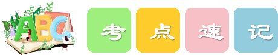

# M2UI Food and drinks!

ì9

Iu:/ : food, cool, school, juice; moon

Iel :

24

juice ( %à) cake apple (#R) banana ( 4#) water   ( z ) tea (*)

healthy breakfast ( % lunch ( 4 %)

have lunch ("44 %) 44, ) a glass ofjuice ( _#%à) a

1 .

1

Yes,

4

noodle-_noodles ;

# 85 01

He likes bread. She drinks milk every morning:

#èx

3 .

i #u  es

book ( + )

rice ( % kh ) a a piece of

pen~pens, book_books; car_cars

es box_boxes, brush_brushes, watch-watches

baby_babies, family_families, candy_candies

boy_boys; toy_toys, key_keys

es man-men, woman-women

es , tomato_tomatoes, potato_potatoes

child_children foot-feet, tooth-teeth

mouse_mice fish->fish

two rice , two bowls of rice

4u : a pen, some pens, some milko a people , #ÿ a persono

LI have two (egg) for breakfast every morning:

- 2.There is some (rice) in the bowl.
- 3.She wants three (glass) ofjuice.
- 4.I like eating (noodle) very much.
- 5.There is a piece of (bread) on the table.

)1 . Would you like some -Yes; please. It's healthy.

A apple

B. milk

)2. I can see many in the basket.

A. banana

B a banana

C. egg

C. bananas

)3. There is a of bread and two of water on the desk.

A. piece; glass B. piece; glasses C. pieces; glass

Do you like

Idon't. I like chicken.

A fish

B. a fish

)5. She has some for lunch. It's delicious .

A. cake

B. cakes

C. fishs

C. a cake

(alwayslusuallyloften/sometimes/never ) every (4 on Sundays (4F] 4 ) usually day

1

% =)4

the my parents they boys `

Tom . my mother .

3 .

es like~likes; play_plays; eat-eats

es study_studies, fly_flies; cry_cries play_plays; stay_stays; enjoy_enjoys

4.

like ( #x) (amlislare )

1

She doesn't like milk. Idon't like juice.

Does she like milk?

Do you like juice?

doldoes No, + Yes, she does./No; she Yes, I do. Idon't. don'tdoesn't. doesn't. JNo,

(amlislare )

+ amlislare + #/

+ am notlisn'tlaren't + #/

we)

He is a student. We are students .

He isn't a student. We aren't students .

Am/Is/Are +

amlislare No,

Is he a student? Are you students?

Yes; we are . we JNO,

6] #

not/isn't/aren't.

isn't.

aren't.

we)

What do you eat for lunch? What does she drink for breakfast?

Do/Does + 4u : Do you like apples? Does he like playing football?

(2)

42 : The girl likes red apples.

4u : She is always late. She usually up early. gets

mother (like)   drinking tea every afternoon. 1.My

(not like) sour oranges.

- 3.What your father (have) for breakfast?
- 4.He (have) bread and milk.
- 5.They (eat) rice for dinner every day.

sister (want) to drink some juice now. 6.My

)1 What like for lunch? you

~Ilike rice and fish.

do

does

are

)2. Tom like milk. He likes juice

A don't

)3. My brother

eat

doesn't

bread every morning:

eats

isn't

eating

)4 . Does your sister like sweet cakes?

She likes sour oranges.

Yes;, she does

she don't No,

)5. We have breakfast at seven o'clock every morning:

A usually

is

she doesn't No,

does

# (1)

- 1.eggs
- 2.rice
- some
- 3.glasses
- 4.noodles

5.bread

a

1B

noodles eggs

- 3.B
- 4.A
- 5.B

bananas

1.ikes some cakes

likes wants

- 2.don't like
- 3.does; have; has
- have; %
- 4.eat they
- 5.wants

1.A

- 2.B
- 3.B

do doesn't

eats 4.C

No, she doesn't 5.A

is has

