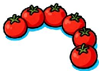
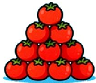
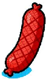
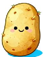
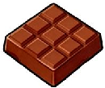
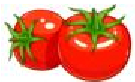
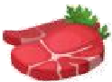
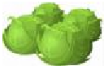
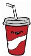
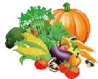

|Part 1| | |Part 2| | | | |84}| | | |
|---|---|---|---|---|---|---|---|---|---|---|---|
| |II|III|I ||II|IV|V | VI ||VI| | | | |

# Part 1 Listening (30 4})

) 1.A. candies

) 2. A. soup

) 3.A_ fast food

4.A. bread and eggs

5.A. water

vegetables

B juice

junk food

rice and meat

milk

fruits

water

 healthy food

noodles and juice

juice

A

A

A

) 1. What kind of drink does Mum want to buy?

B

C

How many tomatoes does Lele need for salad?

B_

C.

) 3. What food does Wenbo ask to buy?

B

C

4. Which vegetable is not available in the supermarket today?

A

B .

A

) 5. What do they buy for dessert?

B

C

) Fd like a sandwich and some tea.

What's your favourite drink?

What would you like to drink?

We have beef noodles and salad today.

Salad is my favourite food.

# Part 2 Reading and Writing (70 4 )

# 10%

)1 . There any jam in the jar. Shall we g0 and buy

A is; any

B are; some

isn't; some

)2. Children can't eat sweets, because are for their teeth. they

A too many; good

B too many; bad

too much; bad

)3 _ What did you eat for breakfast; Jill?

some bread this morning; but I usually some cakes.

A ate; ate

B eat; ate

ate; eat

)4 What you have for dinner last night, Peter?

some chicken:.

A did; have

B do; have

)5 . Mum; can some cabbage? Ming

Of course

A have

B has

did; had

had

)6 . Healthy children eat every day.

A a lot of sweets

B many vegetables

)7 . Its time dinner: Come on, Mike.

a lot of meat

A for

B to

into

)8 . When Tom his breakfast yesterday morning?

A did; have

B does; has

does; have

)9 . and Alice happy this morning because they had a meal. Kitty good

A are

B weren't

were

)10 . in the kitchen?

some ham.

A What; There's

B What's; There's

# ILRead and write (##43*ì) 10%

2 .

C What's; There' re

3 .

5 .

7 .

9 .

4

6.

ours

- 1 Whats in the basket? There are some (potato) and (tomato)
- 2 (be) there a bowl of cherries in the fridge yesterday?

Yes, but there (be) only one in the bowl now.

Who (have) the pineapple? got

4 Let (me) (get) some drinks first.

My father likes (eat) very much. He (eat) two apples last night. apples

6 . Jim can't run (quick) because he is fat.

- 1 . Don't have too much for lunch. Its unhealthy .

- 2 We can some in the supermarket. buy

- 3 . father likes eating are for our health. My They good

- 4 We shouldn't drink too much

- 5 . We should eat every can day. They

What you with Sally yesterday afternoon?

- 2 Kitty
- 3 .

My grandma to the radio in the afternoon.

There's some pork

5 . Ihear a noise every evening.

Nowadays more and more people in the world are fatter, which troubles them a lot. say that it has a lot to do with our 3 habit.

Our eating habits are very for health and a strong body. Most of us like 5 sweets and ice cream. But if we eat them before a meal, may take away our important for us to eat our meal at the same time each When we feel worried or excited, we may not want to eat. good they

)1 . A get

)2 . A Doctors

)3 . A eating

)4 . A happy

)5 . A eat

getting

B We

B sports

B important

B eating

got

Mum

 healthy

yummy

eats

How can we keep fit? Lets look at Susan. Her 50 kilograms( f *). Today,

<20

too thin

20-25

good

>25

too heavy

now! So, healthy body is very important. There are many ways to In the morning; you must up early; g0 outdoors and do morning exercise. Running and swimming can help us keep fit. You should try to make yourself happy too. If you feel you can eat well, well and your body is sure to be in a keep get happy sleep good

- 1 . Susan is too thin.
- 2 . To we must get up early in the morning: keep fit,
- 3 . We can run and swim to keep

Making yourself can' t your body in a happy keep good

5 . Susan's friend, Amy is 1.5 meters tall and 35 kilograms weight. counting, she is By good.

that is right for you: The pyramid calls for eating a variety of foods to the nutrients( # *) you need and eating the right amount of calories( + % E ) to maintain a healthy weight. Most calories should come from the foods in the three lower sections of the pyramid. Each of these groups some, but not all of the nutrients you need. Foods in one group can not replace those in another. No one food group is more important than another. For health; you need them all. guide get good

The pyramid is a that lets you choose a healthy diet. guide

We should enough calories to maintain a healthy weight. get

Most calories come from the lowest section of the pyramid.

Rice; bread and cereal provide all the nutrients that you need.

Vegetables are more important than meat.

2 Read and answer.

What's the pyramid about?

2 How much calories should we to maintain a healthy weight? get

What does each food group provide?

Do we need all the food groups to make us healthy?

How much do you know about the Food Guide Pyramid?

