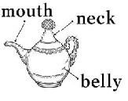
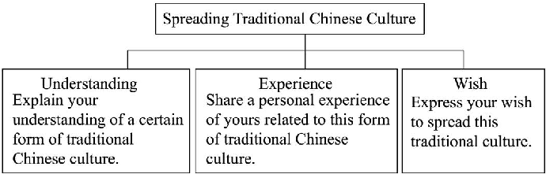
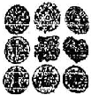
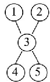
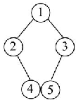
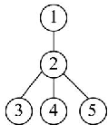
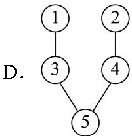

is wonderful that art can make our world more colourful:  Whoever loves creating can be an artist_you don't have to be a famous painter! Our school teacher; Mr Zhang, always encourages us what truly like. He is that he often helps us fix our works after class. art patient we

drawing since I was 10 years old. practising every weekend, my skills have gotten much better:. Last month, I drew happy smile she had when she saw it! She cooked my favourite noodles for me in return.

Shanghai has many great art spots, and the Shanghai Art Museum is one of for students. We often go there for school trips. How lucky we are to live in a so much beautiful art around us! Let's 10 art and trying to be little artists. city keep great

1 A It

B That

C This

2 A something new

3 . A paint

4 A

B new something

B to paint

B such

C anything new

C painting

C . as

A enjoy

6- A Through

A How

8 . A more popular _ ones

9 A with

A love

B enjoyed

B On

B What

B most popular one

B for

B loving

C have enjoyed

In

C What a

C the most popular ones

C . in

C to love

Did you join any fun clubs at school this There is a bamboo teachers in the club always have great Students can 3 to use bamboo to make many beautiful year? They things.

Yangyi is a 14-year-old student. He joins the club his classmates. He wants to make a bamboo fan. Cheng

~Ineed to be very careful when [ am making 5 fan, he says.

Its not easy are too close; and they

sometimes are too far. He often mistakes. But he tries and with the help of his teachers . Isometimes feel I don't When I finish my work; I jump My classmates all come to see 10 and feel so surprised:? Cheng says. they again again unhappy, stop.

"Ilove our club! Its cool to turn bamboo into beautiful says things.

A am

B is

C are

2 A idea

3 . A learn

4 A to

B ideas

B learns

B for

C idea's

C . learning

C with

5 . A

B an

C . the

6 A put

7 . A make

8 . A but

9 A happy

A it

B puts

B makes

B and

B happily

B its

C to put

C making

C . because

C happiness

its

Chinese Seal

The Chinese seal is used in China to sign important or valuable, such as artworks, business agreements and so on. Signing names with seals is Chinese seals are most commonly 3 stone, can also be plastic or metal. Seals have been a of Chinese culture for thousands of years. The known seals date from the Shang Dynasty. along they part

Seals became widely during the Warring States Period to sign official documents. By the time of Han Dynasty; the seals a necessary part of Chinese culture. used

During the history of the Chinese seals, Chinese characters have developed. Some of the changes have something to do characters are in a round People were not sure make the characters match the square seals perfectly. continued to try. That led to the characters changing into a square shape. shape. They

seals are still used for many purposes in China. For example, people can't houses or pass the check in banks can their own seals on. Since one seal is really difficult to copy and should Today buy they put

only by its owner; seals are necessary to adults. So Chinese seal disappear in a short time. We can still see them in many certain situations. quite

1 A everything

B nothing

C something

D anything

2 A

B_ an

C the

a

3 _ A made of

B made from

4 . A earlier

B_ earliest

5 . A becomes

6 A on

B were becoming

B with

7 . A how could B how could they they

8 A unless

if

9 A used

B be used

A mustn't

may not

made in

C later

C are becoming

C in

how can they

C however

C been used

C can't

D made up of

D latest

D had become

D through

D how can they

D although

D used being

D shouldn't

~No print, no is old saying well-known to people in Suzhou, Jiangsu. The 'print? here is

Taohuawu Woodblock New Year Prints get (they) name from the Taohuawu area in Suzhou. 3 (know) for their bright colors; clear patterns and many different themes. In 2006, became They they

Sun Yibo, 44 years old, work) on Taohuawu for over 2Oyears. <Taohuawu are nianhua 5 not only shows menshen (door gods), flowers and birds,' (art) also choose themes from popular culture, games and films. prints prints

Sun once made a woodblock showing a scene in the game Paper Bride He spent months one by one on paper. print

It takes a long time (make) and classes at school. I am 10 (real) happy to see some students starting to learn it in class;, said Sun.

The Grand of the people in China. It is performed widely in Guizhou and Guangxi now. Song Dong Dong

Hu Guanmei is one of the masters of the Grand Her parents encouraged her (learn) it when she was three years old. At that time, she would rather stay at home and practise the Grand Song go out to play: "My parents told me that when you were happy; you could sing; when you 3 sad, you could too; Hu recalled. ~Singing the Grand could keep sadness and worries away from us;, she added. Song Song

In her (twenty), Hu became famous in her village because she could the Grand well. Then she began helping spread the Grand Song. Every night; the kids 5 lived nearby met at Hu's home to together. Later, Hu (invite) to teach students at school. sing Song sing7

Up to now, she has trained over 1,000 students of all (age) Her students (high) of her: "She is a totally committed (RÈÆJJÉJ) teacher: She has not only passed on the singing skills to us; but also succeeded in (help) us have much deeper understanding of Dong culture; one of her students said. speak

So many of her students 10 (win) music competitions and given performances home and abroad. Hu hopes can continue to pass on the traditional culture and bring joy to more people. far, they

There is a special club at Yangzhou Foreign Language School. It is called the Tongcao Flowers Paper Art Workshop. It just won first at a school exhibition prize

The students and teachers made (thousand) of beautiful tongcao flowers and the flowers filled up a 24-square-meter exhibition area.

Tongcao flowers are made from tongcao paper. This paper comes 3 traditional Chinese medicine called tongtuo wood. Tongcao flowers are known as "the flower that never dies" people still feel surprised that can stay beautiful for many years. they

Making tongcao flowers takes many steps. First; cut the pieces of paper into different 5 (size)

Then; shape the wet paper into paper by pinching and rubbing (#* it. Next; the together like a real flower. the end, color the paper. petals petals put

Ren Daiyang (become) a member of the workshop in 2023. For him; shaping the petals is (hard) than other steps.

"Ispent over two hours (make) a tongcao flower in the beginning. But it teaches 10 said 13-year-old Shiyu. "Ilove this paper art want to help keep it going.' Zhang and

The Dong

t 7) back and forth through the cotton threads, the old machine comes to life.

Ever since she was young girl, has been making indigo cloth: This type of handmade cloth is extremely rare You can it at the market, she said. Yang buy

For the people in Guizhou; making indigo cloth has a tradition: The has been passed down from mother to daughter over generations. Nearly every family makes its own cloth. Dong long

This traditional way of making indigo cloth, unfortunately; is now in danger. It will disappear slowly in the modern industrial society. Young people show little interest in it. Some of them have 3 to big cities to find better jobs.

Local officials want to save the tradition. They are trying to change young people's towards it. One program has set up several cloth-making factories in Guizhou. After learning how to make indigo cloth, young people can find jobs easily can also work closer to home Dong They

The people consider indigo cloth as 5 as rice. Many women countless hours making the cloth. rise and start working very early in the morning:  To make the cloth it must be beaten often the whole village up. Dong Dong spend They shiny being

Almost every woman over 40 has a tub for indigo dye in the dye for many rounds to the rich colour: The process of colouring usually takes two weeks: Dong put gain

say she who has the darkest hands makes the best cloth, she says proudly. ~They

1 A hardly

2 A story

B usually

B skill

easily

food

D often

D tool

3 A moved

4 A habit

5 . A interesting

6- A wakes

B returned

B attitude

B expensive

keeps

C travelled

C interest

C important

C turns

D walked

D hobby

D common

takes

It is a small boat made from a peach pit.

During the Dynasty, there was skilled man named Wang Shuyuan. He was at a(n) piece of wood into different like buildings; animals; trees; even people. Ming good turning things, and

One of his greatest works was a small boat made just from a This small boat had a lovely shape like a(n) 3 one. The middle of the boat was the cabin It had eight small four on each side. People could see beautiful patterns on the sides when the windows were open peach pit. part

Three people sat at the front of the boat. The man in the 5 was Su Dongpo. On his right was his friend, Foyin; and on his left was Luzhi. Su Dongpo and Luzhi were long scroll Su Dongpo held one end of the scroll while resting his other hand on Luzhis back. Luzhi at the scroll with his right hand as ifhe was something interesting: Foyin looked happy and 8 lying down on one knee and supporting himself with one arm. pointed

Shuyuan even his name It is hard to believe that he could 10 so many on such a small Wang Shuyuan 's skill is truly amazing! Wang things peach pit.

A small

2 A carefully

B alive

B widely

C silver

C badly

D private

D politely

3 . A empty

B real

C silent

D smooth

A rabbits

B corners

C fields

D windows

5 . A end

6 A looking at

A failing

8 A helpful

9 A traded

B back

B

passing by

B scoring

B awful

B_ wrote

C middle

C setting off

C sharing

 painful

dared

D bottom

D dealing with

D mailing

D peaceful

D examined

A cancel

B create

C announce

D nod

Art is an important part of our life. It has many different forms and can our hearts in special ways. Chinese paper cutting is one of the most famous traditional folk arts. It has a history of more than 1,500 years and is in many parts of China. long

To make paper cutting works; artists only need simple 3 of scissors and some red paper. Red is a lucky color in Chinese culture, so its the most color for paper cutting: Artists cut the paper into different shapes; like flowers, animals and Chinese characters. Every has a special 5 such as happiness and good luck. pair shape

The making of paper cutting is not easy. It needs great patience. Artists must practice a lot to cut the paper into shapes. A paper cutting work is always and lively. When you look at it, you can feel the beauty of art and the warmth of Chinese culture. and perfect good

Now paper cutting is not only loved by Chinese people, but also becomes 8 all over the world. Many foreign people learn to make paper cutting works and it as great way to know about China. Art connects the world. It makes our life more colorful and 10 us to love the world around us they

1 A touch

2 A forgotten

3 . A tools

A boring

5 . A name

6 . A talent

7 . A dark

8 A fresh

9 A regard

A_ teaches

hit

B popular

B pictures

B difficult

B meaning

B time

B vivid

B famous

B_ change

B warns

C break

C expensive

C skills

C common

C use

C money

C cold

C cheap

C turn

C stops

D carry

D silent

D stories

D strange

D shape

D space

D quiet

D clean

D take

D asks

Chinese paper-cutting is one of the oldest handicrafts in China. It appeared during the Northern Dynasties. So it has masters were farmers wives.

Traditional   paper-cuttings were   first on also   called 'window flowers Most paper-cuttings are made of red paper; because red means luck in Chinese culture. people use paper-cuttings to decorate not only windows; but also mirrors, lamps and other furniture. put good Today,

Paper-cuttings are popular because of their expressions of wishes  and hopes. During the Spring Festival, for example; many people put up paper-cuttings of the Chinese character <Fu" upside down. hope that this will them luck. At wedding ceremonies, you can always see paper-cuttings of the character ~Xi" . It means that the couple can enjoy double happiness together: Paper-cuttings have developed different styles in different parts of China. Paper-cuttings from the northern parts usually have interesting shapes and rich patterns. In southern China; people prefer elegant paper-cuttings. focus more on the themes of flowers, fruit, birds and fish. good They bring good They

It is easy to learn how to make paper-cuttings. With a piece of paper and a knife or a of scissors, you can to make your own paper art. You can only make one piece at a time by a knife. But if you use scissors to cut several pieces of paper together; you can make several identical paper-cuttings at once_ quite pair using try

- 1 . How long is the history of Chinese paper-cutting?
- 2 What's another name of paper-cuttings?

Why do people put up the Chinese character -Fu" down? upside

What do people in southern China focus more on in paper-cuttings?

What tool do you need if you want to make several identical paper-cuttings?

knives to cut paper. It has a history (Fj s) of about 1500 years. Let's learn something about paper-cutting. long

Wonderful meanings

Paper-cutting has wonderful meanings happiness and luck. At the Spring Festival, people put up fu on doors or windows. At a good

Why is it red?

In China, people always love red. In our ideas, red is and life, so red is our favourite We can see red everywhere in China. The walls of old palaces are red. Lanterns are red Weddings are always full of red too_ So most of the paper-cutting is red. hope things

Black paper-cutting in Shanzhou

Paper-cutting in Shanzhou; Henan Province is black. Black is the best colour there Shanzhou is a dry (F4 ÉJ) place. People make black paper-cutting to wish for rain.

Now; paper-cutting into many schools. Students can learn how to make paper-cutting at school. Li Jie, as gets such

How is the history of Chinese paper-cutting? long

- 2 Why do Chinese people love red?
- 3 . What do people in Shanzhou use black paper-cutting to do?
- 4 How does Li Jie feel about paper-cutting?
- 5 . Do you want to learn paper-cutting? Why or why not?

Ye Kaiyuan; an artist from traditional literature, Eastern symbols, and Shanshui paintings; Ye creates paper artworks that bridge the past and present.  Using simple tools like scissors  and scenes in Chinese culture. 'Paper-cutting allows me to express my understanding of life and the world, Ye says.

Born in a place known as the "hometown of paper-cutting' Ye developed his interest in the craft as a child.

Although he was born into a poor family, he managed to keep his hobby by using materials from paper boxes. However, when he grew up, he faced pressure to choose a career (事业) that provides enough money for living. After working different jobs—from waiter to tea seller—he gave up his job in 2011 to focus exclusively on paper-cutting. “Life is only meaningful if you do what you love,” he explains.

Ye’s journey was not easy. In 2012, his first exhibition, which he had spent tens of thousands of yuan to hold, sold only one piece for 328 yuan.“There was a moment when I thought about giving up, but I believed in the value of my craft,” he says.

His workshop, Yile Paper-Cutting Art, now creates pieces mixing tradition with modern art. Different from the traditional way of the craft, in which the drawing is done first and then the cutting, he splashes (洒) black, red or yellow ink on rice paper, then draws detailed designs and finally cuts out the paper creation. “The unexpected pattern is the most interesting part, and I think being natural is beautiful,” he says. The creative way is usually slow. It usually takes Ye at least two weeks to complete a paper-cutting work.

His hard work made him well-known around the world and UNESCO listed Zhangpu paper-cutting as intangible cultural heritage in 2010. “I want to bring paper-cutting to daily life, letting more people get to know the craft,” Ye says, showing that ancient crafts can keep alive in the modern world. 1．What does the underlined word “exclusively” mean in paragraph 2?

A．Usually. B．Slowly. C．Carefully. D．Completely.

- 2．Why did Ye give up his job to focus on paper-cutting? A．Because his job didn’t provide him with enough money. B．Because his value in paper-cutting was well-known. C．Because he wanted to turn his hobby into his career. D．Because he was offered a job in Yile Paper-Cutting Art.
- 3．What did Ye do when he was faced with career problems at the beginning? A．He used the money he made to support his career. B．He reminded himself that his work was valuable. C．He asked for help from his friends and relatives. D．He held exhibitions to tell people about his work.
- 4．Which of the following is the correct order of Ye’s way of creating paper-cutting works according to paragraph 4?

①Design the shape of the paper. ②Draw out the lines on the paper.

③Splash ink on the rice paper. ④Cut out the shape.

A

B

C

5 . What is the writing purpose of the passage?

A To introduce a paper-cutting lover.

To teach us the way to make paper-cutting:

C To encourage us to pass on the art paper-cutting.

To show the importance of paper-cutting.

D

Paper cutting is a traditional Chinese art with a history of over 1,500 years. It uses simple tools like scissors and paper to create beautiful patterns. But in modern times, fewer young people are interested in it.

Zhang Min; a 16-year-old student from Nanjing, wants to change this. She learned paper cutting from her grandma when she was 8. She thinks paper cutting is a treasure of Chinese culture and should be passed down.

To promote paper cutting, Zhang Min started an online club. She videos of her paper cutting process on social media. In the videos, she the meaning of each pattern: For example, the fish pattern stands for and the   peony  pattern   represents wealth. She also her   school and community. Many students and neighbors come to learn from her: posts explains good cutting is not old-fashioned.  It can Zhang Min said. She has designed paper cutting patterns for phone cases and bags. These creative works have attracted many young people. Now; more and more people are interested in this traditional art. Zhang Min that one paper cutting will be known by people all over the world. ~Paper hopes day,

1 How long is the history of paper cutting?

A Over 1,000 years.

B Over 1,500 years .

C About 800 years .

D About 500

years.

2 Why did Zhang Min start an online club?

A To learn paper cutting:

To promote paper cutting:

B To sell paper cutting works.

D To make friends.

3 _ What does the fish pattern stand for in paper cutting?

A

Good luck. B Wealth.

C Happiness.

D Health.

4 How does Min make paper cutting popular among young people? Zhang

A She sells paper cutting tools.

B She designs creative paper cutting works.

She writes books about paper cutting.

D She travels around the world to teach paper cutting:

5 . What's Min's hope? Zhang

A．More people will learn paper cutting from her grandma. B．Paper cutting will become a school subject. C．Paper cutting will be known worldwide. D．She will become a famous artist.

# Chinese Paper Cutting: Art, Material and Culture

- ①Paper cutting is one of the most famous traditional arts in China. It has a history of over 1,500 years and is popular all over the country.
- ②Paper cutting is mainly made of red paper. Red is a symbol of good luck and happiness in Chinese culture. The production process is interesting: first, fold the red paper into different shapes; then, use sharp scissors to cut out beautiful patterns. The patterns usually include flowers, animals, and scenes from traditional stories.
- ③Paper cutting is not only a kind of art but also a carrier of culture. During the Spring Festival, people put paper cuttings on windows, doors, and walls to celebrate the festival. It’s a way to express people’s wishes for a better life.
- ④What’s interesting is that paper cutting has spread to foreign countries. In some Western countries, people are interested in this ancient Chinese art. They learn to make paper cuttings and use them to decorate their homes. It has become a bridge for cultural exchange.

- ⑤Now, paper cutting is listed as an intangible (非物质的) cultural heritage. More and more young people are learning this art. They use modern materials and methods to create new styles of paper cuttings, making this traditional art alive. 1．What does the underlined word “It” in Paragraph 4 refer to?

A．Chinese culture. B．A foreign country. C．A traditional story. D．Paper cutting.

- 2．What is the first step in making paper cuttings? A．Cut out patterns. B．Draw patterns. C．Choose sharp scissors. D．Fold the paper.
- 3．How do young people keep paper cutting alive? A．By giving up this art. B．By selling paper cuttings abroad. C．By only making traditional patterns. D．By using modern materials and methods.
- 4．Which of the following best describes the structure of the passage?

A 0IQBI@C B

02

C 0121806

5 . What can infer from the passage? we

A Paper cutting is only popular in China.

Red paper is the only material for paper cutting:

C cutting helps spread Chinese culture abroad. Paper

Young people are not interested in paper cutting.

D

Tea is no stranger to us Chinese people at all. But how much do you know about tea sets? Do you know have changed a lot over time? they

In general, tea sets become smaller and simpler after many changes throughout history  There are few records of tea sets before the Dynasty. In Cha (The Classic of Tea) a great book written by Lu Yu in the Dynasty; 28 kinds of tools used for making and drinking tea are included. Tang Jing Tang

The tea sets in the drinking enjoyed great popularity. The tea bottle used in the game often had a big belly; a neck and a mouth that was not straight.  The mouth could help the players control water better when filling a cup: made of black glaze cup helped keep the tea warm:. Song long Cups

In the and Qing dynasties; tea sets became simple, and those made of and silver slowly disappeared. To test the color of the tea, white tea sets were more popular. In the Qing Dynasty; purple clay tea sets made in Yixing, Jiangsu; began to flourish and were loved widely. It's said that tea made with purple tea sets still tastes after being kept in the teapot for one night, even in a hot summer. Ming gold Yixing clay good

How does the writer start the passage?

A By showing facts.

B

By asking questions. € .

By giving

reasons

2 Which dynasty saw the coming out of Cha Jing?

A The Dynasty. Tang

B The Dynasty. Song

C.

Ming

Dynasty .

The

D

The Qing

Dynasty.

Which tea bottle may be used in the tea game during the Song Dynasty?

A． B． C．

D．

- 4．Which of the following in the dictionary best explains the underlined word "flourish"? A．to grow well (especially plants) B．to be healthy and happy C．to develop quickly and be successful, or common D．to wave (摇晃) sth. around in a way that makes people look at it
- 5．What's the best title for this passage? A．Tea Sets of Different Shapes B．The Development of Tea Sets C．Good Tea Sets Make Good Tea D．Tea Sets with Different Materials

- ①On my way back home, I was drawn by a familiar sweet aroma (香味) to an old man making sugar paintings on a little stool (凳子). I walked straight towards him without a second thought.
- ②Nothing is better than the sugar painting to me. Watching the process of making a sugar painting is a true feast (盛宴) for my eyes.
- ③The old man, with his great skills, created delicate sugar paintings with simple tools, including a small pot, a spoon, a table and some malt sugar (麦芽糖). The sweet smell flew into my nose slowly as the sugar was melted in the pot. After knowing what to paint, the old man scooped (挖，舀) a spoonful of sugar and put the spoon above the table. He moved the spoon a little, and then quickly moved his hands before malt sugar got hard. The golden liquid was scattered (分散) accordingly, thick or thin. It was shortly after the old man moved his hands up or down, fast or slowly that a wonderful painting appeared in front of me. Amazing!
- ④Can you imagine such a lively painting being finished in such a short time? Before malt sugar was completely cold, a thin stick was pressed on the sugar, making it easy to hold.
- ⑤I bought two sugar paintings—a monkey (for my son) and a heart (for me). Taking a bite, I was reminded of my childhood. In those days, I held Mom’s hand, squeezed through (挤过) crowds in the park, and watched the amazing sugar painting process. Mom always bought me a dragon one, the biggest and sweetest. Filled with joy,

we went back home. Sugar paintings have always been sweet, my mother's hand has always been warm; and Fve always felt her love

1 What caught her attention?

A An old man_

B familiar sweet aroma.

C A little stool.

2 In Paragraph 3, we know

D A dragon

A the maker used simple tools to create sugar paintings; including a spoon; a table; and some malt sugar

the last action the maker took was to scoop spoonful of sugar and place it above the marble-topped table

the final appearance of the sugar painting was not influenced by the maker's movements

D the writer expressed amazement at the finished sugar painting

3 _ We can infer (#Èlkfr ) from the passage that the writer

- A could make sugar paintings
- B just liked sugar paintings best eating
- C could give the sugar painting of a monkey to her son

was an artist

4

A

B

C

5 . The passage is mainly about

- A the importance of childhood
- B all kinds of sugar paintings
- C unique place of sugar paintings in my heart
- D Chinese culture

D

D

要求：

- 1. 语句通顺，语意连贯，可适当发挥；
- 2. 至少使用一次 so...that/such...that 句型。 ___________________________________________________________________________________________ ___________________________________________________________________________________________ ___________________________________________________________________________________________ ___________________________________________________________________________________________ ___________________________________________________________________________________________ ___________________________________________________________________________________________ ___________________________________________________________________________________________ ___________________________________________

1．近月，“国潮”文化席卷重庆，无论是磁器口古镇国庆期间的“庙会”，还是校园里的汉服，吟诵古 典诗词，写毛笔字等活动，处处彰显中国传统文化的魅力。学校英语社团正在组织题为“Spreading Traditional Chinese Culture”的征文活动，请你选择一种传统文化的形式，写一篇短文投稿。 要求：

- 1. 注意文字整体性；
- 2. 80—120 词，开头已给出，不计入总词数；
- 3. 文中不能出现自己的姓名和所在学校的名称。

参考信息：calligraphy n.书法，paper-cutting n.剪纸，sugar-painting n.糖画，opera n.京剧

# Spreading Traditional Chinese Culture

Nowadays, with the popularity of Chinese style, more people show great interest in traditional Chinese culture. ___________________________________________________________________________________________ ___________________________________________________________________________________________ ___________________________________________________________________________________________

